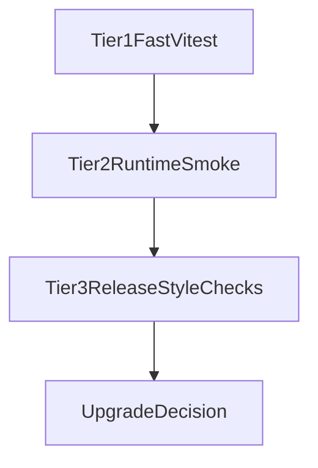

# Bun + Vitest Upgrade Test Pipeline

This document describes the test pipeline we should put in place before redoing the Nitro v3 + h3 v2 upgrade from scratch.

The goal is simple: get a meaningful suite green before dependency changes, then use the exact same suite after the upgrade to tell us which runtime boundary broke first.

Vitest is the practical baseline in this repo today. Bun is worth considering as a future accelerator for low-level test execution and script ergonomics, but the core upgrade safety net should still be designed around the repo's existing Nx + Vitest workflows.

## Testing Goals

The upgrade test pipeline should do four things:

1. Protect current framework behavior before any dependency edits.
2. Catch boundary regressions earlier than app-level symptoms.
3. Prove runtime semantics, not just types and imports.
4. Give us a smallest-first failure loop after the upgrade.

Those goals come directly from the verification philosophy in `NitroMigration.md`: validate behavior, work one migration surface at a time, and stop broad rollout as soon as a shared ownership boundary fails.

## Baseline Before Any Upgrade

Before touching `nitro`, `h3`, or bridge code, this baseline should be green or explicitly documented as red:

- Package-level Vitest coverage for shared runtime packages.
- Representative app builds for SSR, SSG, and API-heavy paths.
- Built-output smoke checks for at least one real app path.
- A written note of all pre-existing flakes, warnings, and failures.

The baseline should answer these questions:

- Does `@analogjs/vite-plugin-nitro` still generate the expected Nitro config?
- Does the dev bridge still normalize, route, and write responses correctly?
- Do router loaders, actions, and server components still receive the expected request contract?
- Do representative apps still render HTML, answer API routes, and preserve cookies, redirects, forms, and internal fetch behavior?

If a test is already red before the upgrade, record it before changing dependencies so it does not get misattributed later.

## Proposed Pipeline

Run the pipeline from fastest feedback to slowest confidence.



### Tier 1: Fast Vitest package checks

Use Vitest for in-process unit and integration checks around shared framework boundaries.

Primary targets:

- `packages/vite-plugin-nitro`
- `packages/router`
- `packages/trpc`
- `packages/platform`

This tier should be the required gate before any broad code migration.

### Tier 2: Runtime smoke checks

Use Vitest-driven or script-driven smoke tests around built or served apps, with plain `fetch` assertions where possible.

Representative targets:

- `analog-app` for dev SSR, middleware, cookies, forms, and route loaders
- `blog-app` for prerender and static output
- `trpc-app` for API health and request semantics

This tier proves that package-level confidence still matches real app behavior.

### Tier 3: Release-style checks

Run lower-frequency but high-confidence checks that mirror release and generator risk:

- generated-app or fresh-app validation
- preset/output smoke checks
- broader release-style build targets

This tier should not be the first line of defense. It is the final confidence net once Tier 1 and Tier 2 are already green.

## High-Value Test Suites

The highest-value suites are the ones that cover shared ownership boundaries from `NitroMigration.md`, not just app-local code.

| Risk surface                                 | Why it matters                                                                                                                      | Suggested test style                                                                     | Primary targets                                                                                                                           |
| -------------------------------------------- | ----------------------------------------------------------------------------------------------------------------------------------- | ---------------------------------------------------------------------------------------- | ----------------------------------------------------------------------------------------------------------------------------------------- |
| Dev middleware bridge and HTML normalization | This is where Vite dev HTML ownership diverges from Nitro/server behavior, and where `/index.html`-style regressions surface first. | Vitest unit/integration tests with mocked Vite server inputs.                            | `packages/vite-plugin-nitro/src/lib/plugins/dev-server-plugin.ts`, `packages/vite-plugin-nitro/src/lib/plugins/dev-server-plugin.spec.ts` |
| Node/Web request-response bridge             | Header, body, status, and cookie loss here can break every shared runtime surface.                                                  | Pure Vitest tests around request creation and response writing.                          | `packages/vite-plugin-nitro/src/lib/utils/node-web-bridge.ts`                                                                             |
| Dev middleware fallthrough and h3 adaptation | `createEvent` removal made this bridge high-risk. Middleware must either respond or fall through cleanly.                           | Vitest integration tests with mocked middleware handlers and response completion checks. | `packages/vite-plugin-nitro/src/lib/utils/register-dev-middleware.ts`                                                                     |
| Nitro config generation and build hooks      | A build that succeeds with the wrong server config is still a regression.                                                           | Vitest config-generation tests and hook assertions.                                      | `packages/vite-plugin-nitro/src/lib/vite-plugin-nitro.ts`, `packages/vite-plugin-nitro/src/lib/vite-plugin-nitro.spec.ts`                 |
| Internal fetch and page-endpoint forwarding  | Loader and prerender failures often come from wrong internal fetch routing, not obvious app bugs.                                   | Vitest tests for generated page-endpoint behavior and event-bound forwarding.            | `packages/vite-plugin-nitro/src/lib/utils/renderers.ts`, `packages/vite-plugin-nitro/src/lib/page-endpoints.spec.ts`                      |
| Public router loader/action contract         | The upgrade must preserve the public `req` / `res` contract unless we explicitly choose otherwise.                                  | Vitest runtime tests plus type-level compatibility checks.                               | `packages/router/src/lib/route-types.ts`, `packages/router/src/lib/route-config.ts`                                                       |
| Server component header/body parsing         | This path moved away from rebuilding h3 events and now depends on raw Node request handling.                                        | Vitest tests with synthetic Node requests and malformed body cases.                      | `packages/router/server/src/server-component-render.ts`                                                                                   |
| tRPC request semantics and errors            | h3 v2 request semantics changed materially here. GET, JSON body parsing, and error paths need hard coverage.                        | Vitest handler tests with synthetic requests.                                            | `packages/trpc/server/src/lib/server.ts`                                                                                                  |
| Built-output SSR, SSG, and API smoke paths   | Package tests alone are not enough; the migration must still work in real apps.                                                     | Vitest or script-driven smoke checks against built/served apps with `fetch`.             | `analog-app`, `blog-app`, `trpc-app`                                                                                                      |

## Where Bun Fits

Bun should be treated as an optional accelerator, not as the source of truth for this repo's upgrade safety net.

Good places to experiment with Bun later:

- running very fast pure-runtime tests for bridge utilities
- local iteration on low-level `Request` / `Response` helpers
- lightweight smoke scripts that do not depend on Angular or Nx-specific behavior

Bad places to rely on Bun first:

- as the only proof for Angular-integrated Vitest behavior
- as the only proof for Nx project execution semantics
- anywhere it would replace repo-native validation before parity is established

In other words, Bun can help us run some checks faster, but Vitest plus the repo's existing Nx targets should remain the canonical pass/fail signal for the upgrade.

## Pre-Upgrade Pass Criteria

We should call the baseline ready only when all of the following are true:

- targeted Vitest package tests pass
- representative app builds pass
- built-output smoke checks pass on representative app paths
- known pre-existing failures are documented
- no public API break is already hiding inside the baseline

This is the minimum acceptable `green before upgrade` state.

## Suggested Command Bundle

These commands should be the practical baseline and the first post-upgrade loop.

### Pre-upgrade baseline

```sh
pnpm nx test vite-plugin-nitro
pnpm nx test platform
pnpm nx test router
pnpm nx build analog-app
pnpm nx build blog-app
pnpm nx build trpc-app
```

### Runtime confidence

```sh
pnpm nx serve-nitro analog-app
pnpm nx serve-nitro blog-app
pnpm nx serve-nitro trpc-app
pnpm nx run analog-app-e2e-playwright:vitest
pnpm nx run trpc-app-e2e-playwright:vitest
```

### Broad confidence after focused loops are green

```sh
pnpm nx run-many --target test
pnpm nx run-many --target build --projects=tag:type:release
```

If we add Bun-assisted scripts later, they should complement this bundle rather than replace it.

## Post-Upgrade Usage

After changing dependencies or bridge code, use the same suite in this order:

1. Run Tier 1 first.
2. Stop on the first shared-boundary failure.
3. Fix the ownership boundary that failed first, not the first app symptom.
4. Re-run only the smallest relevant loop until that surface is green.
5. Move to Tier 2 only after the shared package surface is stable.
6. Use Tier 3 as the final confidence pass, not the primary debugger.

This is the same failure-triage loop described in `NitroMigration.md`: classify, contain, decide, record, and re-run the smallest proof.

## Recommended Failure Lens

When a post-upgrade check fails, classify it before patching anything:

- export or type mismatch
- runtime bridge regression
- public API regression
- app behavior regression
- preset or output regression
- documentation drift after a verified code change

Then add or tighten the nearest targeted Vitest suite so the same regression is cheaper to catch next time.

## What This Would Have Caught Earlier

If we had built this pipeline first, the most valuable early catches would likely have been:

- dev HTML ownership and `/index.html` normalization regressions
- request/response bridge mismatches
- missing or incorrect internal fetch behavior during SSR and prerender
- server component request-header and body parsing regressions
- h3 v2 request-semantics changes in tRPC handlers

That is the main point of this document: test the shared boundaries first, because that is where the upgrade risk actually lives.
