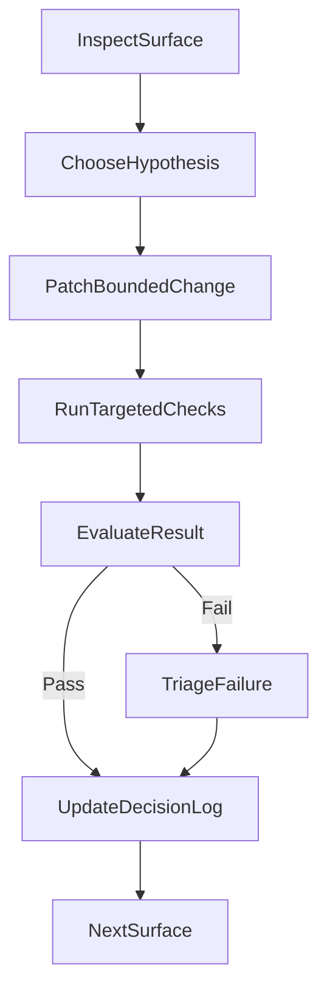

# Nitro v3 + h3 v2 Migration Plan

## Overview

Migrate the Analog framework from `nitropack@^2.11.0` + `h3@^1.13.0` to `nitro@3.x` + `h3@2.0.1-rc.16`.

**References:**

- [Nitro v3 Migration Guide](https://v3.nitro.build/docs/migration)
- [h3 v2 Migration Guide](https://h3.dev/migration)
- [Nitro v3 LLMs Reference](https://v3.nitro.build/llms.txt)

**Scope:** 8 workstreams, ~100+ files across packages, apps, templates, and docs.

This document is the migration source of truth for Nitro v3 + h3 v2 across framework packages, example apps, templates, and docs. It is intentionally both:

- a detailed implementation inventory
- an execution playbook for a compatibility-first, agent-assisted migration

## Completion Snapshot

Status: completed in the current worktree.

Delivered outcomes:

- Normalized the repo to `nitro@^3.0.0` and `h3@2.0.1-rc.16`, with Nitro types taken from `nitro/types` and builder functions taken from `nitro/builder` where required.
- Completed the `@analogjs/vite-plugin-nitro` runtime migration, including the fetch-first Node bridge, `serverDir` adoption, client-template path resolution for SSR builds, HTML renderer response headers, and event-bound internal API forwarding for SSR/prerender.
- Preserved the public `req` / `res` contract in router and tRPC surfaces while migrating internal request/body/header handling to Nitro v3 + h3 v2-compatible patterns.
- Migrated remaining app, template, generator, README, and docs examples away from compat-era guidance where the new idiomatic API was validated.
- Added targeted regression coverage for the renderer virtual modules and validated the tRPC app flow end-to-end against the built Nitro server.

Validation used during completion:

- `pnpm nx test vite-plugin-nitro`
- `pnpm nx build trpc-app`
- `pnpm nx run trpc-app-e2e-playwright:e2e`
- `pnpm nx build docs-app --skip-nx-cache`

Known residual noise after completion:

- `docs-app` still reports pre-existing broken-anchor and CSS-minifier warnings in unrelated pages/locales.
- The `start-server-and-test` flow used by `trpc-app-e2e-playwright:e2e` still logs a non-zero `serve-nitro` shutdown warning after the successful run, but the end-to-end target itself completes successfully.

---

## Must-Follow Rules

These rules are mandatory for every workstream in this migration.

1. **Check real package signatures before changing code.**

   - Do not rely on memory, migration-guide summaries, or old examples alone.
   - Confirm actual exports, callable signatures, and type locations from the installed `nitro` and `h3` packages before codemodding a pattern across the repo.
   - Record the result in the decision log when a signature check changes the migration strategy.

2. **Prefer the new idiomatic API when it is actually supported.**

   - For h3 v2, prefer `defineHandler`, `event.url`, `event.path`, `event.req`, `event.res`, and explicit returned responses over compat-era aliases in new or migrated examples.
   - For Nitro v3, prefer fetch-first request/response flow and standard web `Request` / `Response` handling where the integration surface supports it.
   - Do not keep compat helpers in examples or templates just because they still exist, unless backward-compatibility for a public API explicitly requires it.

3. **Do not invent shims until the native adapter path has been ruled out.**

   - Before introducing custom bridge code, verify whether Nitro or h3 already provides the needed adapter or handler shape.
   - Prefer built-in adapters and standard primitives over custom event reconstruction, custom stream pumping, or ad hoc response translation.
   - If a custom bridge is still required, document why the native path was insufficient.

4. **Treat samples and inline documentation as part of the migration, not follow-up work.**

   - Whenever a migration decision changes how code should be written, update the inline comments, package docs, app samples, and migration notes in the same pass.
   - Do not modernize core code while leaving docs or examples teaching a compat-only pattern.
   - Do not remove useful inline explanation from tricky migration code paths unless it is replaced with a shorter but equally clear explanation.

5. **Validate behavior, not just types.**

   - A passing import or type check is not enough.
   - Confirm runtime behavior for redirects, cookies, headers, body parsing, middleware fallthrough, SSR, prerendering, and preset output on representative app paths.
   - If a signature is valid but the behavior is non-idiomatic or lossy, keep iterating.

6. **Every disproven assumption must update the document.**
   - When a real signature check or runtime test disproves an assumption in this plan, update the decision log, the relevant workstream guidance, and any affected quick-reference mappings immediately.
   - Do not allow stale migration guidance to persist after the implementation direction has changed.

## Goals

- Preserve current Analog behavior unless a change is explicitly called out as a breaking API change.
- Keep the migration compatibility-first across `@analogjs/platform`, `@analogjs/vite-plugin-nitro`, `@analogjs/router`, and `@analogjs/trpc`.
- Land changes in phases that can be verified independently using repo-native Nx, app build, and e2e workflows.
- Convert every unresolved migration assumption into an explicit decision, validation task, or follow-up item.

## Non-Goals

- Do not redesign public APIs opportunistically during the compatibility migration.
- Do not start bulk template or documentation rewrites until runtime behavior and public APIs are stable.
- Do not treat type-check success as sufficient proof of parity for request handling, middleware, SSR, prerendering, or deployment presets.
- Do not merge partial bridge code for high-risk runtime paths without a documented fallback or rollback path.

## Migration Strategy And Operating Model

### Strategy

Use a compatibility-first migration with bounded phases, not a blind repo-wide mechanical rename. The highest risk areas are the Node-to-h3 bridge, Nitro builder integration, and public server-side types. Those surfaces should be migrated and validated before broad follow-on edits in apps, templates, and docs.

### Operating rules

- Work one migration surface at a time.
- Prefer the smallest patch set that proves one migration hypothesis.
- Validate real behavior in at least one repo-owned app path before applying the same pattern elsewhere.
- Defer downstream bulk transforms until the upstream runtime contract is confirmed stable.
- If a core assumption changes, update the decision log and verification plan before continuing.

### Recommended migration mode

- **Atomic within a workstream:** Each workstream should be internally coherent when committed.
- **Phased across the repo:** Core runtime bridge first, public API surfaces second, app/template migration third, docs and release preparation last.
- **Compatibility-first by default:** Preserve `event.node.req`/`event.node.res` access where still supported unless there is a strong reason to move users immediately to web-standard `Request`/`Response`.

## Critical Decisions To Resolve Early

These decisions should be resolved before broad downstream edits begin.

| Decision                                                                 | Why it matters                                                                      | Resolution expectation                                                                     | Downstream impact                                        |
| ------------------------------------------------------------------------ | ----------------------------------------------------------------------------------- | ------------------------------------------------------------------------------------------ | -------------------------------------------------------- |
| `createEvent` replacement strategy                                       | Governs dev middleware, dev response bridging, and server component request parsing | Decide whether to use direct Node handling, `toNodeHandler()`, or Nitro's own dev pipeline | Blocks Workstreams 2, 3, 4, and portions of 5            |
| Nitro v3 top-level exports vs `nitro/types` / `nitro/builder`            | Affects nearly every package import update                                          | Confirm actual export paths after install                                                  | Changes package imports, type augmentation, and examples |
| Preset name changes                                                      | Affects platform/deployment compatibility                                           | Verify Nitro v3 preset naming and deprecations                                             | Blocks provider validation and docs                      |
| Public API stance for `req` / `res` vs web `Request` / `Response`        | Determines whether router/action types stay source-compatible                       | Default to preserving current API unless a deliberate deprecation path is adopted          | Impacts router, actions, docs, and release notes         |
| h3 utility compatibility (`getQuery`, `parseCookies`, `setCookie`, etc.) | Prevents unnecessary churn                                                          | Verify actual h3 v2 exports before replacing helpers manually                              | Influences app examples, docs, and templates             |

## Decision Log And Unknowns Register

Convert every "verify" note in this document into a tracked decision during execution.

| Topic                               | Current assumption                                                                                                                                                                                                                                                                                                                                                                                                                                           | How to resolve                                               | Status       |
| ----------------------------------- | ------------------------------------------------------------------------------------------------------------------------------------------------------------------------------------------------------------------------------------------------------------------------------------------------------------------------------------------------------------------------------------------------------------------------------------------------------------ | ------------------------------------------------------------ | ------------ |
| Nitro builder exports               | `nitro` top-level exports: `build`, `copyPublicAssets`, `createDevServer`, `createNitro`, `prepare`, `prerender`. Types via `nitro/types`. Also has `nitro/config`, `nitro/runtime`, `nitro/vite`, `nitro/h3`.                                                                                                                                                                                                                                               | Confirmed via `node -e "import('nitro')..."`                 | **Resolved** |
| h3 utility availability             | Almost all v1 helpers still exist as compat shims: `defineEventHandler`, `eventHandler`, `readBody`, `readFormData`, `getQuery`, `getHeader`, `setHeader`, `setHeaders`, `sendRedirect`, `proxyRequest`, `setCookie`, `parseCookies`, `sendWebResponse`, `toNodeListener`, `isMethod`, `getRouterParam`, `getRequestURL`, `getResponseHeader`, `createError`, `createEventStream`, `defineWebSocketHandler`. Only `createEvent` and `App` are truly removed. | Confirmed via `node -e "import('h3')..."`                    | **Resolved** |
| Nitro type augmentation module path | `nitro/types` is the correct declaration-merging target and was compile-time validated through the migrated `platform` types plus successful package/app builds.                                                                                                                                                                                                                                                                                             | Completed in the landed worktree                             | **Resolved** |
| Dev middleware bridge               | `createEvent` remained the only hard blocker. The landed implementation keeps two explicit bridges: direct Node response writing in `dev-server-plugin.ts` and a temporary `H3` app + `toNodeHandler()` in `register-dev-middleware.ts`, with SSR/build validation proving the chosen path.                                                                                                                                                                  | Validated through app builds and end-to-end runtime coverage | **Resolved** |
| Preset naming                       | No preset rename was required for the supported repo paths touched by this migration. Existing preset/output handling remained valid in the landed code, so no provider-specific preset rewrite was needed as part of this work.                                                                                                                                                                                                                             | Verified against the landed plugin behavior and current docs | **Resolved** |

When an unknown is resolved:

1. Update the decision log.
2. Update the prescribed migration pattern in the relevant workstream.
3. Update the verification checklist or matrix if the resolution changes what must be tested.

## Preflight Baseline And Success Criteria

Before code edits begin, capture a baseline so regressions are measurable instead of anecdotal.

### Preflight checklist

- Check actual installed `nitro` and `h3` exports/signatures before touching migration hotspots.
- Confirm the repo installs and current dependency graph is understood.
- Record which package-level tests currently pass for `vite-plugin-nitro`, `platform`, `router`, and `trpc`.
- Build at least one SSR app, one static/prerender app, and one API-heavy app from the current mainline state.
- Confirm built-output smoke paths work:
  - `apps/analog-app/project.json` via `serve-nitro`
  - `apps/blog-app/project.json` via static output serving
  - `apps/trpc-app-e2e-playwright/project.json` via `/api/health`
- Note any pre-existing red tests or flakes so they are not misattributed to the migration.

### Success criteria

A phase is only complete when:

- the affected code compiles
- targeted tests for that phase pass
- at least one real app path covering the changed behavior is verified
- any open unknowns are either resolved or explicitly recorded as accepted follow-up work
- no undocumented breaking change has been introduced to a public API

## Near-Perfect Agentic Migration Loop

Use the same loop for human and agent execution. The goal is to prevent broad speculative rewrites before the previous step has been proven.



### Work loop

1. Inspect a single workstream or sub-surface and identify one concrete migration hypothesis.
2. Apply the smallest viable change set that proves that hypothesis.
3. Run only the targeted checks needed for that surface first.
4. If the change passes, record the pattern and continue to the next similar surface.
5. If the change fails, stop broad rollout, classify the failure, and resolve it before repeating the same pattern elsewhere.

### Agent guardrails

- Never run a repo-wide mechanical replacement before validating one representative runtime path.
- Never apply a migration pattern repo-wide before checking the actual package signature that supports it.
- Do not update templates or docs until the underlying runtime pattern has been proven in package code or real apps.
- Prefer behavior parity checks over type-level cleanup.
- Prefer idiomatic v3/v2 APIs in samples and inline docs once the real signature is confirmed.
- Stop immediately if an unexpected public API regression or preset regression appears.

## Phase Plan With Entry And Exit Gates

### Preflight (Completed)

- **Scope:** Dependency verification, export inspection, baseline builds/tests, and decision capture.
- **Required outputs:** Confirmed import strategy, confirmed h3 utility availability, and a clean baseline report.
- **Exit gate:** No critical unknown remains that would invalidate the Phase 1 runtime bridge work.

### Phase 1: Core Runtime Bridge (Completed)

- **Scope:** Workstreams 1, 2, and 8.
- **Primary files:** `packages/vite-plugin-nitro/*`, `packages/platform/src/lib/options.ts`
- **Must prove:** Nitro builder imports, dev middleware bridge, runtime response writing, declaration merging, and SSR/prerender plumbing still work.
- **Exit gate:** `vite-plugin-nitro` and `platform` are source-compatible, targeted tests pass, and at least one SSR app build plus one dev-flow smoke path succeed.
- **Stop conditions:** unresolved `createEvent` replacement, broken dev middleware parity, or broken preset handling.

### Phase 2: Public Server APIs (Completed)

- **Scope:** Workstreams 3 and 4.
- **Primary files:** `packages/router/*`, `packages/trpc/*`
- **Must prove:** loaders/actions/server components/tRPC remain compatible and request/body handling still behaves correctly.
- **Exit gate:** package-level types are stable, server component rendering works, and tRPC/API behavior is proven with real app coverage.
- **Stop conditions:** undocumented breaking changes to public `req` / `res` access or incompatible body/query/header behavior.

### Phase 3: App, Template, And Generator Migration (Completed)

- **Scope:** Workstreams 5 and 6.
- **Primary files:** `apps/*`, `packages/create-analog/*`, `packages/nx-plugin/*`
- **Must prove:** the prescribed migration patterns hold across SSR, SSG, API, middleware, cookies, forms, and generated apps.
- **Exit gate:** representative example apps build and smoke-test correctly, and templates generate valid post-migration code.
- **Stop conditions:** a pattern works in core packages but fails in generated or legacy-template output.

### Phase 4: Docs And Release Readiness (Completed)

- **Scope:** Workstream 7 plus migration communication.
- **Primary files:** docs-app English sources first, then localized copies, plus any package README alignment.
- **Must prove:** examples match the actual supported API and the migration guidance reflects the final validated patterns.
- **Exit gate:** English docs are accurate, localized follow-ups are tracked, and release-note inputs are ready.
- **Stop conditions:** docs or templates rely on patterns that have not yet been runtime-validated.

---

## Workstream 1: Package Dependencies

### 1.1 Root `package.json`

| Field                       | Current   | Target                              |
| --------------------------- | --------- | ----------------------------------- |
| `devDependencies.nitropack` | `^2.11.0` | REMOVE                              |
| `devDependencies.nitro`     | —         | `^3.0.0` (or latest v3 pre-release) |
| `devDependencies.h3`        | `^1.13.0` | `2.0.1-rc.16`                       |

### 1.2 `packages/vite-plugin-nitro/package.json`

| Field                    | Current   | Target   |
| ------------------------ | --------- | -------- |
| `dependencies.nitropack` | `^2.11.0` | REMOVE   |
| `dependencies.nitro`     | —         | `^3.0.0` |

> **Note:** h3 is a transitive dependency of nitro. If direct h3 imports are used in this package (they are), add `h3: 2.0.1-rc.16` as an explicit dependency or peerDependency.

### 1.3 `packages/platform/package.json`

| Field                    | Current   | Target   |
| ------------------------ | --------- | -------- |
| `dependencies.nitropack` | `^2.11.0` | REMOVE   |
| `dependencies.nitro`     | —         | `^3.0.0` |

### 1.4 Lock file & Install

```bash
# After updating all package.json files
pnpm install
```

Verify no remaining references to `nitropack` in `pnpm-lock.yaml` (except as transitive if any).

---

## Workstream 2: Core Build Pipeline (`packages/vite-plugin-nitro/`)

This is the highest-risk workstream. The vite-plugin-nitro package is the core integration layer between Vite and Nitro.

### 2.1 `src/lib/vite-plugin-nitro.ts` (main plugin)

**Import changes:**

```typescript
// BEFORE
import { NitroConfig, build, createDevServer, createNitro } from 'nitropack';
import { App, toNodeListener } from 'h3';

// AFTER
import type { NitroConfig } from 'nitro/types';
import { build, createDevServer, createNitro } from 'nitro';
```

**Line-by-line changes:**

| Line | Current                                        | New                                         | Notes                                                           |
| ---- | ---------------------------------------------- | ------------------------------------------- | --------------------------------------------------------------- |
| 1    | `NitroConfig` imported from `nitropack`        | `NitroConfig` imported from `nitro/types`   | Keep Nitro types on the explicit types subpath                  |
| 2    | Builder APIs imported from `nitropack`         | Builder APIs imported from `nitro`          | Package rename for runtime/builder functions                    |
| 444  | `toNodeListener(server.app as unknown as App)` | manual `Request` -> `server.fetch()` bridge | The staged implementation no longer depends on `toNodeListener` |

**Nitro v3 API check for functions used:**

- `createNitro()` - Still available from `nitro` (same API)
- `createDevServer()` - Still available from `nitro` (same API)
- `build()` - Still available from `nitro` (same API)
- `NitroConfig` type - Now from `nitro/types` or `nitro` top-level

**Staged implementation decision:** Instead of adapting Nitro's dev server through `toNodeListener()`, the current migration builds a web `Request` from Vite's `IncomingMessage`, calls `server.fetch(webRequest)`, and streams the resulting `Response` back to Node `res`. This keeps the bridge aligned with Nitro v3's fetch-first runtime model.

**Additional staged change:** `nitroConfig.renderer` now uses an object shape with `entry` during build setup rather than assigning the virtual module string directly. Keep this in sync with the Nitro v3 renderer contract during implementation.

**Risk: `compatibilityDate` config option** (line 104)

```typescript
compatibilityDate: '2024-11-19',
```

Verify this is still valid in Nitro v3 or update to a newer date.

### 2.2 `src/lib/build-server.ts`

**Import changes:**

```typescript
// BEFORE
import { NitroConfig, copyPublicAssets, prerender } from 'nitropack';
import { createNitro, build, prepare } from 'nitropack';

// AFTER
import type { NitroConfig } from 'nitro/types';
import { copyPublicAssets, prerender } from 'nitro';
import { createNitro, build, prepare } from 'nitro';
```

All six functions (`NitroConfig`, `copyPublicAssets`, `prerender`, `createNitro`, `build`, `prepare`) should still be available from `nitro`. Verify the `nitro` package exports these at the top level; if not, use:

- Types: `import type { NitroConfig } from 'nitro/types'`
- Builder functions: `import { createNitro, build, prepare, copyPublicAssets, prerender } from 'nitro/builder'`

### 2.3 `src/lib/plugins/dev-server-plugin.ts`

**Import changes:**

```typescript
// BEFORE
import { createEvent, sendWebResponse } from 'h3';
import { NitroRouteRules } from 'nitropack';

// AFTER
import type { NitroRouteRules } from 'nitro/types';
```

**Critical h3 v2 changes:**

- `createEvent(req, res)` is **REMOVED** in h3 v2. Node.js `req`/`res` objects are no longer directly wrapped.
- `sendWebResponse()` still exists as a compatibility helper, but this bridge no longer needs it because it is running inside raw Vite middleware.

**Refactor required (lines 91-93):**

```typescript
// BEFORE
if (result instanceof Response) {
  sendWebResponse(createEvent(req, res), result);
  return;
}

// AFTER - staged bridge: write the Response back to raw Node.js res
if (result instanceof Response) {
  res.statusCode = result.status;
  result.headers.forEach((value, key) => {
    res.setHeader(key, value);
  });
  const body = await result.text();
  res.end(body);
  return;
}
```

Although `sendWebResponse()` still exists, the current staged code writes the `Response` to Node directly because this path is not executing inside an h3 handler. That keeps the bridge explicit and avoids rebuilding an event just to flush a response.

### 2.4 `src/lib/utils/register-dev-middleware.ts`

**Import changes:**

```typescript
// BEFORE
import { EventHandler, createEvent } from 'h3';

// AFTER
import { EventHandler, H3, toNodeHandler } from 'h3';
```

**Critical: `createEvent` removal (line 70):**

```typescript
// BEFORE
const result = await middlewareHandler(createEvent(req, res));

// AFTER - staged implementation
const app = new H3();
app.use(middlewareHandler);
const nodeHandler = toNodeHandler(app);
await nodeHandler(req, res);
```

**Staged implementation decision:** Since `createEvent` is removed in h3 v2, the current migration wraps each middleware module in a temporary `H3` app and converts it back into Connect-compatible middleware with `toNodeHandler()`.

```typescript
import { H3, toNodeHandler } from 'h3';

const app = new H3();
app.use(middlewareHandler);
const nodeHandler = toNodeHandler(app);
```

The staged code also wraps `res.end` so it can tell whether the middleware completed the response or should fall through to `next()`. Keep that inline explanation in the source, since it is the least-obvious part of the bridge.

### 2.5 `src/lib/utils/renderers.ts` (virtual modules - string templates)

These are string templates that become virtual Nitro modules. They use h3 APIs that run inside the Nitro runtime.

**SSR Renderer (lines 1-21):**

```typescript
// BEFORE (virtual module string)
import { eventHandler, getResponseHeader } from 'h3';
export default eventHandler(async (event) => {
  const noSSR = getResponseHeader(event, 'x-analog-no-ssr');
  const html = await renderer(event.node.req.url, template, {
    req: event.node.req,
    res: event.node.res,
  });

// AFTER
import { defineHandler } from 'h3';
export default defineHandler(async (event) => {
  const noSSR = event.res.headers.get('x-analog-no-ssr');
  const html = await renderer(event.url, template, {
    req: event.node.req,
    res: event.node.res,
  });
```

**Key changes in the virtual modules:**
| h3 v1 | h3 v2 | Used in |
|---|---|---|
| `eventHandler(fn)` | `defineHandler(fn)` or plain function | ssrRenderer, clientRenderer, apiMiddleware |
| `getResponseHeader(event, name)` | `event.res.headers.get(name)` | ssrRenderer |
| `event.node.req.url` | `event.path` or `event.url` | ssrRenderer, apiMiddleware |
| `event.node.req.method` | `event.method` | apiMiddleware |
| `event.node.req.headers` | `Object.fromEntries(event.req.headers.entries())` | apiMiddleware |
| `proxyRequest(event, url, opts)` | `proxy(event, url, opts)` | apiMiddleware |

**IMPORTANT caveat for `event.node.req` / `event.node.res`:** These are still available in h3 v2 when running on Node.js, but only through `event.node.req` and `event.node.res`. The key difference is that `event.req` is now a web `Request` object (not the Node IncomingMessage). The existing code accessing `event.node.req` and `event.node.res` should still work, but verify the Angular SSR renderer compatibility.

**Client Renderer (lines 23-32):**

```typescript
// BEFORE
import { eventHandler } from 'h3';
export default eventHandler(async () => {
  return template;
});

// AFTER
import { defineHandler } from 'h3';
export default defineHandler(async () => {
  return template;
});
```

**API Middleware (lines 34-59):**

```typescript
// BEFORE
import { eventHandler, proxyRequest } from 'h3';
export default eventHandler(async (event) => {
  if (event.node.req.url?.startsWith(apiPrefix)) {
    const reqUrl = event.node.req.url?.replace(apiPrefix, '');
    if (
      event.node.req.method === 'GET' &&
      !event.node.req.url?.endsWith('.xml')
    ) {
      return $fetch(reqUrl, { headers: event.node.req.headers });
    }
    return proxyRequest(event, reqUrl, { fetch: $fetch.native });
  }
});

// AFTER
import { defineHandler, proxy } from 'h3';
export default defineHandler(async (event) => {
  if (event.path?.startsWith(apiPrefix)) {
    const reqUrl = event.path?.replace(apiPrefix, '');
    if (event.method === 'GET' && !event.path?.endsWith('.xml')) {
      return $fetch(reqUrl, {
        headers: Object.fromEntries(event.req.headers.entries()),
      });
    }
    return proxy(event, reqUrl, { fetch: $fetch.native });
  }
});
```

### 2.6 `src/lib/utils/get-page-handlers.ts`

**Import change:**

```typescript
// BEFORE
import { NitroEventHandler } from 'nitropack';

// AFTER
import type { NitroEventHandler } from 'nitro/types';
```

### 2.7 `src/lib/hooks/post-rendering-hook.ts`

**Import change:**

```typescript
// BEFORE
import { Nitro, PrerenderRoute } from 'nitropack';

// AFTER
import type { Nitro, PrerenderRoute } from 'nitro/types';
```

**Behavior check:** The `nitro.hooks.hook('prerender:generate', ...)` API should remain the same in v3. Verify hook name hasn't changed.

### 2.8 `src/lib/options.ts`

**Import change:**

```typescript
// BEFORE
import { PrerenderRoute } from 'nitropack';

// AFTER
import type { PrerenderRoute } from 'nitro/types';
```

### 2.9 `src/lib/plugins/page-endpoints.ts` (virtual code generation)

This file generates code strings that include h3 imports. Update the generated code template:

```typescript
// BEFORE (generated code string, line 31)
import { defineEventHandler } from 'h3';
// ...
export default defineEventHandler(async(event) => {
  // uses: event.method, event.context.params, event.node.req, event.node.res

// AFTER
import { defineHandler } from 'h3';
// ...
export default defineHandler(async(event) => {
  // event.method - same in h3 v2
  // event.context.params - same in h3 v2
  // event.node.req / event.node.res - still available on Node.js in h3 v2
```

### 2.10 Test Files

**`src/lib/vite-nitro-plugin.spec.data.ts`:**

```typescript
// BEFORE
import { NitroConfig } from 'nitropack';

// AFTER
import type { NitroConfig } from 'nitro/types';
```

**`src/lib/hooks/post-rendering-hooks.spec.ts`:**

```typescript
// BEFORE
import { Nitro } from 'nitropack';

// AFTER
import type { Nitro } from 'nitro/types';
```

---

## Workstream 3: Router Package (`packages/router/`)

### 3.1 `src/lib/route-types.ts`

```typescript
// BEFORE
import type { H3Event, H3EventContext } from 'h3';
import type { $Fetch } from 'nitropack';

// AFTER
import type { H3Event, H3EventContext } from 'h3';
import type { $Fetch } from 'nitro/types';

type NodeContext = NonNullable<H3Event['node']>;
```

**Type decision:** The staged implementation keeps the public `req` / `res` contract Node-based, but narrows through `NonNullable<H3Event['node']>` so the public API remains compatible with h3 v2's nullable node typing.

**h3 v2 type changes:**

- `H3Event` - Still exists in h3 v2, same name
- `H3EventContext` - Still exists in h3 v2, same name
- `$Fetch` - Verify this type is exported from `nitro/types`

**Property access changes in `PageServerLoad` type:**

```typescript
// BEFORE
export type PageServerLoad = {
  params: H3EventContext['params'];
  req: H3Event['node']['req']; // IncomingMessage
  res: H3Event['node']['res']; // ServerResponse
  fetch: $Fetch;
  event: H3Event;
};
```

In h3 v2, `event.node.req` and `event.node.res` are still available on Node.js. The types may need updating:

```typescript
// AFTER - verify type path still works
export type PageServerLoad = {
  params: H3EventContext['params'];
  req: H3Event['node']['req']; // Still available in h3 v2 on Node.js
  res: H3Event['node']['res']; // Still available in h3 v2 on Node.js
  fetch: $Fetch;
  event: H3Event;
};
```

> **Decision needed:** Should we also expose `event.req` (web Request) and deprecate `req`/`res` Node.js properties? This is a public API, so a deprecation path may be warranted.

### 3.2 `server/actions/src/actions.ts`

Same import changes as route-types.ts:

```typescript
// BEFORE
import type { H3Event, H3EventContext } from 'h3';
import type { $Fetch } from 'nitropack';

// AFTER
import type { H3Event, H3EventContext } from 'h3';
import type { $Fetch } from 'nitro/types';
```

### 3.3 `server/src/server-component-render.ts`

**Import changes:**

```typescript
// BEFORE
import { createEvent, readBody, getHeader } from 'h3';

// AFTER
import { json as readJsonBody } from 'node:stream/consumers';
```

**Critical refactor needed:**

**`serverComponentRequest` function (lines 23-40):**

```typescript
// BEFORE
export function serverComponentRequest(serverContext: ServerContext) {
  const serverComponentId = getHeader(
    createEvent(serverContext.req, serverContext.res),
    'X-Analog-Component',
  );

// AFTER - Option A: Read header from Node.js req directly (no h3 needed)
export function serverComponentRequest(serverContext: ServerContext) {
  const serverComponentId = serverContext.req.headers['x-analog-component'] as string | undefined;
```

This function creates an h3 event just to read a header from a Node.js request. Because `ServerContext` is still defined in `@analogjs/router/tokens` as raw Node `IncomingMessage`/`ServerResponse`, the staged implementation reads the component header directly from `serverContext.req.headers`.

**`renderServerComponent` function (lines 72-73):**

```typescript
// BEFORE
const event = createEvent(serverContext.req, serverContext.res);
const body = (await readBody(event)) || {};

// AFTER - staged implementation reads JSON props directly from Node req
const body = (await readJsonBody(serverContext.req).catch(() => ({}))) || {};
```

**Staged implementation decision:** Use Node.js built-in stream consumers. This is correct for this file because the server-component client bridge sends JSON props via `POST`, and `renderServerComponent()` receives raw Node request objects rather than an `H3Event`.

```typescript
import { json as readJsonBody } from 'node:stream/consumers';

const body = (await readJsonBody(serverContext.req).catch(() => ({}))) || {};
```

Do not generalize this decision to every `readBody(event)` call in the repo. It is correct here because this path is JSON-only and Node-only.

---

## Workstream 4: tRPC Package (`packages/trpc/`)

### 4.1 `server/src/lib/server.ts`

**Import changes:**

```typescript
// BEFORE
import type { H3Event } from 'h3';
import { createError, defineEventHandler, isMethod, readBody } from 'h3';

// AFTER
import type { H3Event } from 'h3';
import { HTTPError, defineHandler } from 'h3';
```

**Function-level changes:**

| h3 v1                                      | h3 v2                                                                                                 | Line(s)          |
| ------------------------------------------ | ----------------------------------------------------------------------------------------------------- | ---------------- |
| `defineEventHandler`                       | `defineHandler`                                                                                       | 83               |
| `createError({statusCode, statusMessage})` | `new HTTPError(statusCode, {message: statusMessage})` or `throw HTTPError.create(500, statusMessage)` | 104-107          |
| `isMethod(event, 'GET')`                   | `event.method === 'GET'`                                                                              | 117              |
| `readBody(event)`                          | `await event.req.json()` (or `event.req.text()`)                                                      | 117              |
| `event.node.req`                           | `event.node.req` (still available) or use `event.req` (web Request)                                   | 84, 87, 115, 124 |

**Full refactored handler:**

```typescript
// BEFORE
return defineEventHandler(async (event) => {
  const { req, res } = event.node;
  const $url = createURL(req.url!);
  // ...
  throw createError({
    statusCode: 500,
    statusMessage: JSON.stringify(error),
  });
  // ...
  body: isMethod(event, 'GET') ? null : await readBody(event),
  // ...
  res.statusCode = status;
  headers && Object.keys(headers).forEach((key) => {
    res.setHeader(key, headers[key]!);
  });

// AFTER
return defineHandler(async (event) => {
  const { req, res } = event.node;
  const $url = createURL(req.url!);
  // ...
  throw new HTTPError(500, {
    message: JSON.stringify(error),
  });
  // ...
  body: event.method === 'GET' ? null : await event.req.json(),
  // ...
  res.statusCode = status;
  headers && Object.keys(headers).forEach((key) => {
    res.setHeader(key, headers[key]!);
  });
```

> **Note:** The `event.node.req` and `event.node.res` access pattern is still valid in h3 v2 on Node.js. The `req`/`res` destructure from `event.node` continues to work. What changes is the method for reading the body and checking method.

---

## Workstream 5: Example/Demo Apps (`apps/` + `libs/`)

### 5.1 h3 Import Updates (all apps)

Every file using h3 functions needs updates. Here's the complete mapping:

| h3 v1 Function                   | h3 v2 Replacement                                                      | Files Using It                                                                                                                           |
| -------------------------------- | ---------------------------------------------------------------------- | ---------------------------------------------------------------------------------------------------------------------------------------- |
| `defineEventHandler(fn)`         | `defineHandler(fn)`                                                    | blog-app/routes/rss.xml.ts, blog-app/routes/v1/[...slug].ts, analog-app/middleware/redirect.ts, trpc-app/routes/health.ts, docs examples |
| `eventHandler(fn)`               | `defineHandler(fn)`                                                    | analog-app/routes/api/v1/products.ts, libs/shared/feature/src/api/routes/api/ping.ts                                                     |
| `getQuery(event)`                | `event.req.url` + `URLSearchParams` or keep (check if still available) | blog-app/routes/v1/[...slug].ts, analog-app/pages/search.server.ts                                                                       |
| `getRequestURL(event)`           | `new URL(event.url)` or `event.req.url`                                | blog-app/routes/v1/[...slug].ts                                                                                                          |
| `sendRedirect(event, loc, code)` | `return redirect(loc, code)`                                           | analog-app/middleware/redirect.ts                                                                                                        |
| `setHeaders(event, headers)`     | Loop: `event.res.headers.set(k, v)`                                    | analog-app/middleware/redirect.ts                                                                                                        |
| `setCookie(event, name, value)`  | Check h3 v2 cookie API                                                 | analog-app/pages/(home).server.ts                                                                                                        |
| `parseCookies(event)`            | Check h3 v2 cookie API                                                 | analog-app/pages/shipping/index.server.ts                                                                                                |
| `readFormData(event)`            | `await event.req.formData()`                                           | analog-app/pages/newsletter.server.ts                                                                                                    |
| `getRequestHeader(event, name)`  | `event.req.headers.get(name)`                                          | trpc-app/trpc/context.ts                                                                                                                 |
| `createError(opts)`              | `new HTTPError(status, opts)`                                          | trpc-app via trpc server                                                                                                                 |

### 5.2 File-by-File Changes

**`apps/blog-app/src/server/routes/rss.xml.ts`:**

```typescript
// BEFORE
import { defineEventHandler } from 'h3';
// AFTER
import { defineHandler } from 'h3';
```

**`apps/blog-app/src/server/routes/v1/[...slug].ts`:**

```typescript
// BEFORE
import { defineEventHandler, getQuery, getRequestURL } from 'h3';
// AFTER
import { defineHandler } from 'h3';
// getQuery -> use event.query or URLSearchParams
// getRequestURL -> new URL(event.url) or event.path
```

**`apps/analog-app/src/server/middleware/redirect.ts`:**

```typescript
// BEFORE
import { eventHandler, sendRedirect, setHeaders } from 'h3';
// AFTER
import { defineHandler, redirect } from 'h3';
// setHeaders -> event.res.headers.set(name, value) per header
// sendRedirect -> return redirect(location, code)
```

**`apps/analog-app/src/app/pages/(home).server.ts`:**

```typescript
// BEFORE
import { setCookie } from 'h3';
// AFTER
// setCookie may still exist in h3 v2 as a utility - verify
// Alternative: event.res.headers.append('Set-Cookie', ...)
```

**`apps/analog-app/src/app/pages/shipping/index.server.ts`:**

```typescript
// BEFORE
import { parseCookies } from 'h3';
// AFTER
// parseCookies may still exist in h3 v2 - verify
// Alternative: parse from event.req.headers.get('cookie')
```

**`apps/analog-app/src/app/pages/newsletter.server.ts`:**

```typescript
// BEFORE
import { readFormData } from 'h3';
// AFTER - use web standard FormData
// readFormData(event) -> await event.req.formData()
```

**`apps/analog-app/src/app/pages/search.server.ts`:**

```typescript
// BEFORE
import { getQuery } from 'h3';
// AFTER
// getQuery(event) -> Object.fromEntries(new URL(event.url).searchParams)
```

**`apps/analog-app/src/server/routes/api/v1/products.ts`:**

```typescript
// BEFORE
import { eventHandler } from 'h3';
// AFTER
import { defineHandler } from 'h3';
```

**`apps/trpc-app/src/server/routes/health.ts`:**

```typescript
// BEFORE
import { eventHandler } from 'h3';
// AFTER
import { defineHandler } from 'h3';
```

**`apps/trpc-app/src/server/trpc/context.ts`:**

```typescript
// BEFORE
import { getRequestHeader, H3Event } from 'h3';
// AFTER
import type { H3Event } from 'h3';
// getRequestHeader(event, name) -> event.req.headers.get(name)
```

**`libs/shared/feature/src/api/routes/api/ping.ts`:**

```typescript
// BEFORE
import { eventHandler } from 'h3';
// AFTER
import { defineHandler } from 'h3';
```

---

## Workstream 6: Templates & Generators

### 6.1 `packages/create-analog/` Templates

All template hello.ts files use `defineEventHandler` from h3:

| File                                                     | Change                                  |
| -------------------------------------------------------- | --------------------------------------- |
| `template-angular-v20/src/server/routes/api/v1/hello.ts` | `defineEventHandler` -> `defineHandler` |
| `template-blog/src/server/routes/api/v1/hello.ts`        | `defineEventHandler` -> `defineHandler` |
| `template-angular-v17/src/server/routes/v1/hello.ts`     | `defineEventHandler` -> `defineHandler` |
| `template-latest/src/server/routes/api/v1/hello.ts`      | `defineEventHandler` -> `defineHandler` |
| `template-angular-v18/src/server/routes/v1/hello.ts`     | `defineEventHandler` -> `defineHandler` |
| `template-angular-v19/src/server/routes/api/v1/hello.ts` | `defineEventHandler` -> `defineHandler` |

### 6.2 `packages/nx-plugin/` Templates

| File                                                                                          | Change                                  |
| --------------------------------------------------------------------------------------------- | --------------------------------------- |
| `src/generators/init/files/src/server/routes/api/v1/hello.ts__template__`                     | `defineEventHandler` -> `defineHandler` |
| `src/generators/app/files/template-angular/src/server/routes/api/v1/hello.ts__template__`     | `defineEventHandler` -> `defineHandler` |
| `src/generators/app/files/template-angular-v15/src/server/routes/v1/hello.ts__template__`     | `defineEventHandler` -> `defineHandler` |
| `src/generators/app/files/template-angular-v18/src/server/routes/api/v1/hello.ts__template__` | `defineEventHandler` -> `defineHandler` |
| `src/generators/app/files/template-angular-v19/src/server/routes/api/v1/hello.ts__template__` | `defineEventHandler` -> `defineHandler` |
| `src/generators/app/files/template-angular-v17/src/server/routes/v1/hello.ts__template__`     | `defineEventHandler` -> `defineHandler` |

### 6.3 Template package.json files

Check each template's `package.json` for `nitropack` or `h3` dependencies and update accordingly.

---

## Workstream 7: Documentation (`apps/docs-app/`)

### 7.1 Scope

~30+ markdown files across 5 locales (en, es, de, zh-hans, pt-br) reference h3 imports in code examples.

### 7.2 Affected Documentation Pages

**English (primary - update first):**
| File | h3 Functions Referenced |
|---|---|
| `docs/features/api/overview.md` | `defineEventHandler`, `setHeader`, `getRouterParam`, `readBody`, `getQuery`, `createError`, `setCookie`, `parseCookies` |
| `docs/features/api/websockets.md` | `defineWebSocketHandler`, `defineEventHandler`, `createEventStream` |
| `docs/features/routing/middleware.md` | `defineEventHandler`, `sendRedirect`, `setHeaders`, `getRequestURL` |
| `docs/features/data-fetching/overview.md` | `eventHandler` |
| `docs/guides/forms.md` | `readFormData`, `getQuery` |

**Localized copies (update to match English):**

- `i18n/es/docusaurus-plugin-content-docs/current/features/api/overview.md`
- `i18n/es/docusaurus-plugin-content-docs/current/features/api/websockets.md`
- `i18n/es/docusaurus-plugin-content-docs/current/features/routing/middleware.md`
- `i18n/es/docusaurus-plugin-content-docs/current/features/data-fetching/overview.md`
- `i18n/es/docusaurus-plugin-content-docs/current/guides/forms.md`
- `i18n/de/docusaurus-plugin-content-docs/current/features/api/overview.md`
- `i18n/de/docusaurus-plugin-content-docs/current/features/api/websockets.md`
- `i18n/de/docusaurus-plugin-content-docs/current/features/routing/middleware.md`
- `i18n/de/docusaurus-plugin-content-docs/current/features/data-fetching/overview.md`
- `i18n/zh-hans/docusaurus-plugin-content-docs/current/features/api/overview.md`
- `i18n/zh-hans/docusaurus-plugin-content-docs/current/features/api/websockets.md`
- `i18n/zh-hans/docusaurus-plugin-content-docs/current/features/routing/middleware.md`
- `i18n/zh-hans/docusaurus-plugin-content-docs/current/features/api/og-image-generation.md`
- `i18n/zh-hans/docusaurus-plugin-content-docs/current/features/data-fetching/overview.md`
- `i18n/zh-hans/docusaurus-plugin-content-docs/current/guides/forms.md`
- `i18n/pt-br/docusaurus-plugin-content-docs/current/guides/forms.md`

**SSG docs referencing `nitropack`:**

- `docs/features/server/static-site-generation.md` (2 occurrences of `import { PrerenderRoute } from 'nitropack'`)
- `i18n/de/.../static-site-generation.md`
- `i18n/es/.../static-site-generation.md`
- `i18n/zh-hans/.../static-site-generation.md`

### 7.3 Documentation Code Example Transforms

| Before                                       | After                                                      |
| -------------------------------------------- | ---------------------------------------------------------- |
| `import { defineEventHandler } from 'h3'`    | `import { defineHandler } from 'h3'`                       |
| `import { eventHandler } from 'h3'`          | `import { defineHandler } from 'h3'`                       |
| `import { PrerenderRoute } from 'nitropack'` | `import type { PrerenderRoute } from 'nitro/types'`        |
| `export default defineEventHandler(...)`     | `export default defineHandler(...)`                        |
| `readBody(event)`                            | `await event.req.json()`                                   |
| `readFormData(event)`                        | `await event.req.formData()`                               |
| `getQuery(event)`                            | `getQuery(event)` (verify availability) or use web URL API |
| `getRouterParam(event, name)`                | `event.context.params?.[name]` or verify availability      |
| `setHeader(event, name, value)`              | `event.res.headers.set(name, value)`                       |
| `sendRedirect(event, loc, code)`             | `return redirect(loc, code)`                               |
| `createError({statusCode, message})`         | `throw new HTTPError(statusCode, {message})`               |
| `setCookie(event, ...)`                      | Verify h3 v2 cookie utilities                              |
| `parseCookies(event)`                        | Verify h3 v2 cookie utilities                              |

---

## Workstream 8: Platform Package Type Augmentation

### 8.1 `packages/platform/src/lib/options.ts`

**Import changes:**

```typescript
// BEFORE
import type { NitroConfig, PrerenderRoute } from 'nitropack';

// AFTER
import type { NitroConfig, PrerenderRoute } from 'nitro/types';
```

**Module augmentation (lines 12-20):**

```typescript
// BEFORE
declare module 'nitropack' {
  interface NitroRouteConfig {
    ssr?: boolean;
  }
  interface NitroRouteRules {
    ssr?: boolean;
  }
}

// AFTER
declare module 'nitro/types' {
  interface NitroRouteConfig {
    ssr?: boolean;
  }
  interface NitroRouteRules {
    ssr?: boolean;
  }
}
```

Verify the correct module path for declaration merging in Nitro v3. The types package may use a different module specifier for augmentation.

---

## Detailed Decision Notes

### Decision 1: `createEvent` Replacement Strategy

`createEvent(req, res)` is removed in h3 v2. It is used at critical bridge points:

1. **`dev-server-plugin.ts`** - creates an event to send a web `Response`
2. **`register-dev-middleware.ts`** - creates an event to execute h3 middleware handlers from Vite/connect middleware
3. **`server-component-render.ts`** - creates an event to read request headers and body

**Recommended strategy:**

- For raw Vite middleware response handling, write directly to Node `res`.
- For Nitro dev API handling, prefer a fetch-first bridge (`server.fetch(new Request(...))`) over rebuilding legacy Node listener wiring.
- For h3 middleware adaptation, use a temporary `H3` app plus `toNodeHandler()` instead of inventing a custom event wrapper.
- For server component helpers that only need headers/body, use direct Node APIs and `node:stream/consumers` instead of rebuilding an h3 event.

**Quality gate:** Do not proceed with broad app/template migration until dev middleware behavior is proven in both dev mode and built-server paths.

### Decision 2: Preset Name Updates

If any Analog platform preset configurations reference old names, update them only after validating Nitro v3's actual preset identifiers:

- `cloudflare-pages` -> `cloudflare_module`
- `vercel-edge` -> `vercel`
- `netlify-builder` -> `netlify_functions` or `netlify_edge`

Check `packages/vite-plugin-nitro/src/lib/vite-plugin-nitro.ts` preset detection functions and confirm the final mapping against real preset builds, not documentation alone.

**Quality gate:** Provider docs and release notes must not be updated until at least one provider-specific smoke build passes for each renamed preset.

### Decision 3: Public API Breaking Changes

The `PageServerLoad` and `PageServerAction` types in `packages/router/` expose `req: H3Event['node']['req']` and `res: H3Event['node']['res']`.

Recommended default:

- preserve the current `req` / `res` shape if h3 v2 still supports it on Node.js
- treat any move toward web-standard `Request` / `Response` as a separate, deliberate API evolution
- document any newly exposed web-standard types as additive, not silently substitutive

**Quality gate:** If preserving the existing type shape is not possible, stop and write explicit migration/release guidance before continuing.

### Decision 4: h3 Utility Function Availability

Some h3 v1 utilities may still exist in h3 v2 as compatibility shims, including `getQuery`, `getRouterParam`, `setCookie`, and `parseCookies`.

Before doing manual replacements:

1. Install `h3@2.0.1-rc.16`.
2. Check which functions are actually exported: `node -e "import('h3').then(m => console.log(Object.keys(m)))"`
3. Only replace functions that are truly removed, renamed, or behaviorally changed.
4. Validate helpers with real request/body/cookie flows, not only type resolution.

**Quality gate:** No mass helper replacement should occur until compatibility helpers are verified or explicitly ruled out.

---

## Execution Order

### Step 1: Foundation

1. Update package dependencies (Workstream 1).
2. Run `pnpm install`.
3. Inspect actual `nitro` and `h3` exports.
4. Update the decision log with confirmed import paths, helper availability, and preset names.

### Step 2: Core Infrastructure

5. Migrate `packages/vite-plugin-nitro/` (Workstream 2) with emphasis on the Node/h3 bridge.
6. Migrate `packages/platform/` type augmentation (Workstream 8).
7. Verify SSR, prerender, and dev middleware parity before moving downstream.

### Step 3: Public Server APIs

8. Migrate `packages/router/` types and server component code (Workstream 3).
9. Migrate `packages/trpc/` server handling (Workstream 4).
10. Verify loaders/actions/server components/tRPC with real app paths.

### Step 4: Apps, Templates, And Generators

11. Migrate example and demo apps (Workstream 5).
12. Migrate templates and generators (Workstream 6).
13. Validate generated output and representative app behavior before proceeding.

### Step 5: Documentation And Release Readiness

14. Update English docs first (Workstream 7).
15. Update localized docs after the English guidance is final.
16. Prepare release-note inputs, migration notes, and any compatibility caveats in the same milestone.

---

## Workstream Completion Commands

Run the smallest relevant command set as each workstream completes. Do not skip to the broad repo-wide checks until the workstream-level bundle is green.

### Preflight command bundle

```bash
# Confirm the current dependency graph and install state
pnpm install

# Inspect actual package exports before applying broad transforms
node -e "import('nitro').then((m) => console.log(Object.keys(m)))"
node -e "import('h3').then((m) => console.log(Object.keys(m)))"

# Capture a baseline on representative library/app surfaces
pnpm nx test vite-plugin-nitro
pnpm nx test platform
pnpm nx test router
pnpm nx build analog-app
pnpm nx build blog-app
pnpm nx build trpc-app
```

### Workstream 1: Package Dependencies

```bash
pnpm install
pnpm nx build vite-plugin-nitro
pnpm nx build platform
pnpm nx build router
pnpm nx build trpc
```

### Workstream 2: Core Build Pipeline (`packages/vite-plugin-nitro/`)

```bash
# Package-level confidence
pnpm nx test vite-plugin-nitro
pnpm nx build vite-plugin-nitro

# Representative runtime confidence
pnpm nx build analog-app
pnpm nx serve-nitro analog-app
pnpm nx build blog-app
pnpm nx serve-nitro blog-app
```

### Workstream 3: Router Package (`packages/router/`)

```bash
# Package-level confidence
pnpm nx test router
pnpm nx build router

# Representative SSR/server-component confidence
pnpm nx build analog-app
pnpm nx serve-nitro analog-app
pnpm nx run analog-app-e2e-playwright:e2e
```

### Workstream 4: tRPC Package (`packages/trpc/`)

```bash
# Package/app confidence
pnpm nx build trpc
pnpm nx build trpc-app
pnpm nx serve-nitro trpc-app

# API-health and end-to-end confidence
pnpm nx run trpc-app-e2e-playwright:vitest
pnpm nx run trpc-app-e2e-playwright:e2e
```

### Workstream 5: Example/Demo Apps (`apps/` + `libs/`)

```bash
# Representative app builds
pnpm nx build analog-app
pnpm nx build blog-app
pnpm nx build trpc-app

# Smoke built output
pnpm nx serve-nitro analog-app
pnpm nx serve-nitro blog-app
pnpm nx serve-nitro trpc-app

# App-level tests
pnpm nx test analog-app
pnpm nx test trpc-app
pnpm nx run analog-app-e2e-playwright:e2e
pnpm nx run trpc-app-e2e-playwright:e2e
```

### Workstream 6: Templates & Generators

```bash
# Rebuild the packages that own templates/generators
pnpm nx build platform

# Final confidence should mirror generated-app validation used in CI
pnpm nx build analog-app
pnpm nx build blog-app
pnpm nx build trpc-app
```

### Workstream 7: Documentation (`apps/docs-app/`)

```bash
# Keep docs changes coupled to validated implementation
pnpm nx build analog-app
pnpm nx build blog-app
pnpm nx build trpc-app
```

### Workstream 8: Platform Package Type Augmentation

```bash
pnpm nx test platform
pnpm nx build platform

# Because platform sits above Nitro integration, revalidate the main SSR app
pnpm nx build analog-app
pnpm nx serve-nitro analog-app
```

### Phase 1 completion bundle

```bash
pnpm nx test vite-plugin-nitro
pnpm nx test platform
pnpm nx build vite-plugin-nitro
pnpm nx build platform
pnpm nx build analog-app
pnpm nx build blog-app
pnpm nx serve-nitro analog-app
pnpm nx serve analog-app
```

### Phase 2 completion bundle

```bash
pnpm nx test router
pnpm nx build router
pnpm nx build trpc
pnpm nx build analog-app
pnpm nx build trpc-app
pnpm nx serve-nitro analog-app
pnpm nx serve-nitro trpc-app
pnpm nx run analog-app-e2e-playwright:e2e
pnpm nx run trpc-app-e2e-playwright:e2e
```

### Phase 3 completion bundle

```bash
pnpm nx build analog-app
pnpm nx build blog-app
pnpm nx build trpc-app
pnpm nx serve-nitro analog-app
pnpm nx serve-nitro blog-app
pnpm nx serve-nitro trpc-app
pnpm nx run analog-app-e2e-playwright:e2e
pnpm nx run trpc-app-e2e-playwright:e2e
```

### Phase 4 completion bundle

```bash
pnpm nx build analog-app
pnpm nx build blog-app
pnpm nx build trpc-app
pnpm nx run-many --target build --projects=tag:type:release
```

## Verification Plan

### Verification philosophy

Verification should move from smallest feedback loop to largest:

1. project-scoped package tests
2. representative app builds
3. built-output smoke servers
4. targeted e2e coverage
5. fresh-app / generator / release-style validation

Do not jump directly to large end-to-end validation if a smaller loop can disprove the current migration hypothesis sooner.
Always precede a broad code transform with a package-signature check, and always follow a migration-pattern decision by validating at least one real runtime path that exercises it.

### Repo-native validation commands

```bash
# Broad package/build confidence
pnpm nx run-many --target test
pnpm nx run-many --target build --projects=tag:type:release

# Representative app builds
pnpm nx build analog-app
pnpm nx build blog-app
pnpm nx build trpc-app

# Built-output smoke paths used in the repo
pnpm nx serve-nitro analog-app
pnpm nx serve-nitro blog-app
pnpm nx serve-nitro trpc-app

# Representative e2e targets
pnpm nx run analog-app-e2e-playwright:vitest
pnpm nx run trpc-app-e2e-playwright:vitest
```

For final confidence, mirror the fresh-app and generator validation style already used in `.github/workflows/test-release.yml`. This migration should not be considered near-complete until the same class of generated-app scenarios still build, test, and produce the expected Nitro output structure.

### Verification matrix

| Surface                                     | Minimum loop                                                                   | What to verify                                                                                                | Exit signal                                                                       |
| ------------------------------------------- | ------------------------------------------------------------------------------ | ------------------------------------------------------------------------------------------------------------- | --------------------------------------------------------------------------------- |
| Nitro builder imports and config generation | project-scoped tests for `vite-plugin-nitro`                                   | config generation, prerender expansion, source markdown output, route rules, hooks                            | package tests pass and generated config matches expected Nitro v3 paths           |
| Dev middleware bridge                       | dev server plus representative SSR app                                         | middleware executes, redirects work, API requests complete, returned `Response` objects are written correctly | no bridge-specific errors and behavior matches preflight baseline                 |
| Production SSR output                       | `pnpm nx build analog-app` plus `pnpm nx serve-nitro analog-app`               | built server starts, SSR pages render, API routes respond, middleware still applies                           | built server is bootable and core user flows work                                 |
| Static/prerender output                     | `pnpm nx build blog-app` plus `pnpm nx serve-nitro blog-app`                   | prerendered HTML exists, static routes behave correctly, content-dir flows still work                         | expected output exists and static app serves without runtime Nitro regressions    |
| API and body/query/header handling          | targeted app/API checks and package tests                                      | GET vs non-GET behavior, `event.req` usage, query parsing, form handling, header reads/writes                 | request semantics match the previous implementation or documented intended change |
| Cookies and forms                           | representative app routes                                                      | cookie utilities or replacements behave the same, form data parsing succeeds                                  | cookie/form flows work in a real app path                                         |
| Server loaders/actions                      | router package tests plus real app flows                                       | params, body, fetch, and event access remain valid                                                            | no type/runtime regressions in page loaders/actions                               |
| Server components                           | server component rendering path in router plus real request body/header inputs | component header lookup, body parsing, and rendering behavior remain correct                                  | server components render with expected request-driven behavior                    |
| tRPC integration                            | `trpc-app` build plus `/api/health` and e2e path                               | request context, headers, body parsing, and error handling remain correct                                     | API-health and representative tRPC flows pass                                     |
| Deployment presets                          | provider-specific builds                                                       | preset names resolve correctly and output remains deployable                                                  | Vercel, Cloudflare, and Netlify smoke builds succeed                              |
| Templates and generators                    | generated-app checks and existing release workflow                             | new app output contains correct imports and build targets                                                     | generated apps build and serve using the new runtime surface                      |
| Fresh-app regression net                    | release-style validation modeled after `.github/workflows/test-release.yml`    | new standalone and Nx app scenarios still build/test and emit expected `analog` output                        | generated migration scenarios still pass end-to-end                               |
| Docs examples                               | English docs review against implemented APIs                                   | examples match actual supported helpers and import paths                                                      | no doc example relies on a rejected or unverified pattern                         |

### Phase completion checklist

- [ ] Affected package tests pass.
- [ ] At least one representative app path covering the change has been validated.
- [ ] Built-output smoke checks pass where runtime behavior changed.
- [ ] Decision log entries have been updated for any newly resolved unknowns.
- [ ] No unresolved "verify later" item remains for the completed phase unless explicitly accepted as follow-up work.

## Feedback Loops And Failure Triage

### Required feedback loop

When a check fails, do not continue broad rollout. Use this loop:

1. **Classify** the failure.
2. **Contain** it to the smallest affected surface.
3. **Decide** whether to shim, redesign, defer, or block the phase.
4. **Record** the outcome in the decision log and workstream notes.
5. **Re-run** only the targeted checks necessary to prove the revised fix.
6. **Resume** broader migration only after the revised pattern is proven.

### Failure classes

| Failure class             | Typical examples                                                              | Default action                                                                    |
| ------------------------- | ----------------------------------------------------------------------------- | --------------------------------------------------------------------------------- |
| Export mismatch           | Nitro exports moved, helper names differ, type imports fail                   | Update import strategy and re-run package-level checks                            |
| Runtime bridge regression | dev middleware, response writing, SSR handoff, Node/h3 adaptation fails       | Stop Phase 1 rollout and validate a narrower bridge approach                      |
| Public API regression     | `req` / `res` types or behavior no longer match documented Analog contract    | Block downstream migrations until compatibility or migration guidance is explicit |
| App behavior regression   | cookies, forms, query parsing, redirects, server actions differ from baseline | Reproduce in the smallest real app path and fix before bulk app/template edits    |
| Preset regression         | provider build or runtime output no longer matches expectations               | Keep preset work isolated and do not update docs until one real build passes      |
| Documentation drift       | docs/examples assume helpers or APIs that are no longer valid                 | Update docs only after implementation patterns are final                          |

### What must be updated after each resolved failure

- the decision log
- the relevant workstream prescription
- the verification matrix or checklist if the required proof changes

## Risk Assessment And Rollback Criteria

| Risk                                       | Severity   | Mitigation                                                                                                 | Rollback / stop trigger                                                                                            |
| ------------------------------------------ | ---------- | ---------------------------------------------------------------------------------------------------------- | ------------------------------------------------------------------------------------------------------------------ |
| `createEvent` removal breaks dev server    | **HIGH**   | Prototype `register-dev-middleware.ts` and raw response writing first; keep Nitro dev pipeline as fallback | If middleware parity cannot be restored quickly, stop after Phase 1 and back out the bridge change set             |
| h3 v2 RC has undocumented behavior changes | **HIGH**   | Pin exact `2.0.1-rc.16`; validate with real request/body/cookie flows                                      | If helper or request semantics drift unpredictably, pause on the pinned version and document the blocker           |
| Nitro v3 builder export changes            | **MEDIUM** | Verify actual exports before broad import rewrites                                                         | If import strategy remains unstable after install, stop downstream work until one canonical pattern is established |
| Public API shape changes in router/actions | **HIGH**   | Preserve current Node-based access by default; treat web API exposure as additive                          | If a public API break is unavoidable, block merge until migration docs and release notes exist                     |
| Angular SSR compatibility changes          | **MEDIUM** | Validate `event.node.req` / `event.node.res` handoff in real SSR builds                                    | If SSR parity is not achieved in both dev and built modes, revert the affected runtime patch                       |
| Template/generator drift                   | **MEDIUM** | Delay bulk template edits until runtime patterns are proven; validate generated apps                       | If generated output diverges from supported runtime behavior, stop Phase 3 and realign templates before docs       |
| Deployment preset regressions              | **MEDIUM** | Validate renamed presets with explicit smoke builds                                                        | If any supported preset no longer builds, do not ship the migration as complete                                    |
| Documentation examples lag reality         | **LOW**    | Update docs after code paths are proven; review English sources against final API                          | If examples are still speculative, keep docs changes out of the same "done" milestone                              |

### Backout rules

- Roll back the current package-level change set if it introduces a public API regression without a documented migration path.
- Roll back the current bridge change set if dev middleware or built-server SSR parity cannot be re-established within the current phase.
- Do not merge a phase with open high-severity regressions hidden behind TODO comments or "verify later" notes.
- Prefer a smaller, proven compatibility shim over a larger incomplete rewrite, but only if the shim is documented and covered by targeted verification.

## Release Readiness

The migration is not ready to merge or release until all of the following are true:

- the final import and helper patterns are stable across packages, apps, and templates
- representative SSR, SSG, API, middleware, server component, and tRPC paths are green
- provider-specific preset smoke builds have passed or unsupported combinations are explicitly documented
- English migration and feature docs match the shipped implementation
- any required localized doc follow-ups are tracked
- release notes call out public API changes, compatibility assumptions, and any temporary migration caveats

For public communication, the release message should answer:

- what changed for application authors
- what stayed source-compatible
- which helpers or imports must be updated
- which deployment presets or behaviors need special attention

---

## Appendix: Quick Reference Import Migration Map

### nitropack -> nitro

| Old Import                                                                | New Import                                        |
| ------------------------------------------------------------------------- | ------------------------------------------------- |
| `from 'nitropack'` (types)                                                | `from 'nitro/types'`                              |
| `from 'nitropack'` (functions: `createNitro`, `build`, `createDevServer`) | `from 'nitro'` (verify) or `from 'nitro/builder'` |
| `from 'nitropack'` (`copyPublicAssets`, `prerender`, `prepare`)           | `from 'nitro'` (verify) or `from 'nitro/builder'` |
| `declare module 'nitropack'`                                              | `declare module 'nitro/types'`                    |

### h3 v1 -> h3 v2

| Old                                  | New                                                                                 | Category                   |
| ------------------------------------ | ----------------------------------------------------------------------------------- | -------------------------- |
| `defineEventHandler(fn)`             | `defineHandler(fn)`                                                                 | Handler definition         |
| `eventHandler(fn)`                   | `defineHandler(fn)`                                                                 | Handler definition (alias) |
| `createEvent(req, res)`              | REMOVED - use Node APIs, `toNodeHandler()`, or a fetch-first bridge as appropriate  | Event creation             |
| `sendWebResponse(event, resp)`       | Usually write to Node `res` directly in raw middleware; helper still exists         | Response                   |
| `toNodeListener(app)`                | Prefer `toNodeHandler(app)` or `server.fetch(new Request(...))` based on the bridge | Node.js bridge             |
| `App`                                | `H3`                                                                                | Type                       |
| `EventHandler`                       | `EventHandler` (same)                                                               | Type                       |
| `getHeader(event, name)`             | `event.req.headers.get(name)`                                                       | Request headers            |
| `getRequestHeader(event, name)`      | `event.req.headers.get(name)`                                                       | Request headers            |
| `getResponseHeader(event, name)`     | `event.res.headers.get(name)`                                                       | Response headers           |
| `setHeader(event, name, val)`        | `event.res.headers.set(name, val)`                                                  | Response headers           |
| `setHeaders(event, obj)`             | Loop: `event.res.headers.set(k, v)`                                                 | Response headers           |
| `readBody(event)`                    | `await event.req.json()`                                                            | Request body               |
| `readFormData(event)`                | `await event.req.formData()`                                                        | Request body               |
| `getQuery(event)`                    | Verify availability or `Object.fromEntries(new URL(event.url).searchParams)`        | Query params               |
| `getRouterParam(event, name)`        | `event.context.params?.[name]`                                                      | Route params               |
| `getRequestURL(event)`               | `new URL(event.url)`                                                                | Request URL                |
| `sendRedirect(event, loc, code)`     | `return redirect(loc, code)`                                                        | Response                   |
| `proxyRequest(event, target, opts)`  | `return proxy(event, target, opts)`                                                 | Proxy                      |
| `createError({statusCode, message})` | `new HTTPError(statusCode, {message})`                                              | Errors                     |
| `isMethod(event, method)`            | `event.method === method`                                                           | Request method             |
| `event.node.req.url`                 | `event.path` or `event.url`                                                         | URL access                 |
| `event.node.req.method`              | `event.method`                                                                      | Method access              |
| `event.node.req.headers`             | `Object.fromEntries(event.req.headers.entries())`                                   | Headers object             |
