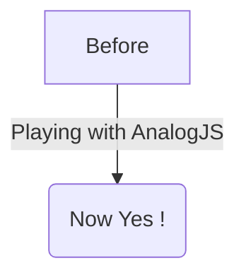

# Content Routes

Analog also supports using markdown content as routes, and rendering markdown content in components.

### Setup

In the `src/app/app.config.ts`, add the `provideContent()` function, along with the `withMarkdownRenderer()` feature to the `providers` array when bootstrapping the application.

```ts
import { ApplicationConfig } from '@angular/core';
import { provideContent, withMarkdownRenderer } from '@analogjs/content';

export const appConfig: ApplicationConfig = {
  providers: [
    // ... other providers
    provideContent(withMarkdownRenderer()),
  ],
};
```

## Defining Content Routes

Content routes include support for frontmatter, metatags, and syntax highlighting with PrismJS.

The example route below in `src/app/pages/about.md` defines an `/about` route.

```md
---
title: About
meta:
  - name: description
    content: About Page Description
  - property: og:title
    content: About
---

## About Analog

Analog is a meta-framework for Angular.

[Back Home](./)
```

### PrismJS Syntax Highlighting

Analog supports syntax highlighting with PrismJS. To enable syntax highlighting with `PrismJS`, add `withPrismHighlighter()` to the `provideContent()` function in `app.config.ts`.

```diff-ts
import { ApplicationConfig } from '@angular/core';
import { provideContent, withMarkdownRenderer } from '@analogjs/content';
+ import { withPrismHighlighter } from '@analogjs/content/prism-highlighter';

export const appConfig: ApplicationConfig = {
  providers: [
    // ... other providers
-   provideContent(withMarkdownRenderer()),
+   provideContent(withMarkdownRenderer(), withPrismHighlighter()),
  ],
};
```

Import a Prism theme into to your global stylesheet:

```css
@import 'prismjs/themes/prism.css';
```

#### Using the `diff` Highlight Plugin

Analog supports highlighting diff changes with PrismJS.

Add the `prism-diff` language to the `additionalLangs` in the `analog` plugin:

```ts
import { defineConfig } from 'vite';
import analog from '@analogjs/platform';

export default defineConfig({
  // ...
  plugins: [
    analog({
      content: {
        prismOptions: {
          additionalLangs: ['prism-diff'],
        },
      },
    }),
  ],
});
```

Add the `diff-highlight` plugin import to the `app.config.ts`:

```ts
import 'prismjs/plugins/diff-highlight/prism-diff-highlight';
```

Use the `diff` language tag to highlight them or
`diff-<language>` to highlight the diff changes in a specific language.

````md
```diff
- This is a sentence.
+ This is a longer sentence.
```

```diff-typescript
- const foo = 'bar';
+ const foo = 'baz';
```
````

To highlight changed line backgrounds instead of just the text, add this import to your global stylesheet:

```css
@import 'prismjs/plugins/diff-highlight/prism-diff-highlight.css';
```

### Shiki Syntax Highlighting

Analog also supports syntax highlighting with Shiki. To enable syntax highlighting with `Shiki`, add `withShikiHighlighter()` to the `provideContent()` function in `app.config.ts`.

```diff-ts
import { ApplicationConfig } from '@angular/core';
import { provideContent, withMarkdownRenderer } from '@analogjs/content';
+ import { withShikiHighlighter } from '@analogjs/content/shiki-highlighter';

export const appConfig: ApplicationConfig = {
  providers: [
    // ... other providers
-   provideContent(withMarkdownRenderer()),
+   provideContent(withMarkdownRenderer(), withShikiHighlighter()),
  ],
};
```

To enable build-time syntax highlighting with `shiki`, configure the `analog` plugin in the `vite.config.ts`.

```ts
import { defineConfig } from 'vite';
import analog from '@analogjs/platform';

export default defineConfig({
  // ...
  plugins: [
    analog({
      content: {
        highlighter: 'shiki',
      },
    }),
  ],
});
```

#### Configure Shiki Highlighter

> Please check out [Shiki Documentation](https://shiki.style/) for more information on configuring Shiki.

To configure Shiki, you can pass options to the `shikiOptions` object.

```ts
import { defineConfig } from 'vite';
import analog from '@analogjs/platform';

export default defineConfig({
  // ...
  plugins: [
    analog({
      content: {
        highlighter: 'shiki',
        shikiOptions: {
          highlight: {
            // alternate theme
            theme: 'ayu-dark'
          }
          highlighter: {
             // add more languages
            additionalLangs: ['mermaid'],
          },
        },
      },
    }),
  ],
});
```

By default, `shikiOptions` has the following options.

```ts
{
  "container": "%s",
  "highlight": {
    "theme": "github-dark"
  }
  "highlighter": {
    "langs": [
      "json",
      "ts",
      "tsx",
      "js",
      "jsx",
      "html",
      "css",
      "angular-html",
      "angular-ts",
    ],
    "themes": ["github-dark", "github-light"]
  }
}
```

## Defining Content Files

For more flexibility, markdown content files can be provided in the `src/content` folder. Here you can list markdown files such as blog posts.

```md
---
title: My First Post
slug: 2022-12-27-my-first-post
description: My First Post Description
coverImage: https://images.unsplash.com/photo-1493612276216-ee3925520721?ixlib=rb-4.0.3&ixid=MnwxMjA3fDB8MHxwaG90by1wYWdlfHx8fGVufDB8fHx8&auto=format&fit=crop&w=464&q=80
---

Hello World
```

## Using the Content Files List

To get a list using the list of content files in the `src/content` folder, use the `injectContentFiles<Attributes>(filterFn?: InjectContentFilesFilterFunction<Attributes>)` function from the `@analogjs/content` package in your component. To narrow the files, you can use the `filterFn` predicate function as an argument. You can use the `InjectContentFilesFilterFunction<T>` type to set up your predicate.

```ts
import { Component } from '@angular/core';
import { RouterLink, RouterOutlet } from '@angular/router';
import { injectContentFiles } from '@analogjs/content';
import { NgFor } from '@angular/common';

export interface PostAttributes {
  title: string;
  slug: string;
  description: string;
  coverImage: string;
}

@Component({
  standalone: true,
  imports: [RouterOutlet, RouterLink, NgFor],
  template: `
    <ul>
      <li *ngFor="let post of posts">
        <a [routerLink]="['/blog', 'posts', post.slug]">{{
          post.attributes.title
        }}</a>
      </li>
    </ul>
  `,
})
export default class BlogComponent {
  readonly posts = injectContentFiles<PostAttributes>((contentFile) =>
    contentFile.filename.includes('/src/content/blog/'),
  );
}
```

## Using the Analog Markdown Component

Analog provides a `MarkdownComponent` and `injectContent()` function for rendering markdown content with frontmatter.

The `injectContent()` function uses the `slug` route parameter by default to get the content file from the `src/content` folder.

```ts
// /src/app/pages/blog/posts.[slug].page.ts
import { injectContent, MarkdownComponent } from '@analogjs/content';
import { AsyncPipe, NgIf } from '@angular/common';
import { Component } from '@angular/core';

export interface PostAttributes {
  title: string;
  slug: string;
  description: string;
  coverImage: string;
}

@Component({
  standalone: true,
  imports: [MarkdownComponent, AsyncPipe, NgIf],
  template: `
    <ng-container *ngIf="post$ | async as post">
      <h1>{{ post.attributes.title }}</h1>
      <analog-markdown [content]="post.content"></analog-markdown>
    </ng-container>
  `,
})
export default class BlogPostComponent {
  readonly post$ = injectContent<PostAttributes>();
}
```

### MDX Support

Analog supports MDX (Markdown with JSX) out of the box, allowing you to embed Angular components directly in your Markdown content. This enables interactive documentation and rich content experiences.

### Using Components in Markdown

You can include Angular components directly in your Markdown files:

```md title="example.md - Using components in Markdown"
---
title: Interactive Example
---

# My Interactive Page

Here's a regular paragraph.

<my-custom-component [data]="someData">
This content will be passed to the component
</my-custom-component>

And here's more markdown content.
```

### Registering Components

To use components in your Markdown files, register them with the content provider:

```ts
import { ApplicationConfig } from '@angular/core';
import { provideContent, withMarkdownRenderer } from '@analogjs/content';
import { MyCustomComponent } from './components/my-custom.component';

export const appConfig: ApplicationConfig = {
  providers: [
    provideContent(
      withMarkdownRenderer({
        components: {
          'my-custom-component': MyCustomComponent,
        },
      }),
    ),
  ],
};
```

### Component Inputs and Outputs

Components used in Markdown support inputs and outputs just like regular Angular components:

```md
<!-- Pass data to component inputs -->

<alert-box type="warning" [dismissible]="true">
This is a warning message that can be dismissed.
</alert-box>

<!-- Components can emit events -->

<interactive-demo (valueChanged)="onValueChange($event)">
Interactive content here
</interactive-demo>
```

## Using A Resolver For Metatags

In your route configuration, you can use the `RouteMeta` object to resolve meta tags for a route. This is done by assigning the `postMetaResolver` function to the `meta` property.

Below is an example of using a `postMetaResolver` function that fetches the meta tags for a post. This function returns an array of meta tags.

```ts
export const postMetaResolver: ResolveFn<MetaTag[]> = (route) => {
  const postAttributes = injectActivePostAttributes(route);

  return [
    {
      name: 'description',
      content: postAttributes.description,
    },
    {
      name: 'author',
      content: 'Analog Team',
    },
    {
      property: 'og:title',
      content: postAttributes.title,
    },
    {
      property: 'og:description',
      content: postAttributes.description,
    },
    {
      property: 'og:image',
      content: postAttributes.coverImage,
    },
  ];
};
```

The meta tags can be done asynchronously also. Assign the `postMetaResolver` function to the `meta` property.

```ts
export const routeMeta: RouteMeta = {
  title: postTitleResolver,
  meta: postMetaResolver,
};
```

The resolved meta tags can also be accessed in the component using the `ActivatedRoute` service.

```ts
export default class BlogPostComponent {
  readonly route = inject(ActivatedRoute);
  readonly metaTags$ = this.route.data.pipe(map(data => data['meta']));

  // In the template
  <my-component [metaTags]="metaTags$ | async"></my-component>
}
```

### Enabling support for Mermaid

Analog's markdown component supports [Mermaid](https://mermaid.js.org/). To enable support by the `MarkdownComponent` define a dynamic import for `loadMermaid` in `withMarkdownRenderer()`.

```ts
withMarkdownRenderer({
  loadMermaid: () => import('mermaid'),
});
```

After it is enabled, Mermaid blocks are transformed by mermaid into SVGs.

Example of mermaid graph:



## Support for Content Subdirectories

Analog also supports subdirectories within your content folder.

The `injectContent()` function can also be used with an object that contains the route parameter and subdirectory name.

This can be useful if, for instance, you have blog posts, as well as a portfolio of project markdown files to be used on the site.

```treeview
src/
└── app/
│   └── pages/
│       └── project.[slug].page.ts
└── content/
    ├── posts/
    │   ├── my-first-post.md
    │   └── my-second-post.md
    └── projects/
        ├── my-first-project.md
        └── my-second-project.md
```

```ts
// /src/app/pages/project.[slug].page.ts
import { injectContent, MarkdownComponent } from '@analogjs/content';
import { AsyncPipe, NgIf } from '@angular/common';
import { Component } from '@angular/core';

export interface ProjectAttributes {
  title: string;
  slug: string;
  description: string;
  coverImage: string;
}

@Component({
  standalone: true,
  imports: [MarkdownComponent, AsyncPipe, NgIf],
  template: `
    <ng-container *ngIf="project$ | async as project">
      <h1>{{ project.attributes.title }}</h1>
      <analog-markdown [content]="project.content"></analog-markdown>
    </ng-container>
  `,
})
export default class ProjectComponent {
  readonly project$ = injectContent<ProjectAttributes>({
    param: 'slug',
    subdirectory: 'projects',
  });
}
```

## Loading Custom Content

By default, Analog uses the route params to build the filename for retrieving a content file from the `src/content` folder. Analog also supports using a custom filename for retrieving content from the `src/content` folder. This can be useful if, for instance, you have a custom markdown file that you want to load on a page.

The `injectContent()` function can be used by passing an object that contains the `customFilename` property.

```ts
readonly post$ = injectContent<ProjectAttributes>({
  customFilename: 'path/to/custom/file',
});
```

## Content Collections

Content collections allow you to organize and query content files programmatically. This is particularly useful for building blogs, documentation sites, or any content-driven application where you need to work with multiple related content files.

### Defining Content Collections

Collections are defined by organizing content files in structured directories within your `src/content` folder:

```treeview
src/
└── content/
    ├── blog/
    │   ├── post-1.md
    │   ├── post-2.md
    │   └── post-3.md
    ├── docs/
    │   ├── getting-started.md
    │   ├── routing.md
    │   └── deployment.md
    └── projects/
        ├── project-a.md
        └── project-b.md
```

### Querying Collections

Use the `injectContentFiles()` function to get all files from a specific collection:

```ts
import { Component } from '@angular/core';
import { injectContentFiles } from '@analogjs/content';

export interface BlogPostAttributes {
  title: string;
  description: string;
  publishDate: string;
  tags: string[];
}

@Component({
  standalone: true,
  template: `
    <div class="blog-posts">
      @for (post of blogPosts; track post.filename) {
        <article>
          <h2>{{ post.attributes.title }}</h2>
          <p>{{ post.attributes.description }}</p>
          <time>{{ post.attributes.publishDate }}</time>
        </article>
      }
    </div>
  `,
})
export default class BlogListComponent {
  readonly blogPosts = injectContentFiles<BlogPostAttributes>((contentFile) =>
    contentFile.filename.includes('/src/content/blog/'),
  );
}
```

### Filtering and Sorting Collections

You can filter and sort collections based on frontmatter attributes:

```ts
import { Component, computed } from '@angular/core';
import { injectContentFiles } from '@analogjs/content';

@Component({
  template: `
    <div class="featured-posts">
      @for (post of featuredPosts(); track post.filename) {
        <article class="featured-post">
          <h2>{{ post.attributes.title }}</h2>
          <p>{{ post.attributes.description }}</p>
        </article>
      }
    </div>
  `,
})
export default class FeaturedPostsComponent {
  private readonly allPosts = injectContentFiles<BlogPostAttributes>(
    (contentFile) => contentFile.filename.includes('/src/content/blog/'),
  );

  readonly featuredPosts = computed(() =>
    this.allPosts()
      .filter((post) => post.attributes.featured)
      .sort(
        (a, b) =>
          new Date(b.attributes.publishDate).getTime() -
          new Date(a.attributes.publishDate).getTime(),
      ),
  );
}
```

### Collection Metadata

Each content file in a collection includes metadata about the file:

```ts
interface ContentFile<T = Record<string, any>> {
  filename: string;
  slug: string;
  attributes: T;
  content: string;
}
```

- **`filename`**: Full path to the content file
- **`slug`**: URL-friendly identifier derived from the filename
- **`attributes`**: Frontmatter data parsed as an object
- **`content`**: Raw markdown content
