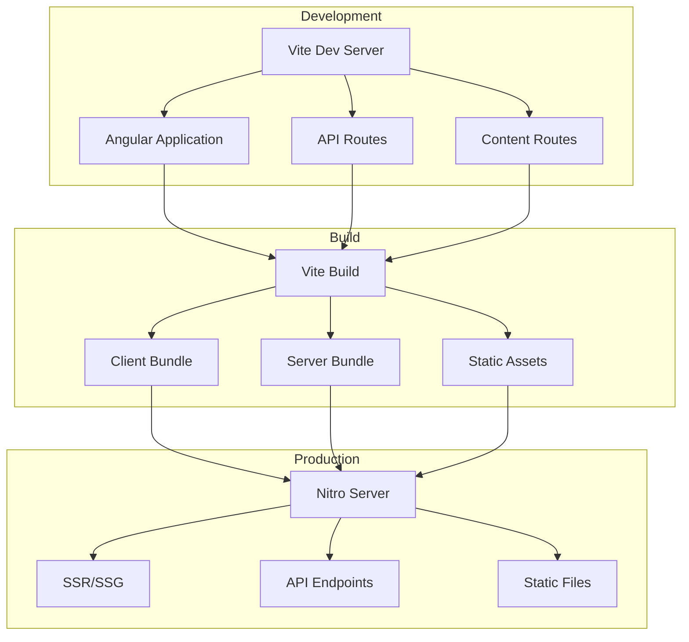

# Introduction

Analog is a fullstack meta-framework for building applications and websites with [Angular](https://angular.dev).

Similar to other meta-frameworks such as Next.JS, Nuxt, SvelteKit, Qwik City, and others, Analog provides a similar experience, building on top of Angular.

## What is Analog?

Analog is a meta-framework that enhances Angular with modern development capabilities:

- **Modern Tooling**: Built on [Vite](https://vitejs.dev/) for lightning-fast development
- **Full-Stack**: Seamlessly integrate frontend and backend code
- **File-Based Routing**: Intuitive routing based on your file structure
- **Server-Side Rendering**: Built-in SSR/SSG capabilities powered by [Nitro](https://nitro.unjs.io)
- **Content-First**: Native support for Markdown and MDX content
- **API Routes**: Build backend APIs alongside your Angular app
- **Developer Experience**: Hot Module Replacement, TypeScript support, and more

## Core Features

### 🚀 Modern Development Stack

- **Vite**: Lightning-fast HMR and optimized builds
- **Vitest**: Unit testing with native Vite support
- **Playwright**: E2E testing framework
- **TypeScript**: First-class TypeScript support

### 📁 File-Based Routing

- [Automatic route generation](/docs/features/routing/overview) from your file structure
- [Route metadata](/docs/features/routing/metadata) for SEO and page configuration

### 🌐 Server-Side Capabilities

- [Server-side rendering (SSR)](/docs/features/server/server-side-rendering)
- [Static site generation (SSG)](/docs/features/server/static-site-generation)
- [Hybrid rendering modes](/docs/features/server/hybrid-rendering)
- [API routes](/docs/features/api/overview) with full HTTP method support
- [WebSocket support](/docs/features/api/websockets)

### 📝 Content Management

- [Markdown routes](/docs/features/routing/content) for documentation and blogs
- [MDX support](/docs/features/routing/content#mdx-support) for interactive content
- [Syntax highlighting](/docs/packages/content/shiki-highlighter) with Shiki
- [Content collections](/docs/features/routing/content#content-collections)

### 🔌 Integrations

- [Angular CLI](/docs/getting-started#angular-cli) support
- [Nx workspaces](/docs/integrations/nx) for monorepo development
- [Angular Material](/docs/integrations/angular-material) integration
- [Ionic Framework](/docs/integrations/ionic) support
- [Storybook](/docs/integrations/storybook) for component development
- [Astro](/docs/packages/astro-angular/overview) for using Angular components

## Quick Links

  <a href="/docs/getting-started" className="quick-link-card">
    

      <h3>🚀 Getting Started</h3>
      
Create your first Analog application in minutes

    

  </a>
  
  <a href="/docs/features/routing/overview" className="quick-link-card">
    

      <h3>🛣️ Routing Guide</h3>
      
Learn about file-based routing and layouts

    

  </a>
  
  <a href="/docs/features/api/overview" className="quick-link-card">
    

      <h3>🔌 API Routes</h3>
      
Build backend APIs with Analog

    

  </a>
  
  <a href="/docs/features/deployment/overview" className="quick-link-card">
    

      <h3>🚢 Deployment</h3>
      
Deploy to production platforms

    

  </a>

## Why Analog?

### For Angular Developers

If you're already using Angular, Analog provides:

- Modern development experience with Vite
- Built-in SSR/SSG without complex configuration
- File-based routing similar to other meta-frameworks
- Seamless integration with existing Angular knowledge

### For Full-Stack Development

- Write frontend and backend code in the same project
- Share types between client and server
- Unified deployment process
- Built-in API route handling

### For Content Sites

- Native Markdown/MDX support
- Optimized static site generation
- SEO-friendly by default
- Fast page loads with Vite optimization

## Architecture Overview

## Community & Support

  <a href="https://github.com/analogjs/analog" className="community-link">
    ⭐
    Star on GitHub
  </a>
  
  <a href="https://chat.analogjs.org" className="community-link">
    💬
    Join Discord
  </a>
  
  <a href="https://twitter.com/analogjs" className="community-link">
    🐦
    Follow on Twitter
  </a>
  
  <a href="/docs/sponsoring" className="community-link">
    ❤️
    Become a Sponsor
  </a>

## Next Steps

Ready to get started? Check out our [Getting Started Guide](/docs/getting-started) to create your first Analog application!
