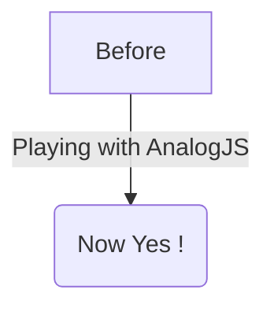

# Inhaltliche Routen

Analog unterstützt auch die Verwendung von Markdown-Inhalten als Routen und das Rendern von Markdown-Inhalten in Komponenten.

### Einrichtung

Fügen in der Datei `src/app/app.config.ts` die Funktion `provideContent()` zusammen mit der Funktion `withMarkdownRenderer()` in das Array `providers` ein.

```ts
import { ApplicationConfig } from '@angular/core';
import { provideContent, withMarkdownRenderer } from '@analogjs/content';

export const appConfig: ApplicationConfig = {
  providers: [
    // ... other providers
    provideContent(withMarkdownRenderer()),
  ],
};
```

## Definieren von Inhaltsrouten

Die Inhaltsrouten unterstützen Frontmatter, Metatags und Syntaxhervorhebung mit PrismJS.

Die Beispielroute unten in `src/app/pages/about.md` definiert eine `/about`-Route.

```md
---
title: About
meta:
  - name: description
    content: About Page Description
  - property: og:title
    content: About
---

## About Analog

Analog is a meta-framework for Angular.

[Back Home](./)
```

### PrismJS-Syntaxhervorhebung

Analog unterstützt die Syntaxhervorhebung mit PrismJS. Um die Syntaxhervorhebung mit `PrismJS` zu aktivieren, füge `withPrismHighlighter()` zur Funktion `provideContent()` in `app.config.ts` hinzu.

```diff-ts
import { ApplicationConfig } from '@angular/core';
import { provideContent, withMarkdownRenderer } from '@analogjs/content';
+ import { withPrismHighlighter } from '@analogjs/content/prism-highlighter';

export const appConfig: ApplicationConfig = {
  providers: [
    // ... other providers
-   provideContent(withMarkdownRenderer()),
+   provideContent(withMarkdownRenderer(), withPrismHighlighter()),
  ],
};
```

#### Verwendung des `diff` Highlight Plugins

Analog unterstützt das Hervorheben von Diff-Änderungen mit PrismJS.

Füge die Sprache `prism-diff` zu den `additionalLangs` im Plugin `analog` hinzu:

```ts
import { defineConfig } from 'vite';
import analog from '@analogjs/platform';

export default defineConfig({
  // ...
  plugins: [
    analog({
      content: {
        prismOptions: {
          additionalLangs: ['prism-diff'],
        },
      },
    }),
  ],
});
```

Fügen den Plugin-Import `diff-highlight` in die `app.config.ts` ein:

```ts
import 'prismjs/plugins/diff-highlight/prism-diff-highlight';
```

Verwenden den `diff` language tag, um es hervorzuheben oder
`diff-<language>`, um die Diff-Änderungen in einer bestimmten Sprache hervorzuheben.

````md
```diff
- This is a sentence.
+ This is a longer sentence.
```

```diff-typescript
- const foo = 'bar';
+ const foo = 'baz';
```
````

Um geänderte Zeilenhintergründe und nicht nur den Text hervorzuheben, fügen Sie diesen Import in Ihr globales Stylesheet ein:

```css
@import 'prismjs/plugins/diff-highlight/prism-diff-highlight.css';
```

### Shiki Syntax-Hervorhebung

Analog unterstützt auch die Syntaxhervorhebung mit Shiki. Um die Syntaxhervorhebung mit `Shiki` zu aktivieren, füge `withShikiHighlighter()` zur Funktion `provideContent()` in `app.config.ts` hinzu.

```diff-ts
import { ApplicationConfig } from '@angular/core';
import { provideContent, withMarkdownRenderer } from '@analogjs/content';
+ import { withShikiHighlighter } from '@analogjs/content/shiki-highlighter';

export const appConfig: ApplicationConfig = {
  providers: [
    // ... other providers
-   provideContent(withMarkdownRenderer()),
+   provideContent(withMarkdownRenderer(), withShikiHighlighter()),
  ],
};
```

Um die Syntaxhervorhebung mit `shiki` zu aktivieren, konfiguriere das Plugin `analog` in der `vite.config.ts`.

```ts
import { defineConfig } from 'vite';
import analog from '@analogjs/platform';

export default defineConfig({
  // ...
  plugins: [
    analog({
      content: {
        highlighter: 'shiki',
      },
    }),
  ],
});
```

#### Shiki Highlighter konfigurieren

> Weitere Informationen zur Konfiguration von Shiki findest du unter [Shiki-Dokumentation] (https://shiki.style/).

Um Shiki zu konfigurieren, können Optionen an das Objekt `shikiOptions` übergeben werden.

```ts
import { defineConfig } from 'vite';
import analog from '@analogjs/platform';

export default defineConfig({
  // ...
  plugins: [
    analog({
      content: {
        highlighter: 'shiki',
        shikiOptions: {
          highlight: {
            // alternate theme
            theme: 'ayu-dark'
          }
          highlighter: {
             // add more languages
            additionalLangs: ['mermaid'],
          },
        },
      },
    }),
  ],
});
```

Standardmäßig hat `shikiOptions` die folgenden Optionen.

```ts
{
  "container": "%s",
  "highlight": {
    "theme": "github-dark"
  }
  "highlighter": {
    "langs": [
      "json",
      "ts",
      "tsx",
      "js",
      "jsx",
      "html",
      "css",
      "angular-html",
      "angular-ts",
    ],
    "themes": ["github-dark", "github-light"]
  }
}
```

## Definieren von Inhaltsdateien

Für mehr Flexibilität können Markdown-Inhaltsdateien im Ordner `src/content` bereitgestellt werden. Hier könne Markdown-Dateien wie z. B. Blogbeiträge auflistet werden.

```md
---
title: My First Post
slug: 2022-12-27-my-first-post
description: My First Post Description
coverImage: https://images.unsplash.com/photo-1493612276216-ee3925520721?ixlib=rb-4.0.3&ixid=MnwxMjA3fDB8MHxwaG90by1wYWdlfHx8fGVufDB8fHx8&auto=format&fit=crop&w=464&q=80
---

Hello World
```

## Verwendung der Liste der Inhaltsdateien

Um eine Liste mit der Inhaltsdateien im Ordner `src/content` zu erhalten, verwende die Funktion `injectContentFiles<Attributes>(filterFn?: InjectContentFilesFilterFunction<Attributes>)` aus dem Paket `@analogjs/content` in der Komponente. Um die Dateien einzugrenzen, kann die Prädikatsfunktion `filterFn` als Argument verwendet werden. Du kannst den Typ `InjectContentFilesFilterFunction<T>` verwenden, um Ihr Prädikat einzurichten.

```ts
import { Component } from '@angular/core';
import { RouterLink, RouterOutlet } from '@angular/router';
import { injectContentFiles } from '@analogjs/content';
import { NgFor } from '@angular/common';

export interface PostAttributes {
  title: string;
  slug: string;
  description: string;
  coverImage: string;
}

@Component({
  standalone: true,
  imports: [RouterOutlet, RouterLink, NgFor],
  template: `
    <ul>
      <li *ngFor="let post of posts">
        <a [routerLink]="['/blog', 'posts', post.slug]">{{
          post.attributes.title
        }}</a>
      </li>
    </ul>
  `,
})
export default class BlogComponent {
  readonly posts = injectContentFiles<PostAttributes>((contentFile) =>
    contentFile.filename.includes('/src/content/blog/'),
  );
}
```

## Verwendung der Analog Markdown-Komponente

Analog bietet eine `MarkdownComponent` und `injectContent()` Funktion für die Darstellung von Markdown-Inhalten mit Frontmatter.

Die Funktion `injectContent()` verwendet standardmäßig den Routenparameter `slug`, um die Inhaltsdatei aus dem Ordner `src/content` zu holen.

```ts
// /src/app/pages/blog/posts.[slug].page.ts
import { injectContent, MarkdownComponent } from '@analogjs/content';
import { AsyncPipe, NgIf } from '@angular/common';
import { Component } from '@angular/core';

export interface PostAttributes {
  title: string;
  slug: string;
  description: string;
  coverImage: string;
}

@Component({
  standalone: true,
  imports: [MarkdownComponent, AsyncPipe, NgIf],
  template: `
    <ng-container *ngIf="post$ | async as post">
      <h1>{{ post.attributes.title }}</h1>
      <analog-markdown [content]="post.content"></analog-markdown>
    </ng-container>
  `,
})
export default class BlogPostComponent {
  readonly post$ = injectContent<PostAttributes>();
}
```

### Einen Resolver für Metatags verwenden

In Ihrer Routenkonfiguration kann das Objekt `RouteMeta` verwendet werden, um Meta-Tags für eine Route aufzulösen. Dies geschieht, indem der Eigenschaft `meta` die Funktion `postMetaResolver` zugewiesen wird.

Nachfolgend ein Beispiel für die Verwendung einer Funktion `postMetaResolver`, die die Meta-Tags für einen Beitrag abruft. Diese Funktion gibt ein Array von Meta-Tags zurück.

```ts
export const postMetaResolver: ResolveFn<MetaTag[]> = (route) => {
  const postAttributes = injectActivePostAttributes(route);

  return [
    {
      name: 'description',
      content: postAttributes.description,
    },
    {
      name: 'author',
      content: 'Analog Team',
    },
    {
      property: 'og:title',
      content: postAttributes.title,
    },
    {
      property: 'og:description',
      content: postAttributes.description,
    },
    {
      property: 'og:image',
      content: postAttributes.coverImage,
    },
  ];
};
```

Die Meta-Tags können auch asynchron erstellt werden. Weise dafür die Funktion `postMetaResolver` der Eigenschaft `meta` zu.

```ts
export const routeMeta: RouteMeta = {
  title: postTitleResolver,
  meta: postMetaResolver,
};
```

Auf die aufgelösten Meta-Tags kann in der Komponente auch über den Dienst `ActivatedRoute` zugegriffen werden.

```ts
export default class BlogPostComponent {
  readonly route = inject(ActivatedRoute);
  readonly metaTags$ = this.route.data.pipe(map(data => data['meta']));

  // In the template
  <my-component [metaTags]="metaTags$ | async"></my-component>
}
```

### Unterstützung für Mermaid aktivieren

Die Markdown-Komponente von Analog unterstützen [Mermaid] (https://mermaid.js.org/). Um die Unterstützung durch die `MarkdownComponent` zu aktivieren, definiere einen dynamischen Import für `loadMermaid` in `withMarkdownRenderer()`.

```ts
withMarkdownRenderer({
  loadMermaid: () => import('mermaid'),
});
```

Nach der Aktivierung werden Mermaid Blöcke von Mermaid in SVGs umgewandelt.

Beispiel für ein Mermaid-Diagramm:



## Unterstützung für Inhaltsunterverzeichnisse

Analog unterstützt auch Unterverzeichnisse innerhalb des Inhaltsordners.

Die Funktion `injectContent()` kann auch mit einem Objekt verwendet werden, das den Routenparameter und den Namen des Unterverzeichnisses enthält.

Dies kann nützlich sein, wenn z.B. Blog-Posts sowie ein Portfolio von Projekten als Markdown-Dateien vorhanden sind, die auf der Website verwendet werden sollen.

```treeview
src/
└── app/
│   └── pages/
│       └── project.[slug].page.ts
└── content/
    ├── posts/
    │   ├── my-first-post.md
    │   └── my-second-post.md
    └── projects/
        ├── my-first-project.md
        └── my-second-project.md
```

```ts
// /src/app/pages/project.[slug].page.ts
import { injectContent, MarkdownComponent } from '@analogjs/content';
import { AsyncPipe, NgIf } from '@angular/common';
import { Component } from '@angular/core';

export interface ProjectAttributes {
  title: string;
  slug: string;
  description: string;
  coverImage: string;
}

@Component({
  standalone: true,
  imports: [MarkdownComponent, AsyncPipe, NgIf],
  template: `
    <ng-container *ngIf="project$ | async as project">
      <h1>{{ project.attributes.title }}</h1>
      <analog-markdown [content]="project.content"></analog-markdown>
    </ng-container>
  `,
})
export default class ProjectComponent {
  readonly project$ = injectContent<ProjectAttributes>({
    param: 'slug',
    subdirectory: 'projects',
  });
}
```

## Laden benutzerdefinierter Inhalte

Standardmäßig verwendet Analog die Route-Parameter, um den Dateinamen für den Abruf einer Inhaltsdatei aus dem Ordner `src/content` zu erstellen. Analog unterstützt auch die Verwendung eines benutzerdefinierten Dateinamens für das Abrufen von Inhalten aus dem Ordner `src/content`. Dies kann nützlich sein, wenn es zum Beispiel eine benutzerdefinierte Markdown-Datei gibt, die auf einer Seite geladen werden soll.

Die Funktion `injectContent()` kann verwendet werden, indem ein Objekt übergeben wird, das die Eigenschaft `customFilename` enthält.

```ts
readonly post$ = injectContent<ProjectAttributes>({
  customFilename: 'path/to/custom/file',
});
```
