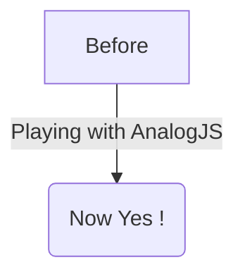

import Tabs from '@theme/Tabs';
import TabItem from '@theme/TabItem';

# Rutas de Contenido

Analog también soporta el uso de contenido en markdown como rutas y la renderización de contenido en componentes.

### Configuración

En el archivo `src/app/app.config.ts`, añade la función `provideContent()` junto con la característica `withMarkdownRenderer()` al arreglo de `providers` al iniciar la aplicación.

```ts
import { ApplicationConfig } from '@angular/core';
import { provideContent, withMarkdownRenderer } from '@analogjs/content';

export const appConfig: ApplicationConfig = {
  providers: [
    // ... otros proveedores
    provideContent(withMarkdownRenderer()),
  ],
};
```

## Definiendo Rutas de Contenido

Las rutas de contenido incluyen soporte para frontmatter, metatags y resaltado de sintaxis con PrismJS.

El ejemplo de ruta a continuación en `src/app/pages/about.md` define una ruta `/about`.

```md
---
title: About
meta:
  - name: description
    content: About Page Description
  - property: og:title
    content: About
---

## About Analog

Analog is a meta-framework for Angular.

[Back Home](./)
```

### Resaltado de Sintaxis con PrismJS

Analog soporta el resaltado de sintaxis con PrismJS. Para habilitar el resaltado de sintaxis con `PrismJS`, añade `withPrismHighlighter()` a la función `provideContent()` en `app.config.ts`.

```diff-ts
import { ApplicationConfig } from '@angular/core';
import { provideContent, withMarkdownRenderer } from '@analogjs/content';
+ import { withPrismHighlighter } from '@analogjs/content/prism-highlighter';

export const appConfig: ApplicationConfig = {
  providers: [
    // ... otros proveedores
-   provideContent(withMarkdownRenderer()),
+   provideContent(withMarkdownRenderer(), withPrismHighlighter()),
  ],
};
```

Importa un tema de Prism en tu hoja de estilos global:

```css
@import 'prismjs/themes/prism.css';
```

#### Usando el Plugin de Resaltado `diff`

Analog soporta el resaltado de cambios en diffs con PrismJS.

Añade el lenguaje `prism-diff` a `additionalLangs` en el plugin `analog`:

```ts
import { defineConfig } from 'vite';
import analog from '@analogjs/platform';

export default defineConfig({
  // ...
  plugins: [
    analog({
      content: {
        prismOptions: {
          additionalLangs: ['prism-diff'],
        },
      },
    }),
  ],
});
```

Añade la importación del plugin `diff-highlight` al `app.config.ts`:

```ts
import 'prismjs/plugins/diff-highlight/prism-diff-highlight';
```

Usa la etiqueta de lenguaje `diff` para resaltar o `diff-<language>` para resaltar los cambios de diffs en un lenguaje específico.

````md
```diff
- This is a sentence.
+ This is a longer sentence.
```

```diff-typescript
- const foo = 'bar';
+ const foo = 'baz';
```
````

Para resaltar los fondos de las líneas cambiadas en lugar de solo el texto, añade esta importación a tu hoja de estilos global:

```css
@import 'prismjs/plugins/diff-highlight/prism-diff-highlight.css';
```

### Resaltado de Sintaxis con Shiki

Analog también soporta el resaltado de sintaxis con Shiki. Para habilitar el resaltado de sintaxis con `Shiki`, añade `withShikiHighlighter()` a la función `provideContent()` en `app.config.ts`.

```diff-ts
import { ApplicationConfig } from '@angular/core';
import { provideContent, withMarkdownRenderer } from '@analogjs/content';
+ import { withShikiHighlighter } from '@analogjs/content/shiki-highlighter';

export const appConfig: ApplicationConfig = {
  providers: [
    // ... otros proveedores
-   provideContent(withMarkdownRenderer()),
+   provideContent(withMarkdownRenderer(), withShikiHighlighter()),
  ],
};
```

Para habilitar el resaltado de sintaxis en tiempo de compilación con `shiki`, configura el plugin `analog` en el `vite.config.ts`.

```ts
import { defineConfig } from 'vite';
import analog from '@analogjs/platform';

export default defineConfig({
  // ...
  plugins: [
    analog({
      content: {
        highlighter: 'shiki',
      },
    }),
  ],
});
```

#### Configurar el Resaltador Shiki

> Por favor, consulta la [Documentación de Shiki](https://shiki.style/) para más información sobre la configuración de Shiki.

Para configurar Shiki, puedes pasar opciones al objeto `shikiOptions`.

```ts
import { defineConfig } from 'vite';
import analog from '@analogjs/platform';

export default defineConfig({
  // ...
  plugins: [
    analog({
      content: {
        highlighter: 'shiki',
        shikiOptions: {
          highlight: {
            // tema alternativo
            theme: 'ayu-dark'
          }
          highlighter: {
             // añadir más lenguajes
            additionalLangs: ['mermaid'],
          },
        },
      },
    }),
  ],
});
```

Por defecto, `shikiOptions` tiene las siguientes opciones.

```ts
{
  "container": "%s",
  "highlight": {
    "theme": "github-dark"
  }
  "highlighter": {
    "langs": [
      "json",
      "ts",
      "tsx",
      "js",
      "jsx",
      "html",
      "css",
      "angular-html",
      "angular-ts",
    ],
    "themes": ["github-dark", "github-light"]
  }
}
```

## Definiendo Archivos de Contenido

Para mayor flexibilidad, los archivos de contenido en markdown pueden proporcionarse en la carpeta `src/content`. Aquí puedes listar archivos markdown como entradas de blog.

```md
---
title: My First Post
slug: 2022-12-27-my-first-post
description: My First Post Description
coverImage: https://images.unsplash.com/photo-1493612276216-ee3925520721?ixlib=rb-4.0.3&ixid=MnwxMjA3fDB8MHxwaG90by1wYWdlfHx8fGVufDB8fHx8&auto=format&fit=crop&w=464&q=80
---

Hello World
```

## Usando la Lista de Archivos de Contenido

Para obtener una lista usando los archivos de contenido en la carpeta `src/content`, usa la función `injectContentFiles<Attributes>(filterFn?: InjectContentFilesFilterFunction<Attributes>)` del paquete `@analogjs/content` en tu componente. Para filtrar los archivos, puedes usar la función predicado `filterFn` como argumento. Puedes usar el tipo `InjectContentFilesFilterFunction<T>` para configurar tu predicado.

```ts
import { Component } from '@angular/core';
import { RouterLink, RouterOutlet } from '@angular/router';
import { injectContentFiles } from '@analogjs/content';
import { NgFor } from '@angular/common';

export interface PostAttributes {
  title: string;
  slug: string;
  description: string;
  coverImage: string;
}

@Component({
  standalone: true,
  imports: [RouterOutlet, RouterLink, NgFor],
  template: `
    <ul>
      <li *ngFor="let post of posts">
        <a [routerLink]="['/blog', 'posts', post.slug]">{{
          post.attributes.title
        }}</a>
      </li>
    </ul>
  `,
})
export default class BlogComponent {
  readonly posts = injectContentFiles<PostAttributes>((contentFile) =>
    contentFile.filename.includes('/src/content/blog/'),
  );
}
```

## Usando el Componente Markdown de Analog

Analog provee un `MarkdownComponent` y la función `injectContent()` para renderizar contenido en markdown con frontmatter.

La función `injectContent()` usa el parámetro de ruta `slug` por defecto para obtener el archivo de contenido de la carpeta `src/content`.

```ts
// /src/app/pages/blog/posts.[slug].page.ts
import { injectContent, MarkdownComponent } from '@analogjs/content';
import { AsyncPipe, NgIf } from '@angular/common';
import { Component } from '@angular/core';

export interface PostAttributes {
  title: string;
  slug: string;
  description: string;
  coverImage: string;
}

@Component({
  standalone: true,
  imports: [MarkdownComponent, AsyncPipe, NgIf],
  template: `
    <ng-container *ngIf="post$ | async as post">
      <h1>{{ post.attributes.title }}</h1>
      <analog-markdown [content]="post.content"></analog-markdown>
    </ng-container>
  `,
})
export default class BlogPostComponent {
  readonly post$ = injectContent<PostAttributes>();
}
```

### Usando un Resolver para Metatags

En tu configuración de rutas, puedes usar el objeto `RouteMeta` para resolver metatags para una ruta. Esto se hace asignando la función `postMetaResolver` a la propiedad `meta`.

A continuación se muestra un ejemplo de uso de una función `postMetaResolver` que obtiene los metatags para una entrada. Esta función retorna un arreglo de metatags.

```ts
export const postMetaResolver: ResolveFn<MetaTag[]> = (route) => {
  const postAttributes = injectActivePostAttributes(route);

  return [
    {
      name: 'description',
      content: postAttributes.description,
    },
    {
      name: 'author',
      content: 'Analog Team',
    },
    {
      property: 'og:title',
      content: postAttributes.title,
    },
    {
      property: 'og:description',
      content: postAttributes.description,
    },
    {
      property: 'og:image',
      content: postAttributes.coverImage,
    },
  ];
};
```

Los metatags también pueden ser resueltos de forma asíncrona. Asigna la función `postMetaResolver` a la propiedad `meta`.

```ts
export const routeMeta: RouteMeta = {
  title: postTitleResolver,
  meta: postMetaResolver,
};
```

Los metatags resueltos también pueden ser accedidos en el componente usando el servicio `ActivatedRoute`.

```ts
export default class BlogPostComponent {
  readonly route = inject(ActivatedRoute);
  readonly metaTags$ = this.route.data.pipe(map(data => data['meta']));

  // En la plantilla
  <my-component [metaTags]="metaTags$ | async"></my-component>
}
```

### Habilitando el Soporte para Mermaid

El componente markdown de Analog soporta [Mermaid](https://mermaid.js.org/). Para habilitar el soporte por el `MarkdownComponent`, define una importación dinámica para `loadMermaid` en `withMarkdownRenderer()`.

```ts
withMarkdownRenderer({
  loadMermaid: () => import('mermaid'),
});
```

Después de habilitarlo, los bloques de Mermaid son transformados por mermaid en SVGs.

Ejemplo de gráfico Mermaid:



## Soporte para Subdirectorios de Contenido

Analog también soporta subdirectorios dentro de tu carpeta de contenido.

La función `injectContent()` también puede ser usada con un objeto que contiene el parámetro de ruta y el nombre del subdirectorio.

Esto puede ser útil si, por ejemplo, tienes entradas de blog, así como un portafolio de archivos markdown de proyectos para ser usados en el sitio.

```treeview
src/
└── app/
    └── pages/
        └── project.[slug].page.ts
└── content/
    ├── posts/
    │   ├── my-first-post.md
    │   └── my-second-post.md
    └── projects/
        ├── my-first-project.md
        └── my-second-project.md
```

```ts
// /src/app/pages/project.[slug].page.ts
import { injectContent, MarkdownComponent } from '@analogjs/content';
import { AsyncPipe, NgIf } from '@angular/common';
import { Component } from '@angular/core';

export interface ProjectAttributes {
  title: string;
  slug: string;
  description: string;
  coverImage: string;
}

@Component({
  standalone: true,
  imports: [MarkdownComponent, AsyncPipe, NgIf],
  template: `
    <ng-container *ngIf="project$ | async as project">
      <h1>{{ project.attributes.title }}</h1>
      <analog-markdown [content]="project.content"></analog-markdown>
    </ng-container>
  `,
})
export default class ProjectComponent {
  readonly project$ = injectContent<ProjectAttributes>({
    param: 'slug',
    subdirectory: 'projects',
  });
}
```

## Cargando Contenido Personalizado

Por defecto, Analog usa los parámetros de ruta para construir el nombre de archivo para recuperar un archivo de contenido de la carpeta `src/content`. Analog también soporta el uso de un nombre de archivo personalizado para recuperar contenido de la carpeta `src/content`. Esto puede ser útil si, por ejemplo, tienes un archivo markdown personalizado que deseas cargar en una página.

La función `injectContent()` puede ser usada pasando un objeto que contiene la propiedad `customFilename`.

```ts
readonly post$ = injectContent<ProjectAttributes>({
  customFilename: 'path/to/custom/file',
});
```
