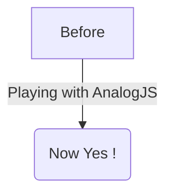

# 内容路由

Analog 同样支持将 markdown 文档作为路由并且在组件中渲染 markdown 文档。

### 设置

在文件 `src/app/app.config.ts` 的 `providers` 数组里添加 `provideContent()` 函数并传入 `withMarkdownRenderer()` 参数。

```ts
import { ApplicationConfig } from '@angular/core';
import { provideContent, withMarkdownRenderer } from '@analogjs/content';

export const appConfig: ApplicationConfig = {
  providers: [
    // ... other providers
    provideContent(withMarkdownRenderer()),
  ],
};
```

## 定义内容路由

内容路由内置了对 frontmatter, metatags 和基于 PrismJS 的语法高亮的支持。

下面 `src/app/pages/about.md` 的例子定义了一个 `/about` 路由。

```md
---
title: About
meta:
  - name: description
    content: About Page Description
  - property: og:title
    content: About
---

## About Analog

Analog is a meta-framework on top of Angular.

[Back Home](./)
```

### PrismJS 语法高亮

Analog 支持基于 PrismJS 的语法高亮。通过在 `app.config.ts` 里的 `provideContent()` 添加 `withPrismHighlighter()` 参数来启用语法高亮

```diff-ts
import { ApplicationConfig } from '@angular/core';
import { provideContent, withMarkdownRenderer } from '@analogjs/content';
+ import { withPrismHighlighter } from '@analogjs/content/prism-highlighter';

export const appConfig: ApplicationConfig = {
  providers: [
    // ... other providers
-   provideContent(withMarkdownRenderer()),
+   provideContent(withMarkdownRenderer(), withPrismHighlighter()),
  ],
};
```

将 `prism.css` 样式添加到全局样式表里:

```css
@import 'prismjs/themes/prism.css';
```

#### 使用 `diff` 高亮插件

Analog 支持基于 PrismJS 高亮差异。

在 `analog` 插件的 `additionalLangs` 部分添加 `prism-diff` 即可：

```ts
import { defineConfig } from 'vite';
import analog from '@analogjs/platform';

export default defineConfig({
  // ...
  plugins: [
    analog({
      content: {
        prismOptions: {
          additionalLangs: ['prism-diff'],
        },
      },
    }),
  ],
});
```

在 `app.config.ts` 里导入 `diff-highlight` 插件：

```ts
import 'prismjs/plugins/diff-highlight/prism-diff-highlight';
```

使用 `diff` 语法标签高亮或者 `diff-<language>` 来高亮指定的语言。

````md
```diff
- This is a sentence.
+ This is a longer sentence.
```

```diff-typescript
- const foo = 'bar';
+ const foo = 'baz';
```
````

如果要高亮变更行的背景而不是文本自身，在全局样式里添加如下样式文件：

```css
@import 'prismjs/plugins/diff-highlight/prism-diff-highlight.css';
```

### Shiki 语法高亮

Analog 也支持基于 Shiki 的语法高亮。要启用 `Shiki` 语法高亮，在 `app.config.ts` 的 `provideContent()` 函数里添加 `withShikiHighlighter()` 。

```diff-ts
import { ApplicationConfig } from '@angular/core';
import { provideContent, withMarkdownRenderer } from '@analogjs/content';
+ import { withShikiHighlighter } from '@analogjs/content/shiki-highlighter';

export const appConfig: ApplicationConfig = {
  providers: [
    // ... other providers
-   provideContent(withMarkdownRenderer()),
+   provideContent(withMarkdownRenderer(), withShikiHighlighter()),
  ],
};
```

在 `vite.config.ts` 里的 `analog` 插件配置里添加 `shiki` 来启用编译时语法高亮。

```ts
import { defineConfig } from 'vite';
import analog from '@analogjs/platform';

export default defineConfig({
  // ...
  plugins: [
    analog({
      content: {
        highlighter: 'shiki',
      },
    }),
  ],
});
```

#### 配置 Shiki 高亮

> 请移步 [Shiki 文档](https://shiki.style/) 了解更多关于 Shiki 的配置信息。

要配置 Shiki，你可以通过 `shikiOptions` 对象实现。

```ts
import { defineConfig } from 'vite';
import analog from '@analogjs/platform';

export default defineConfig({
  // ...
  plugins: [
    analog({
      content: {
        highlighter: 'shiki',
        shikiOptions: {
          highlight: {
            // alternate theme
            theme: 'ayu-dark'
          }
          highlighter: {
             // add more languages
            additionalLangs: ['mermaid'],
          },
        },
      },
    }),
  ],
});
```

默认情况下，`shikiOptions` 包含以下选项。

```ts
{
  "container": "%s",
  "highlight": {
    "theme": "github-dark"
  }
  "highlighter": {
    "langs": [
      "json",
      "ts",
      "tsx",
      "js",
      "jsx",
      "html",
      "css",
      "angular-html",
      "angular-ts",
    ],
    "themes": ["github-dark", "github-light"]
  }
}
```

## 定义内容文件

为了更加灵活，markdown 内容文件可以存放在 `src/content` 目录下。你可以在这里放置类似博客文章的 markdown 文件。

```md
---
title: My First Post
slug: 2022-12-27-my-first-post
description: My First Post Description
coverImage: https://images.unsplash.com/photo-1493612276216-ee3925520721?ixlib=rb-4.0.3&ixid=MnwxMjA3fDB8MHxwaG90by1wYWdlfHx8fGVufDB8fHx8&auto=format&fit=crop&w=464&q=80
---

Hello World
```

## 使用内容文件列表

在组件中调用 `@analogjs/content` 包中的 `injectContentFiles<Attributes>(filterFn?: InjectContentFilesFilterFunction<Attributes>)` 函数可以获取 `src/content` 目录下的内容文件列表。要过滤指定的文件，可以使用 `filterFn` 函数作为参数，也可以用 `InjectContentFilesFilterFunction<T>` 来设置过滤器。

```ts
import { Component } from '@angular/core';
import { RouterLink, RouterOutlet } from '@angular/router';
import { injectContentFiles } from '@analogjs/content';
import { NgFor } from '@angular/common';

export interface PostAttributes {
  title: string;
  slug: string;
  description: string;
  coverImage: string;
}

@Component({
  standalone: true,
  imports: [RouterOutlet, RouterLink, NgFor],
  template: `
    <ul>
      <li *ngFor="let post of posts">
        <a [routerLink]="['/blog', 'posts', post.slug]">{{
          post.attributes.title
        }}</a>
      </li>
    </ul>
  `,
})
export default class BlogComponent {
  readonly posts = injectContentFiles<PostAttributes>((contentFile) =>
    contentFile.filename.includes('/src/content/blog/'),
  );
}
```

## 使用 Ananlog Markdown 组件

Analog 提供了一个 `MarkdownComponent` 和 `injectContent()` 函数用于渲染包含前言的 markdown 内容。

`injectContent()` 函数默认使用 `slug` 路由参数从 `src/content` 目录获取内容文件。

```ts
// /src/app/pages/blog/posts.[slug].page.ts
import { injectContent, MarkdownComponent } from '@analogjs/content';
import { AsyncPipe, NgIf } from '@angular/common';
import { Component } from '@angular/core';

export interface PostAttributes {
  title: string;
  slug: string;
  description: string;
  coverImage: string;
}

@Component({
  standalone: true,
  imports: [MarkdownComponent, AsyncPipe, NgIf],
  template: `
    <ng-container *ngIf="post$ | async as post">
      <h1>{{ post.attributes.title }}</h1>
      <analog-markdown [content]="post.content"></analog-markdown>
    </ng-container>
  `,
})
export default class BlogPostComponent {
  readonly post$ = injectContent<PostAttributes>();
}
```

### 使用 meta 标签解析器

在路由配置中通过为 `RouteMeta` 对象的 `meta` 属性设置一个 `postMetaResolver` 函数，可以为一个路由解析 meta 标签。

下面时一个使用 `postMetaResolver` 函数为一个博客文字获取 meta 标签的例子，它返回了一组 meta 标签。

```ts
export const postMetaResolver: ResolveFn<MetaTag[]> = (route) => {
  const postAttributes = injectActivePostAttributes(route);

  return [
    {
      name: 'description',
      content: postAttributes.description,
    },
    {
      name: 'author',
      content: 'Analog Team',
    },
    {
      property: 'og:title',
      content: postAttributes.title,
    },
    {
      property: 'og:description',
      content: postAttributes.description,
    },
    {
      property: 'og:image',
      content: postAttributes.coverImage,
    },
  ];
};
```

meta 标签也可以异步返回。给 `meta` 属性设置一个 `postMetaResolver` 函数。

```ts
export const routeMeta: RouteMeta = {
  title: postTitleResolver,
  meta: postMetaResolver,
};
```

meta 标签的解析也可以通过在组件中通过 `ActivatedRoute` 服务来获取。

```ts
export default class BlogPostComponent {
  readonly route = inject(ActivatedRoute);
  readonly metaTags$ = this.route.data.pipe(map(data => data['meta']));

  // In the template
  <my-component [metaTags]="metaTags$ | async"></my-component>
}
```

### 启用对 Mermaid 的支持

Analog 的 markdown 组件支持 [Mermaid](https://mermaid.js.org/)，在 `withMarkdownRenderer()` 的 `loadMermaid` 里动态导入即可。

```ts
withMarkdownRenderer({
  loadMermaid: () => import('mermaid'),
});
```

启用以后，Mermaid 块将被 mermaid 转换成 SVG。

mermaid 图形的一个例子：



## 内容子目录的支持

Analog 同样支持在内容目录下面包含子目录。

`injectContent()` 函数也可以用于一个既包含路由参数也包含子目录名的对象。

这个很有用，比如说，你的站点有博客以及展示项目的 markdown 文件。

```treeview
src/
└── app/
│   └── pages/
│       └── project.[slug].page.ts
└── content/
    ├── posts/
    │   ├── my-first-post.md
    │   └── my-second-post.md
    └── projects/
        ├── my-first-project.md
        └── my-second-project.md
```

```ts
// /src/app/pages/project.[slug].page.ts
import { injectContent, MarkdownComponent } from '@analogjs/content';
import { AsyncPipe, NgIf } from '@angular/common';
import { Component } from '@angular/core';

export interface ProjectAttributes {
  title: string;
  slug: string;
  description: string;
  coverImage: string;
}

@Component({
  standalone: true,
  imports: [MarkdownComponent, AsyncPipe, NgIf],
  template: `
    <ng-container *ngIf="project$ | async as project">
      <h1>{{ project.attributes.title }}</h1>
      <analog-markdown [content]="project.content"></analog-markdown>
    </ng-container>
  `,
})
export default class ProjectComponent {
  readonly project$ = injectContent<ProjectAttributes>({
    param: 'slug',
    subdirectory: 'projects',
  });
}
```

## 加载自定义内容

默认情况下，Analog 通过路由参数从 `src/content` 目录获取内容文件并编译。Analog 也支持自定义的文件名来从 `src/content` 目录获取文件内容。在你有一些自定义的 markdown 文件并且你想在页面上加载的时候，这个很有用。

`injectContent()` 函数可以指定一个 `customFilename` 属性。

```ts
readonly post$ = injectContent<ProjectAttributes>({
  customFilename: 'path/to/custom/file',
});
```
