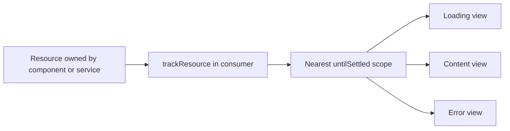

# RFC: Declarative Resource Tracking

**Date:** 2026-09-11
**Package:** `@analogjs/router`
**Related integration:** Experimental SSR streaming in `@analogjs/router/server`

## Summary

Declarative resource tracking coordinates loading and error views for parts of
a page that depend on asynchronous data. Applications can group resources to
reveal related content together, or nest scopes so each section reveals its
content independently.

The feature consists of two APIs:

- `trackResource(resource)` registers a resource with the nearest tracking
  scope and returns the original resource.
- `*untilSettled="loading; error: failed"` declares that scope and selects its
  loading, content, or error view.

Resource tracking is a regular feature built on Angular's public resource,
dependency injection, and view APIs. It works during client rendering and
buffered SSR. Its optional integration with Analog's experimental streaming
renderer adds progressive HTML updates; that integration has a separate
stability and hydration model.

## Motivation

A resource describes the state of one asynchronous operation. A page often
needs to coordinate several operations across child components: show a single
loading view until a product is available, reveal reviews separately, and keep
a reviews failure from replacing the product details.

Manually combining these states in the page couples its template to the data
dependencies of its children. Repeating loading and error branches in every
component makes it harder to choose which parts of the page should appear
together.

Resource tracking separates these responsibilities. Components register the
resources they consume. The enclosing template determines the loading and
error experience and the grouping of content.

## Goals

- Coordinate resources across descendant components through a template scope.
- Preserve each resource's values, signals, types, reload API, and ownership.
- Support `resource`, `httpResource`, and `rxResource` through a small shared
  contract.
- Support grouped resources, independent nested scopes, and error propagation.
- Preserve component instances while displaying a loading or error fallback.
- Use structural directive syntax on existing elements or components without
  requiring an `ng-container` or an extra rendered wrapper.
- Allow incremental adoption without changing resource loaders or requiring
  streaming.

## Scope

This feature coordinates view selection. It does not own fetching, caching,
resource cancellation, or retries. It does not discover arbitrary promises,
HTTP requests, or work merely because it occurs inside a component subtree.

An error view handles errors exposed by registered resources. It is not a
general exception handler for arbitrary template or lifecycle errors.

The directive does not defer component creation or code loading. Its content
must exist so resources can register and begin their normal work. Independent
hydration of each scope is outside the current streaming implementation.

## Public API

All public symbols are exported from `@analogjs/router`:

```ts
import { UntilSettled, trackResource } from '@analogjs/router';
import type { UntilSettledErrorContext } from '@analogjs/router';
```

### Resource registration

The helper's type preserves the input resource:

```ts
declare function trackResource<
  R extends Pick<Resource<unknown>, 'isLoading' | 'error'>,
>(resource: R): R;
```

Only `isLoading()` and `error()` participate in coordination. The helper does
not wrap the resource, replace its value signal, or change its loader.

Registration requires an injection context, typically a component field
initializer. It lasts until that context's `DestroyRef` is destroyed. Calling
the helper outside a tracking scope returns the resource unchanged.

### View declaration

```html
<app-product *untilSettled="loading; error: failed" />

<ng-template #loading>
  <p role="status">Loading product…</p>
</ng-template>
<ng-template #failed let-error>
  <p role="alert">Product unavailable.</p>
</ng-template>
```

| API                        | Meaning                                                           |
| -------------------------- | ----------------------------------------------------------------- |
| `UntilSettled`             | Standalone directive imported by the declaring component.         |
| `untilSettled`             | Required loading `TemplateRef`.                                   |
| `untilSettledError`        | Optional error `TemplateRef`, exposed as `error:` in microsyntax. |
| `UntilSettledErrorContext` | Template context with `$implicit: unknown` for `let-error`.       |

The content is the host element or component covered by the structural
directive. Angular desugars the declaration into an embedded template; no
additional wrapper is rendered around its content.

The name `untilSettled` describes waiting for registered work to leave its
loading state, including failure. A resource does not need to represent a
stream, and completion does not mean it has a value: an idle resource also does
not hold a scope in loading.

## Complete example

This product page reveals product details first. Reviews have their own
loading and error views. Each error template can retry its resource without
recreating the page.

Configure `provideHttpClient()` in the application's providers. The example
expects `/api/product` and `/api/reviews` to return the declared JSON shapes.

```ts
import { Component, Injectable, inject } from '@angular/core';
import { httpResource } from '@angular/common/http';
import { UntilSettled, trackResource } from '@analogjs/router';

interface Product {
  name: string;
  description: string;
}

interface Review {
  id: string;
  text: string;
}

@Injectable()
class ProductData {
  readonly product = httpResource<Product>(() => '/api/product');
  readonly reviews = httpResource<Review[]>(() => '/api/reviews');
}

@Component({
  selector: 'app-product-details',
  standalone: true,
  template: `
    @if (product.hasValue()) {
      <h2>{{ product.value().name }}</h2>
      <p>{{ product.value().description }}</p>
    }
  `,
})
class ProductDetails {
  readonly product = trackResource(inject(ProductData).product);
}

@Component({
  selector: 'app-product-reviews',
  standalone: true,
  template: `
    @if (reviews.hasValue()) {
      <h3>Reviews</h3>
      @for (review of reviews.value(); track review.id) {
        <p>{{ review.text }}</p>
      }
    }
  `,
})
class ProductReviews {
  readonly reviews = trackResource(inject(ProductData).reviews);
}

@Component({
  standalone: true,
  imports: [UntilSettled, ProductDetails, ProductReviews],
  providers: [ProductData],
  template: `
    <h1>Product</h1>

    <section *untilSettled="productLoading; error: productError">
      <app-product-details />
      <app-product-reviews
        *untilSettled="reviewsLoading; error: reviewsError"
      />
    </section>

    <ng-template #productLoading>
      <p role="status">Loading product…</p>
    </ng-template>
    <ng-template #productError>
      <p role="alert">Product unavailable.</p>
      <button (click)="data.product.reload()">Retry product</button>
    </ng-template>
    <ng-template #reviewsLoading>
      <p role="status">Loading reviews…</p>
    </ng-template>
    <ng-template #reviewsError>
      <p role="alert">Reviews unavailable.</p>
      <button (click)="data.reviews.reload()">Retry reviews</button>
    </ng-template>
  `,
})
export default class ProductPage {
  readonly data = inject(ProductData);
}
```

`ProductData` owns the resources for the lifetime of the page. Its resources
are registered by the consuming child components, where the appropriate
tracking scope is available. Their creation and request timing remain governed
by Angular.

Calling `trackResource` in the page's own field initializer would not register
against a directive later created in that page's template. Registration follows
the injection context of the call.

The `hasValue()` guards remain necessary. Pending content is instantiated and
checked even while a fallback is visible.

## Discovery and lifetime

Each directive creates a scope and supplies it through the injector used to
instantiate its content. `trackResource` resolves the nearest scope through
that injector and registers the resource's loading and error signals.



Discovery is explicit registration combined with automatic scope selection.
There is no scan of a component's fields, interception of resource value
reads, or requirement to enumerate descendant resources in the page template.

The same shared resource can be registered by several consumers. Each
registration has an independent lifetime, and consumers in different scopes
can coordinate the same resource independently. Unregistering a resource does
not destroy it. Angular's owning context retains responsibility for its
cleanup and cancellation.

## View selection and errors

A scope is pending while any registered resource reports `isLoading()`. It
selects the first defined resource error in registration order, ignoring errors
from resources that are currently loading. This prevents an old error retained
during a retry from being treated as a new failure.

| State                                                               | Selected view                                                         |
| ------------------------------------------------------------------- | --------------------------------------------------------------------- |
| A resource has an error and this scope has an error template        | Error template, even if another registered resource is still loading. |
| At least one resource is loading before the first successful reveal | Loading template.                                                     |
| No resource is loading and no handled error prevents reveal         | Content.                                                              |
| A new load starts after a successful reveal                         | Keep the existing content view.                                       |
| A resource fails after a successful reveal                          | Error template, when provided.                                        |

The directive remembers whether its content has successfully revealed. Retaining
the content view during later loads preserves component state; it does not
guarantee that the resource retains its previous value.

An error template receives the selected error as `$implicit`. The error remains
`unknown`, so application code should narrow it before reading specific fields.
The scope does not combine multiple errors into a new error type.

Retries use the resource's existing `reload()` method or a change to its
reactive inputs. An initial failure returns to loading during retry. If the
scope had already revealed successfully, the retry follows the content-retention
rule above.

## Composition

A single scope waits for all directly registered resources:

```html
<section *untilSettled="loading; error: failed">
  <app-product-details />
  <app-product-reviews />
</section>
```

A nested scope owns its descendants' registrations. Its loading state does not
hold the parent in loading. The parent can therefore reveal its own content
alongside the child's fallback.

An inner error template handles its resource errors locally. Without an inner
error template, the error propagates to the enclosing scope. If no enclosing
scope handles it, the outermost scope reports it to Angular's `ErrorHandler`.
Forwarding an error does not make the parent wait for the child's loading state.

Fallback templates use the enclosing injector rather than the content scope
they replace. Work registered by a fallback can therefore belong to an outer
scope. Fallbacks should normally be synchronous and lightweight.

## Rendering implementation

The directive creates its content through `ViewContainerRef` with a scoped
injector. A detached Angular host keeps that embedded view attached to change
detection while its nodes are absent from the page. Resource loaders and
dependent resources can continue running in this state.

An effect reads the aggregate state, checks the content, and moves the same
embedded view between the visible container and the detached host. Loading and
error templates occupy the visible container when needed. Component instances
are preserved across these transitions.

Destroying the directive removes its parent registration, destroys its content,
detaches and destroys the hidden host, and destroys the scoped injector. Each
resource registration also unregisters when its consumer is destroyed.

The resource-tracking implementation uses public Angular APIs. Its internal
scope and detached host are implementation details rather than additional
application APIs.

## Server rendering

### Buffered SSR

Buffered SSR continues to wait for application stability. The response contains
the resolved content or error template. Adding `UntilSettled` does not opt a
route into streaming or alter the renderer's stability requirements.

### Experimental progressive SSR

With `experimental.streaming` enabled, the streaming renderer provides a
request-local registry to the directives. Each scope registers an anchor,
access to its currently selected native nodes, and update notifications.

The response proceeds through these stages:

1. Send the document head and reconciliation runtime.
2. Once scopes appear in the document, send the page shell with loading views.
3. As a scope changes, replace its range in the browser with its current content
   or error view. A parent can reveal while a nested scope remains pending.
4. If a child settles while its parent is hidden, include its latest state when
   the parent reveals.
5. Once the server application is stable, send the authoritative document with
   Angular's hydration annotations and transferred data.
6. Hydrate a hidden copy of that document while preserving the visible preview.
   After client application stability, remove the preview and reveal the live
   application.

The renderer adds scope markers to copied HTML, leaving Angular's live server
DOM untouched. Scope identifiers and update queues are local to each request.
This integration uses directive notifications; it does not introduce another
Angular runtime patch. The enclosing experimental renderer still has its
existing Angular-version and streaming-hook requirements and buffered fallbacks.

The client handoff preserves document-level Angular integrity comments. It
keeps the preview visible because client hydration can initiate work that was
not transferred from the server. For example, an HTTP failure may be requested
again on the client. Exposing that intermediate state would produce an
`error → loading → error` flash.

### Data transfer and limits

`trackResource` does not serialize values or errors or add a cache. Eligible
`httpResource` responses use Angular's HTTP transfer cache. Other resource
sources retain their own transfer behavior, if any.

Progressive display and interactivity have different timing. The preview is
not an independently hydrated application; interactivity waits for the global
client handoff. The retained preview is inert during that handoff. A slow client
task, or one that never completes, can therefore delay the whole page becoming
interactive.

Changes outside registered scopes appear in the authoritative document.
Crawler requests and routes that disable streaming retain buffered rendering.
After response headers have been sent, an error fallback cannot change the
response status.

The current renderer clones the document body when preparing scope updates.
This favors correctness and preserves Angular's DOM, but costs memory and
serialization work proportional to the document size. During hydration, the
preview and authoritative copy coexist temporarily.

## Alternatives considered

| Approach                                                        | Assessment                                                                                                               |
| --------------------------------------------------------------- | ------------------------------------------------------------------------------------------------------------------------ |
| Combine loading and error signals manually in every page        | Works for small pages, but parents must know their descendants' data dependencies.                                       |
| Supply a resource list directly to the directive                | Explicit, but moves knowledge of descendant resources back into the declaring template.                                  |
| Track scoped `PendingTasks`                                     | Describes outstanding work, but does not provide the resource error or consumption relationship needed by this API.      |
| Instrument resource creation or reads with a compiler transform | Could reduce registration calls, but adds compiler coupling and ambiguity around shared resources.                       |
| Add an Angular discovery hook                                   | Could support deeper integration in the future; the current feature can use public APIs and explicit registration today. |
| Use `@defer` alone                                              | Controls deferred view and code activation; it does not express this resource-registration contract.                     |

The selected design keeps dependency registration close to resource consumption
and uses Angular DI to determine composition. A structural directive fits the
existing template model and works directly on components or elements.

## Compatibility and adoption

Applications opt in by importing `UntilSettled` and registering resources in
their consumers. Existing resource code remains valid without registration.
Shared services can remain where they are provided; their consumers register
the resources in the relevant scopes.

Angular resources require Angular 19 or later. Compatibility of the complete
feature must be checked against each supported Angular version; the completed
focused validation uses Angular 22.1.5. Streaming follows the experimental
renderer's separate compatibility requirements.

Normal resource tracking has no experimental configuration flag. The streaming
integration remains explicitly opt-in. Documentation presents these as separate
capabilities so applications can adopt view coordination independently.

## Validation

The current implementation has passed a router and streaming-demo build,
22 focused router tests, three browser scenarios, and formatting checks.

Coverage includes grouped resources, nested loading and errors, error forwarding,
retry, retained component instances, cleanup and request cancellation, shared
scope behavior, dependent resources, and calls outside a scope. Streaming tests
cover nested range replacement, hidden children that settle first, request
isolation, crawler fallback, and preservation of the server DOM.

Browser validation covers progressive display, hydration without duplicate
successful HTTP requests, continuous error visibility during hydration,
interactive controls after the handoff, and recovery through retry. The tests
use a non-crawler user agent to exercise the streaming renderer.

The full CI suite and supported-version matrix have not been run. Linting of
the wider changed router files stalled and remains unverified.

## Remaining streaming questions

- Can the hydration handoff become local to a scope so unrelated client work
  does not delay the whole page?
- How should components that measure layout during initial rendering behave
  while the authoritative application is hidden?
- What guarantees should cover mixed `@defer` previews, dynamically created
  scopes, focus, and interactions before finalization?
- What response-disconnect, timeout, and backpressure policy should the
  experimental renderer provide?

These questions concern the streaming implementation. The resource registration
and template composition contract can be used independently of that renderer.

## Implementation and documentation

- [Resource tracking directive and helper](../packages/router/src/lib/until-settled.ts)
- [Resource tracking tests](../packages/router/src/lib/until-settled.spec.ts)
- [Request-local scope streaming](../packages/router/server/src/resource-tracking-stream.ts)
- [Streaming renderer](../packages/router/server/src/render-stream.ts)
- [Browser reconciliation runtime](../packages/router/server/src/defer-reconcile-runtime.ts)
- [Interactive demo](../apps/streaming-app/src/app/pages/resource-tracking.page.ts)
- [Browser regression tests](../apps/streaming-app-e2e-playwright/tests/until-settled.spec.ts)
- [Declarative Resource Tracking guide](../apps/docs-analog/src/content/features/data-fetching/declarative-resource-tracking.md)
