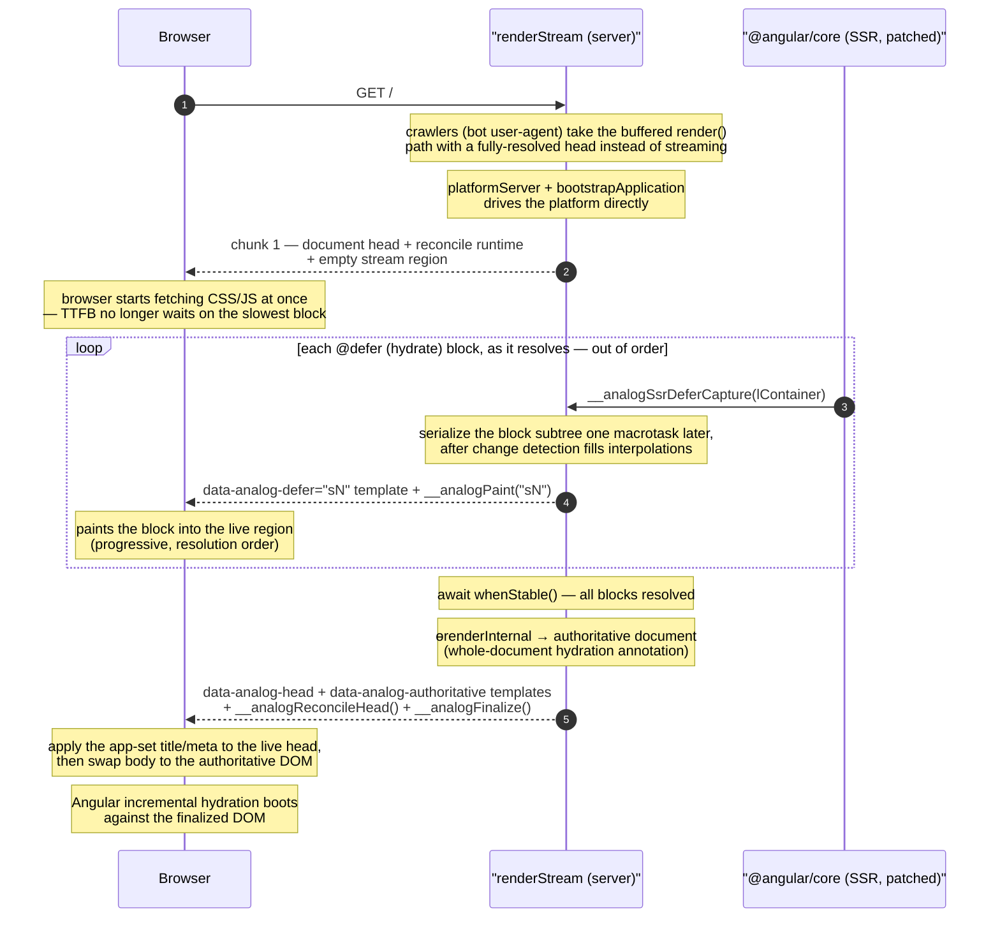

# RFC: Progressive Streaming SSR (`renderStream`)

**Status:** Prototype (feat/streaming-ssr branch)
**Author:** Brandon Roberts
**Date:** 2026-07-06
**Packages:** @analogjs/router (`@analogjs/router/server`), @analogjs/platform, @analogjs/vite-plugin-nitro

---

## Summary

A streaming SSR renderer for Analog that flushes bytes to the client **during**
the render instead of after it. `renderStream(App, config)` is an alternative to
`render(App, config)` in `main.server.ts` that returns a
`ReadableStream<Uint8Array>`:

1. the document head + a small client runtime flush immediately, before the app
   finishes rendering;
2. each `@defer (hydrate …)` block flushes the moment it resolves on the server
   — out of document order — so a slow block never holds back an earlier one;
3. once the app is stable, the authoritative, fully hydration-annotated document
   flushes as the tail, and the client runtime swaps it in before Angular's
   incremental hydration runs.

The Angular capability it needs — a per-`@defer`-block resolution signal — is
delivered as a small **additive** string patch to `@angular/core`, applied only
to SSR builds via a Vite plugin (`deferStreamingPlugin`) and gated behind an
opt-in `experimental.streaming` flag. No hand-patching of `node_modules`.

## Motivation

The standard `render()` path calls `renderApplication` from
`@angular/platform-server`, which is **fully buffered**: it renders the entire
app to a Domino DOM, waits for `ApplicationRef.whenStable()` (which waits for
_every_ `@defer (hydrate …)` block to resolve), annotates the whole document for
hydration, and only then serializes and returns a single string.

Consequences:

1. **Time-to-first-byte is bounded by the slowest `@defer` block.** Nothing —
   not even `<head>`/`<title>` or linked CSS/JS — reaches the browser until the
   entire render finishes. A page with one slow hydrate-on-defer block delays
   the whole response by that block's latency.
2. **No progressive paint.** With incremental hydration, `@defer (hydrate …)`
   blocks _are_ rendered eagerly on the server, so their content already exists
   in the DOM well before `whenStable` — but the buffered path holds all of it
   until the last block resolves.

Streaming decouples TTFB from render completion and lets each block paint as it
resolves, which is the point of server rendering heavy/expensive subtrees behind
`@defer`.

## Design

Four pieces. How they interact over the lifetime of one request:



The head flushes before the app has rendered, each `@defer` block flushes the
moment it resolves (out of order), and the authoritative document — the only
thing hydration runs against — is the tail. The rest of this section covers each
piece in turn.

### 1. `renderStream` (`@analogjs/router/server`)

Drives the platform directly (`platformServer` + `bootstrapApplication` +
`ɵrenderInternal`) rather than calling `renderApplication`, so it can interleave
flushes with rendering. The `start()` of the returned `ReadableStream`:

- flushes `document` head + the reconcile runtime + an empty streaming region;
- installs `globalThis.__analogSsrDeferCapture`; on each resolved block it serializes
  the block's live Domino subtree (a macrotask later, once change detection has
  filled interpolations) and flushes it as a `<template>` + paint script;
- after `whenStable()`, calls `ɵrenderInternal(platformRef, appRef)` to produce
  the authoritative, hydration-annotated document (byte-identical to a buffered
  render) and flushes both its `<head>` (in a `<template data-analog-head>`) and
  its body as the tail;
- falls back to a single buffered chunk for server-component requests, for
  **crawlers** (bot user-agents, so they index a fully-resolved head — see
  _Head & title_ below), or when the streaming primitive is absent, so output
  matches the classic path.

### 2. Client reconcile runtime (`defer-reconcile-runtime.ts`)

A tiny inlined script exposing `window.__analogPaint(id)` (paints a streamed
block into the live region as it arrives — progressive, out of order),
`window.__analogReconcileHead()` (applies the authoritative `<head>`'s
title/meta/link to the live document — idempotent, so unchanged shell tags are
left alone), and `window.__analogFinalize()` (swaps the whole body to the
authoritative document before hydration boots, so the reconciled DOM matches a
buffered render byte-for-byte).

### 3. `deferStreamingPlugin` — the additive Angular seam (`@analogjs/platform`)

A Vite plugin (same shape and ssr-gate as the existing `i18nDefRegistryPlugin`)
that string-patches `@angular/core` during SSR builds. It is **purely additive**
— two edits keyed on single-occurrence anchors:

1. inside `applyDeferBlockState`, fire `globalThis.__analogSsrDeferCapture` when a
   block reaches `Complete` on the server, passing its live `lContainer`;
2. expose `collectNativeNodesInLContainer` on `globalThis.__analogSsrInternals` so
   the renderer can serialize a block's subtree.

The transform is exported as a pure function (`injectDeferStreamingHook`) and
unit-tested against a bundle string. It is registered only when
`ssr && experimental.streaming`, so default builds are untouched.

### 4. `ssrStreamRenderer` (`@analogjs/vite-plugin-nitro`)

An h3 event handler that returns the `ReadableStream` with chunked transfer
encoding, preserving the `x-analog-no-ssr` bypass. The buffered `ssrRenderer` is
unchanged.

### Runtime & concurrency

The per-`@defer` resolution signal is a process-global entry point (the patched
`@angular/core` can only call one `globalThis` function), so `renderStream`
installs a **stable dispatcher once** and routes each resolved block to the
render that owns it using `AsyncLocalStorage` (`node:async_hooks`). Concurrent
renders in one process are therefore isolated — a block resolving in render A is
never enqueued into render B's stream.

Runtime portability is delegated to **Nitro**: Analog does not shim runtimes.
`node:async_hooks` is provided across Nitro's deployment presets (native Node,
and non-Node targets via `nodejs_compat` / unenv), so `renderStream` depends on
it directly rather than carrying its own edge fallbacks.

### Resilience to Angular drift

Because the patch anchors on internal symbol names, `deferStreamingPlugin`
classifies each `@angular/core` module: it warns if it finds the `@defer`
runtime but the anchors have drifted (Angular changed internals), and at
`buildEnd` if that module was never encountered — instead of silently producing
a build that falls back to buffered. `renderStream` likewise warns in dev when
the streaming primitive is absent at request time.

### Honest boundary

Angular's hydration annotation is **whole-document** — the root component's `ngh`
index references every `@defer` container — so the authoritative hydration
payload can only be finalized once all blocks have resolved. Therefore
**rendering streams progressively, but hydration begins when the tail arrives.**
The blocks are effectively sent twice (progressive preview during render +
authoritative copy in the tail); this is the byte cost measured below, and the
target of the "Future work" section.

### Head & title

Because the shell `<head>` is flushed **before** the app renders, a title or
meta set _during_ render (`Title`/`Meta` services, route meta) is not yet known
when the head goes out. Two mechanisms keep this correct, mirroring how Nuxt
handles the identical problem in its streaming renderer:

1. **Finalize-time reconcile (interactive clients).** The authoritative `<head>`
   is streamed in the tail (`<template data-analog-head>`) and
   `__analogReconcileHead()` applies its title/meta/link to the live document
   before hydration boots. This is the same "inject the resolved head late"
   strategy Nuxt uses — Nuxt flushes a head _shell_ then streams
   `renderSSRHeadSuspenseChunk` `<script>` patches as Suspense boundaries
   resolve; Analog's whole-document model needs only a single patch at the tail,
   since the authoritative head is known in one shot at `whenStable`.
2. **Buffered path for crawlers.** A late `<script>` reconcile does not help a
   bot that doesn't execute it, so crawlers (matched by user-agent) are routed
   to the buffered `render()` path, whose `<head>` is fully resolved and
   byte-identical to the classic render. Nuxt does the same — its `prefersStream`
   check excludes bot user-agents from streaming.

Net: JS clients get the correct dynamic head (with a brief shell-title interval
before finalize), and crawlers get a fully-resolved head with no streaming
scaffolding. A static `<title>` in `index.html` is correct on every path.

## Benchmarks

In-process (no network), dev-mode Angular, synthetic per-block dependency
delays, median of 12 cold-cache runs. These measure render + serialization +
flush scheduling, **not** wire TTFB — on a real network the TTFB win is larger,
because the browser can begin fetching linked assets during the server's defer
wait.

**Latency shape (2 blocks, deps [150, 60] ms):**

|                     | Buffered | Streaming  |
| ------------------- | -------- | ---------- |
| TTFB                | 201 ms   | **0.6 ms** |
| first block visible | —        | 70 ms      |
| complete            | 201 ms   | 201 ms     |

TTFB is flat (~0.5 ms) regardless of block latency; completion time is identical
(streaming adds negligible CPU). The win is entirely latency-shape.

**Byte cost (heavier ~1.5 KB blocks):** the buffered document is 3716 bytes; the
streaming response is 7439 bytes (**+100%**), because each block ships in both
the progressive preview and the authoritative tail. The overhead is smaller in
relative terms with more/larger blocks (shell overhead amortizes) but is the
main downside of the additive-seam design.

## Validation

- End-to-end (server `renderStream` + client runtime, jsdom): head/shell flush
  before the tail; blocks flush out of document order before `whenStable`;
  progressive paint in resolution order; assembled DOM byte-identical to a
  buffered render (modulo `ng-server-context`); incremental hydration succeeds
  with DOM node reuse and post-hydration interactivity. **10/10.**
- Concurrency: two interleaved `renderStream` calls, blocks resolving at the
  same time — each stream receives only its own app's blocks, no cross-talk.
- `injectDeferStreamingHook` + `inspectAngularCoreModule` unit tests. **9/9.**
- Real Vite/nitro app (`apps/streaming-app`) driven in Chromium: chunked HTTP
  with head-first / out-of-order block / tail ordering; an eager component and
  `@defer` blocks on `hydrate on immediate`, `httpResource`-backed data, and
  `hydrate on interaction` all hydrate and stay interactive; a title/meta set
  during render is reconciled onto the live head after the stream; a Googlebot
  user-agent gets the buffered render with the resolved head and no streaming
  scaffolding. Zero console errors.

The prototype's single seam is the plugin-applied Angular patch; everything else
is standard Analog/Angular.

## Example usage

```ts
// main.server.ts
import { renderStream } from '@analogjs/router/server';
import { config } from './app/app.config.server';
import { App } from './app/app';

export default renderStream(App, config);
```

```ts
// vite.config.ts
export default defineConfig({
  plugins: [analog({ experimental: { streaming: true } })],
});
```

## Future work

### Single-send via a per-block incremental annotator

The +100% byte cost comes entirely from re-sending block content in the
authoritative tail. It can be eliminated by **annotating each block for
hydration at resolve time** so the block is streamed once, already carrying its
`ngh`/`jsaction`/`ngb`, and the tail is the shell with block content sliced out
(replaced by slot markers) plus the transfer state.

This has been prototyped and validated (single-send document hydrates identically
to buffered, 5/5). The mechanism is a larger patch to `@angular/core`:

- **A one-line edit inside `serializeLContainer`** so the defer-block id is
  memoized by container when streaming is active, instead of `d${deferBlocks.size}`.
  This is what keeps per-block annotation and the final whole-document pass
  agreeing on ids — ids become **resolution-order** and consistent everywhere.
- **An appended driver** (`__analogSsrStreamBegin/End`, `__analogSsrAnnotateBlock`) that
  reuses Angular's own `serializeLContainer` to annotate a single resolved
  block's DOM.

**Byte results (same ~1.5 KB × 2 block scenario):**

|                                         | bytes | vs buffered |
| --------------------------------------- | ----- | ----------- |
| buffered (baseline)                     | 3716  | —           |
| single-send (incremental annotator)     | 4603  | **+24%**    |
| double-send (this RFC's implementation) | 7439  | +100%       |

The residual +24% is streaming scaffolding (per-block `<template>` wrappers,
mount scripts, slot markers, runtime), not re-sent content, and it amortizes
toward `buffered + small constant` as blocks grow. There is a **crossover**: for
very small blocks the per-block wrapper (~90 B) exceeds the saved content, so
single-send is net-negative — it wins only for realistically-sized `@defer`
blocks.

**Why this is deferred:** unlike the additive seam (two append-only anchors,
one private symbol), the incremental annotator _edits the middle of_
`serializeLContainer` and references several more private core symbols
(`SerializedViewCollection`, `isIncrementalHydrationEnabled`,
`IS_EVENT_REPLAY_ENABLED`, …). It rides entirely on non-minified FESM symbol
names. That maintenance surface is exactly the line where a framework-carried
string patch stops being reasonable.

### Upstream primitive

Both the additive seam and the incremental annotator are prototypes for a
capability that belongs in Angular proper: a first-class streaming SSR entry
point (e.g. `renderApplicationStream`) that emits `@defer` blocks progressively
with per-block hydration annotation. The Analog prototype demonstrates the design
and quantifies the payoff; the durable form is an upstream API, not a patch a
framework maintains against private symbols.

### Other

- Progressive-paint positioning (mount blocks into their document position as they
  arrive, rather than a preview region) — orthogonal to bytes.
- Real over-HTTP / browser benchmarks (blocked in the current sandbox).
- A `create-analog` template and nitro config flag once the primitive stabilizes.
