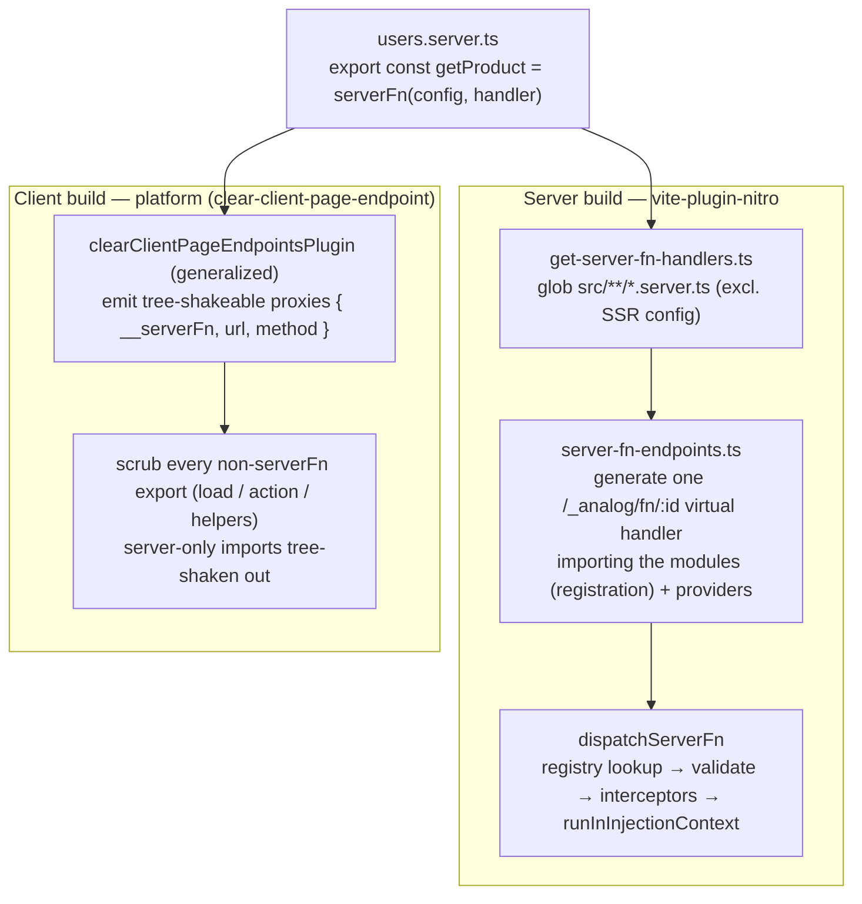
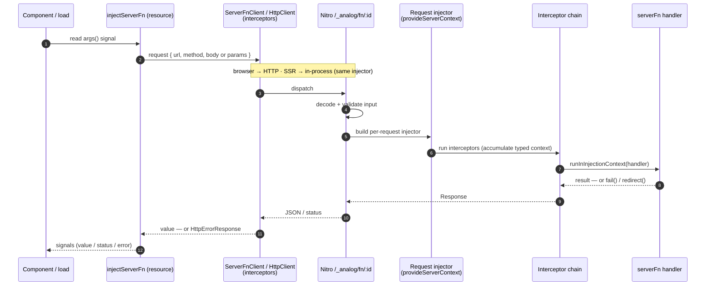

# RFC: Introduce Analog Server Functions

**Status:** Implemented (`feat/server-functions-rfc` branch)
**Author:** Brandon Roberts
**Date:** 2026-07-09
**Packages:** `@analogjs/router` (`/server` + client entries) · `@analogjs/vite-plugin-nitro` · `@analogjs/platform`

---

## Summary

Add a typed, validated, **DI-aware** server function primitive to Analog:

```ts
// products.server.ts
import { serverFn } from '@analogjs/router/server';
import { inject } from '@angular/core';
import { REQUEST } from '@analogjs/router/tokens';
import * as v from 'valibot';

export const getProduct = serverFn(
  v.object({ id: v.string() }), // a schema ⇒ validated POST (shorthand)
  async (input) => {
    const catalog = inject(CatalogService); // runs in the SSR request injector
    const req = inject(REQUEST); // Analog's request-scoped token
    return catalog.find(input.id, req.headers['accept-language']);
  },
);

// an input-less read is just a handler ⇒ GET
export const getProducts = serverFn(() => inject(CatalogService).all());
```

A server function is an `async` function whose body executes **inside the same
request-scoped injection context Analog already builds for SSR**, and whose
client half is a first-class Angular `resource()`, hydrated the same way `load`
is. It generalizes the existing
route-bound `load` / `action` mechanism into an arbitrary, colocated,
type-inferred RPC callable — without introducing a new DI story, a bespoke
client cache, or a non-idiomatic builder API.

## Motivation

Analog can already run server code from a colocated `*.server.ts` file, but only
in two fixed shapes, both bound to a page route:

- `load` — one GET per page, invoked during navigation, consumed via
  `injectLoad` (`packages/router/src/lib/inject-load.ts`).
- `action` — one POST per page, consumed via the `FormAction` directive.

That covers page data and form posts, but not the common case of _"call this
one typed, validated server operation from anywhere — a component, an effect, a
resolver — and get the result back with DI on the server."_ Today that requires
hand-writing a Nitro API route + a client `fetch`/`HttpClient` call + manual
typing on both ends. `serverFn` is the typed client/server RPC primitive for
Analog; it supersedes the `@analogjs/trpc` integration, which is no longer a
recommended path.

The pieces to do better already exist in the tree; they are just not composed
into a general primitive:

- **Server DI context** — `provideServerContext({ req, res })`
  (`packages/router/server/src/provide-server-context.ts`) already provides
  `REQUEST`, `RESPONSE`, `BASE_URL`, `LOCALE` from `@analogjs/router/tokens`
  into the SSR injector per request.
- **The endpoint transform** — `pageEndpointsPlugin`
  (`packages/vite-plugin-nitro/src/lib/plugins/page-endpoints.ts`) already
  esbuild-scans a `.server.ts` for `load` / `action` exports and wraps them in an
  h3 `defineEventHandler`, dispatching by method.
- **Endpoint routing** — `getPageHandlers`
  (`packages/vite-plugin-nitro/src/lib/utils/get-page-handlers.ts`) already
  globs `*.server.ts` and registers Nitro routes.
- **Response helpers** — `json` / `redirect` / `fail`
  (`packages/router/server/actions/src/actions.ts`).
- **Client scrub** — `clearClientPageEndpointsPlugin`
  (`packages/platform/src/lib/clear-client-page-endpoint.ts`) already replaces a
  `.server.ts` module with `export default undefined;` on the client build. It is
  scoped to `src/app/pages/` and today discards all exports.
- **Server→client hydration** — the `TransferState`-based transfer Analog already
  uses for `load`: a value resolved during SSR is serialized into the page and
  rehydrated on the client with no refetch, independent of HTTP method. Uses
  Angular-core `TransferState`, so no HTTP transfer-cache configuration.

This RFC composes those into `serverFn`.

## Goals

- A single authoring API for arbitrary server operations, colocated in
  `*.server.ts`, with **end-to-end type inference** (input from the validator,
  output from the handler return).
- **`inject()` works in the handler**, resolving from the per-request SSR
  injector — request tokens (`REQUEST`/`RESPONSE`/`BASE_URL`/`LOCALE`) and app
  services alike.
- **Middleware as functional interceptors**, composed through DI in the same
  shape as `provideHttpClient(withInterceptors([...]))`.
- **Idiomatic client consumption**: the reactive form is a `resource()` whose
  loader rides `HttpClient` (via `ServerFnClient`), so it inherits client
  `HttpInterceptorFn`s and `HttpTestingController` testing, and hydrates via
  `TransferState` with no HTTP transfer-cache configuration.
- **Intent-named client helpers** — `injectServerFn` for reactive reads (a
  `ResourceRef`) and `injectServerFnMutation` for imperative writes (a bound
  callable), both in the `injectLoad` helper family; the read/write intent is in
  the helper name, not implied by whether an args factory was passed.
- Server code and its dependencies never enter the client bundle. On the client,
  a `.server.ts` is rewritten to only its tree-shakeable `serverFn` proxies;
  every other export and its server-only imports are scrubbed and tree-shaken.
- **`serverFn` is supported in existing `.server.ts` files**, coexisting with the
  `load` / `action` in the same module.
- `load` / `action` become expressible as thin sugar over `serverFn`.
- Server functions do not bypass normal app authorization. The primitive provides
  validation, same-origin transport, and interceptor hooks; apps still decide
  which users can call which operations.

## Non-Goals

- **Inline `serverFn` inside client route files** (TanStack Start's "extract the
  closure out of the component" model). v1 is file-scoped to `*.server.ts`,
  which sidesteps closure hoisting entirely because the module is already
  server-only. Inline authoring is deferred (see Future Work).
- A new client data cache. We reuse Angular's `resource()`, `HttpClient` (via
  `ServerFnClient`), and `TransferState`.
- A central procedure registry / "router" object. Server functions are grouped
  by module colocation (`*.server.ts`), not a single typed router. Consumers
  import the exact exports they use; there is no root type to assemble. This is
  the deliberate replacement for the tRPC router model — larger surfaces are
  many colocated `serverFn` exports, not one procedure tree.

## Design

### 1. Authoring API (server entry)

`serverFn(config, handler)` lives in `@analogjs/router/server` (server-only
entry — it already depends on `@angular/platform-server`).

```ts
export interface ServerFnConfig<In> {
  method?: 'GET' | 'POST'; // default 'POST'. GET is only valid with no input.
  input?: StandardSchemaV1<In>; // valibot/zod/arktype via Standard Schema
  // No `id`: the route id is build-derived (see Security), never author-chosen.
}

// Three authoring forms, normalized to `(config, handler)` internally.
export declare function serverFn<Out>( // input-less read → GET
  handler: (context: ServerFnContext) => Promise<Out> | Out,
): ServerFn<void, Out>;

export declare function serverFn<In, Out>( // schema-first → POST
  input: StandardSchemaV1<In>,
  handler: (input: In, context: ServerFnContext) => Promise<Out> | Out,
): ServerFn<In, Out>;

export declare function serverFn<In, Out>( // full control
  config: ServerFnConfig<In>,
  handler: (input: In, context: ServerFnContext) => Promise<Out> | Out,
): ServerFn<In, Out>;
```

The **config-object form is the base**; the other two are shorthands for the
common cases, so the boilerplate scales with the complexity of the function
rather than being paid up front:

- **`serverFn(handler)`** — a handler alone is an input-less **GET** read. No
  `{ method: 'GET' }` ceremony for the most common read shape.
- **`serverFn(schema, handler)`** — a Standard-Schema validator followed by a
  handler is an input-bearing **POST**. The `input:` wrapper and the `method:
'POST'` (already the default) both disappear; passing the schema _is_ the
  declaration that the function takes validated input.
- **`serverFn(config, handler)`** — the full form, needed only when overriding a
  default (e.g. an input-less `GET` that must be a `POST`, or extending config
  later). `normalizeArgs` detects the schema form by the Standard-Schema
  `~standard` marker and a bare handler by `typeof arg === 'function'`, so the
  three never collide.

`ServerFn<In, Out>` is a branded callable whose **type** is `(input: In) =>
Promise<Out>`. On the server it is the real handler; on the client the build
replaces the implementation with an RPC proxy while preserving that type (see
Data Flow). The handler body runs via `runInInjectionContext`, which is what
makes top-level `inject()` inside it legal.

The interceptor-accumulated context is passed to the handler as its **second
argument** (`ServerFnContext`), not injected — a parameter is explicit and
discoverable. `ServerFnContext` is an interface apps extend by declaration
merging; because interceptors are registered through DI at runtime, the
per-handler context type cannot be inferred from them statically, so
augmentation is the typing seam.

**Transport.** Input-bearing functions are **POST**, with `input` in the request
body; we do not query-serialize. `method: 'GET'` is reserved for input-less
reads (its only benefit is runtime HTTP/CDN cacheability — hydration does not
depend on the method; see Client consumption). A `GET` config that also declares
an `input` schema is a build-time error.

> **Injection-context rule.** `inject()` is valid _inside the handler body_
> (invoked in an injection context at call time), not at module scope where
> `serverFn(...)` is declared. This matches the `assertInInjectionContext` guard
> on `injectLoad` and every other Analog inject-helper.

### 2. DI-aware execution — reuse `provideServerContext`

The generated endpoint runs the handler inside the request injector Analog
already assembles for SSR. Conceptually:

**Provider source — one app injector, per-request children.** Server function
endpoints must run with the same application server providers used by SSR, but
those providers should be built **once**, not re-listed on every request. The
generated dispatch handler constructs a single app-level `Injector` at module
load from the app's `serverFnAppProviders` (the SSR provider set plus
`provideServerFns(...)`), then passes it to `dispatchServerFn` as the **parent**
of a small per-request child injector:

```ts
// generated /_analog/fn/:id handler
const appInjector = Injector.create({ providers: serverFnAppProviders });

export default eventHandler(async (event) => {
  const id = getRouterParam(event, 'id');
  const input = event.method === 'GET' ? undefined : await readBody(event);
  const { status, body, headers } = await dispatchServerFn(id, input, event, {
    parent: appInjector, // app services + interceptors resolve up this chain
    method: event.method, // enforced against the function's configured method
  });
  // …set status + response headers, return body
});
```

`dispatchServerFn` takes an **options object** (`{ parent?, providers?, method?
}`) rather than positional arguments, and creates the per-request injector as a
**child of `parent`**:

```ts
const injector = Injector.create({
  parent, // the app injector — app services + interceptors live here
  providers: [
    { provide: REQUEST, useValue: event.node.req }, // only these two are
    { provide: RESPONSE, useValue: event.node.res }, // genuinely per-request
    ...providers, // extra providers for direct callers without an app injector
  ],
});
```

So only `REQUEST`/`RESPONSE` are rebuilt per call; `inject(SessionService)`,
registered interceptors, and everything else resolve **up the parent chain** to
the app injector without being re-listed on each request. `inject(REQUEST)`,
`inject(RESPONSE)`, `inject(LOCALE)` (all from `@analogjs/router/tokens`) and any
app service resolve exactly as they do inside a component during SSR, and
request-scoped tokens still resolve to the current request because the injector
is a real per-request child.

> A `providedIn: 'root'` service resolves through this chain only when `parent`
> is the app's **bootstrapped** environment injector; a plain
> `Injector.create({ providers })` parent resolves explicitly-listed providers
> (the validated mechanism) but not tree-shakeable `root` providers. Wiring the
> parent to the SSR entry's bootstrapped injector — so `providedIn: 'root'`
> services resolve with zero enumeration — is env-gated on a live Analog build.

**The surface is strictly DI.** The raw `H3Event` is used only internally to
build the injector and decode input — it is never handed to interceptors or
handlers. All request/response access goes through the `REQUEST` / `RESPONSE` /
`BASE_URL` / `LOCALE` tokens. This keeps handlers portable across the h3 runtime
and testable by overriding those tokens in `TestBed`, with no `event` to mock.

### 3. Middleware = functional interceptors, provided via DI

Modeled directly on `HttpInterceptorFn`. Interceptors are **not** attached
per-function; they are provided once and apply to every server function,
ordered by registration — the mental model developers already have from HTTP
interceptors.

```ts
// tenant.server-interceptor.ts
import { ServerFnInterceptorFn } from '@analogjs/router/server';
import { inject } from '@angular/core';
import { fail } from '@analogjs/router/server/actions';

export const authInterceptor: ServerFnInterceptorFn = (ctx, next) => {
  const session = inject(SessionService); // DI inside the interceptor
  if (!session.user()) return fail(401, { message: 'unauthenticated' });
  return next(ctx.with({ user: session.user() })); // typed context accumulates
};
```

```ts
// app.config.server.ts — mirrors provideHttpClient(withInterceptors(...))
provideServerFns(
  withServerFnInterceptors([
    authInterceptor,
    tenantInterceptor,
    loggingInterceptor,
  ]),
),
```

The feature builder is `withServerFnInterceptors`, not `withInterceptors`, to
avoid colliding with the `withInterceptors` already exported for
`provideHttpClient`. It follows the same `provide*(with*())` shape.

`ServerFnInterceptorFn = (ctx: ServerFnContext, next: ServerFnHandler) =>
Promise<Response | unknown>`. The `ctx.with({...})` helper threads a typed
context object down the chain; the accumulated type is visible to later
interceptors and is delivered to the handler as its second argument. Returning a
`Response` (via
`fail` / `redirect` / `json`) short-circuits — reusing the existing action
helpers verbatim.

### 4. Validation

`config.input` is any Standard Schema validator (valibot is the Analog default;
zod and arktype also conform). It runs server-side before the
handler. The same schema may optionally run client-side for early feedback,
which is free because Standard Schema is isomorphic.

### 5. Security boundary

Server functions are HTTP endpoints and use the same trust model as Analog's
existing server endpoints: validation protects input shape, not authorization or
intent. Authentication and authorization belong in app-provided
`ServerFnInterceptorFn`s or in the handler itself.

**Route ids are build-derived, not author-chosen** (`id = hash(fileId +
exportName)`, 64-bit hex; `deriveServerFnId` in `@analogjs/vite-plugin-nitro`).
The same function derives the id on both the server registration and the client
proxy, so they always agree, and it gives three properties that a hand-picked id
does not:

- **Collision-free.** Two functions can never resolve to the same route and
  hijack each other's dispatch — a real hazard when two authors independently
  pick `getUser`. Uniqueness is a pure function of `(file, export)`.
- **Non-enumerable.** The public route is an opaque digest
  (`/_analog/fn/740e2a761e159c4c`), not a guessable verb like
  `/_analog/fn/deleteAccount`, so the endpoint surface is not discoverable by
  reading route names. Guessing the export name 404s.
- **Not author-controlled.** Authors cannot accidentally expose a meaningful or
  duplicate route; a stray `id` in the config is overwritten by the transform.

This is defense-in-depth on top of — not a replacement for — the interceptor/auth
layer. Client proxies only ever call relative `/_analog/fn/{hash}` URLs of their
own app, so the transport is same-origin RPC by design.

**Same-origin is enforced out of the box.** Because server functions may be
cookie-authenticated, a cross-origin page must not be able to invoke one against
a logged-in user (a CSRF-shaped attack). The generated transport therefore
**rejects cross-origin browser calls with `403` by default, with no per-app
configuration** — `isServerFnOriginAllowed` in `@analogjs/router/server` runs at
the very top of `dispatchServerFn`, before the registry lookup, so the id space
is not even probeable from another origin (a cross-origin request to an unknown
id is `403`, not `404`). It uses the browser-set, unforgeable `Sec-Fetch-Site`
signal (`same-origin`/`none` pass; `same-site`/`cross-site` do not), falling back
to an `Origin`-vs-host comparison when that header is absent. Non-browser callers
(server-to-server, curl) and the in-process SSR path send neither header and are
unaffected — the guard blocks exactly the cross-origin browser request it exists
to stop. The guard is gated on the transport passing the request `method`, so
trusted in-process callers (which omit it) are exempt. The framework does not add
permissive CORS headers for server functions; an app that genuinely needs
cross-origin access opts in explicitly via
`provideServerFns(withAllowedOrigins([...]))` (a list of permitted origins, or
`'*'` to disable the check), not by default. Dispatch reads the allow-list off
the app injector before the registry lookup, so the guard still runs first.

Input-bearing server functions use `POST` with a JSON body. The endpoint rejects
unsupported content types for JSON server function calls with `415`, rejects
schema-invalid input with a 4xx `fail(...)`, and does not execute the handler
until decoding and validation succeed.

### 6. Client consumption — a `resource()` hydrated from `TransferState`

The reactive form returns a `ResourceRef<Out>` from Angular's `resource()`
(`packages/core/src/resource/resource.ts`) whose loader calls `ServerFnClient` —
so requests still ride `HttpClient` and its interceptors. This is the client half
of every server function: a normal Angular resource.

```ts
@Component({
  /* … */
})
export class ProductCard {
  id = input.required<string>();
  protected product = injectServerFn(getProduct, () => ({ id: this.id() }));
}
```

```html
@if (product.value(); as p) { {{ p.name }} } @else if (product.error()) {
<error-banner [err]="product.error()" /> } @else { <spinner /> }
```

A read automatically gets: client `HttpInterceptorFn`s (via `ServerFnClient` /
`HttpClient`), signal state (`value`/`status`/`error`/`reload`), and
`HttpTestingController` in tests.

**Hydration is method-independent and needs no configuration.** Reads hydrate the
same way `load` does — not through the HttpClient transfer cache. When the
resource resolves during SSR, its value is serialized into the page under a
`TransferState` key derived from the function id and serialized input; on the
client the resource takes that seeded value as its first result with no request,
then fetches normally on later reactive changes. This uses Angular-core
`TransferState` directly, so **no `provideClientHydration` /
`withHttpTransferCacheOptions` / `includePostRequests` setup is required, and a
POST read (any input-bearing read) hydrates exactly like a GET.**

Reads and writes are **two intent-named client helpers** rather than one
overload whose behavior flips on whether an args factory is passed. Both must run
in an injection context (they `inject()` the transport), guarded by
`assertInInjectionContext` exactly like `injectLoad` — the same inject-helper
family they belong to.

```ts
export declare function injectServerFn<Out>( // input-less reactive read
  fn: ServerFn<void, Out>,
): ResourceRef<Out | undefined>;

export declare function injectServerFn<In, Out>( // parameterized reactive read
  fn: ServerFn<In, Out>,
  args: () => In | undefined,
): ResourceRef<Out | undefined>;

export declare function injectServerFnMutation<In, Out>( // imperative write
  fn: ServerFn<In, Out>,
): (input: In) => Promise<Out>;
```

**`injectServerFn` — reactive read.** Returns a `ResourceRef<Out | undefined>`
from `resource()`. With no args factory it is an input-less read that runs once
and hydrates from `TransferState`; with a signal-reading args factory it
refetches when the read signals change. Its `value` is a writable signal, so
optimistic updates are a `.value.set(...)` followed by `.reload()`. When the args
factory returns `undefined` the resource stays idle (no call), so a read gated on
a not-yet-available input is expressed by returning `undefined`, not by
conditionally calling the helper.

**`injectServerFnMutation` — imperative write.** Returns a DI-bound `(input) =>
Promise<Out>` for mutations, resolvers, effects, and `load`. Splitting it out of
the read overload means a mutation is never accidentally created by forgetting an
args factory, and the call site reads as what it is — a write:

```ts
@Component({
  /* … */
})
export class Checkout {
  private place = injectServerFnMutation(placeOrder); // POST serverFn → callable
  async submit(sku: string, qty: number) {
    const { orderId } = await this.place({ sku, qty });
  }
}

export const load = async () => {
  const loadProduct = injectServerFnMutation(getProduct);
  return { product: await loadProduct({ id: 'p_1' }) };
};
```

Both helpers go through the same injected transport, so client interceptors apply
either way. During SSR
the transport short-circuits the
HTTP round-trip and invokes the handler in-process within the request injector;
HTTP is only the browser transport. The seam is a DI token: `provideServerContext`
provides `SERVER_FN_DISPATCHER`, which `ServerFnClient` prefers when present and
which is simply absent in the browser. The caller's injector is passed to the
dispatcher rather than captured with the token, because `provideServerContext` is
applied as _platform_ providers — above the app's `providedIn: 'root'` services,
which a handler must be able to resolve.

`ServerFnClient` is the lower-level injectable the callable form is built on
(`inject(ServerFnClient).call(fn, input)`); reach for it only when you need the
transport outside an injection context. Prefer `injectServerFn`. Both are
**client-safe** and live in the main `@analogjs/router` entry, not `/server`
(see Entry-Point Boundary).

### 7. Errors

Handlers and interceptors signal failure with the existing `fail(status,
errors)` helper, which already tags responses with `X-Analog-Errors`. On the
client, the resource surfaces these as `HttpErrorResponse` (thrown by
`HttpClient` through `ServerFnClient`) in `.error()`, and `redirect()` is honored
by the transport.

### 8. Relationship to `load` / `action`

`load` and `action` become sugar:

- a page `load` ≡ a `serverFn({ method: 'GET' })` auto-bound to the route and
  consumed by `injectLoad`;
- an `action` ≡ a `serverFn({ method: 'POST' })` consumed by `FormAction`.

`page-endpoints.ts` can be re-expressed on top of the general endpoint
transform, collapsing two code paths into one. This is proposed as a follow-up,
not a prerequisite, to keep the first cut additive and low-risk.

## Version requirements

The client half uses Angular's `resource()` (first shipped experimental in
**Angular 19.0**, stable API in 22.0), `HttpClient`, and `TransferState`. It does
**not** depend on `httpResource`, so the floor is **`@angular/core` /
`@angular/common` ≥ 19.0** — consuming the experimental `resource()` API on
19.0–21 and the stable API on 22+.

This is a higher floor than `@analogjs/router`'s current peer range
(`^17 || … || ^22`), so `serverFn` is gated to 19.0+ rather than lowering the
whole package's support. Consuming an experimental API means tracking its changes
across minors.

## Entry-Point Boundary (import safety)

This is a deliberate design constraint, not an accident of layout:

| Symbol                                                                                | Entry                     | Why                                                          |
| ------------------------------------------------------------------------------------- | ------------------------- | ------------------------------------------------------------ |
| `serverFn`, `ServerFnInterceptorFn`, `provideServerFns`, `withServerFnInterceptors`   | `@analogjs/router/server` | Server-only; authored in `*.server.ts`, stripped from client |
| `injectServerFn`, `injectServerFnMutation`, `ServerFnClient`, `provideServerFnClient` | `@analogjs/router` (main) | Client-safe; must be importable from components              |

A user's `*.server.ts` imports `serverFn` from `/server`; a component imports
`injectServerFn` from the root entry and references the _same exported symbol_
(`getProduct`), which the client build has rewritten to a proxy carrying
`{ url, method }`. The types line up because only the implementation is swapped.

## Implementation

### Files changed / added

| File                                                                     | Change                                                                                                                                                                                                                                                                                                    |
| ------------------------------------------------------------------------ | --------------------------------------------------------------------------------------------------------------------------------------------------------------------------------------------------------------------------------------------------------------------------------------------------------- |
| `packages/router/server/src/server-fn/server-fn.ts`                      | **new** — `serverFn`, three authoring forms (`handler` → GET, `schema, handler` → POST, `config, handler`) normalized via `normalizeArgs`; self-registers and delegates ref construction to `createServerFnRef`                                                                                           |
| `packages/router/server/src/server-fn/interceptors.ts`                   | **new** — `ServerFnInterceptorFn`, `provideServerFns`, `withServerFnInterceptors`, `SERVER_FN_INTERCEPTORS`, chain runner + `ctx.with`                                                                                                                                                                    |
| `packages/router/server/src/server-fn/dispatch.ts`                       | **new** — `dispatchServerFn(id, input, event, { parent?, providers?, method?, allowedOrigins? })`: same-origin guard (403) → lookup → method-enforce (405) → validate → per-request child of `parent` (REQUEST/RESPONSE only) → interceptors → `runInInjectionContext(handler)`; `Response` short-circuit |
| `packages/router/server/src/server-fn/same-origin.ts`                    | **new** — `isServerFnOriginAllowed`: `Sec-Fetch-Site`-first, `Origin`-vs-host fallback same-origin predicate; `allowedOrigins` (incl. `'*'`) opt-in; used by dispatch for out-of-the-box cross-origin rejection                                                                                           |
| `packages/router/server/src/server-fn/registry.ts`                       | **new** — id-keyed `serverFnRegistry` populated by `serverFn` at import time                                                                                                                                                                                                                              |
| `packages/router/server/src/index.ts`                                    | export the server authoring + dispatch surface                                                                                                                                                                                                                                                            |
| `packages/router/src/lib/server-fn/types.ts`                             | **new** — client-safe shared types (`ServerFn`, `ServerFnConfig`, `ServerFnContext`, `StandardSchemaV1`, …)                                                                                                                                                                                               |
| `packages/router/src/lib/server-fn/server-fn-ref.ts`                     | **new** — `createServerFnRef` factory shared by the server `serverFn` and the client scrub proxy (identical `{ __serverFn, id, url, method }` refs)                                                                                                                                                       |
| `packages/router/src/lib/server-fn/dispatcher.ts`                        | **new** — `SERVER_FN_DISPATCHER`, the client-safe token `ServerFnClient` uses to run a call in-process instead of over HTTP                                                                                                                                                                               |
| `packages/router/server/src/server-fn/ssr-dispatcher.ts`                 | **new** — `createServerFnDispatcher(req, res)`: the SSR leg, dispatching with the caller's injector as parent and no `method` (a trusted in-process caller), surfacing non-2xx as `HttpErrorResponse`                                                                                                     |
| `packages/router/server/src/provide-server-context.ts`                   | provide `SERVER_FN_DISPATCHER` alongside the request tokens                                                                                                                                                                                                                                               |
| `packages/router/src/lib/server-fn/inject-server-fn.ts`                  | **new** — `injectServerFn` (reactive read → `resource()`, `TransferState` hydration, idle on `undefined` args), `injectServerFnMutation` (imperative write → bound callable), `ServerFnClient` (over `HttpClient`), `provideServerFnClient`                                                               |
| `packages/router/src/index.ts`                                           | export the client surface + `createServerFnRef`                                                                                                                                                                                                                                                           |
| `packages/vite-plugin-nitro/src/lib/utils/derive-server-fn-id.ts`        | **new** — `deriveServerFnId` (`hash(fileId+export)`) + `serverFnFileId`; dependency-light single source of truth, exported as `@analogjs/vite-plugin-nitro/server-fn-id`                                                                                                                                  |
| `packages/vite-plugin-nitro/src/lib/utils/inject-server-fn-ids.ts`       | **new** — `oxc`/`magic-string` server transform: stamp the derived `id` into each `serverFn` config, keeping the handler; overwrite any stray author id                                                                                                                                                   |
| `packages/vite-plugin-nitro/src/lib/plugins/server-fn-id-plugin.ts`      | **new** — Nitro-build plugin applying `injectServerFnIds` to `*.server.ts`                                                                                                                                                                                                                                |
| `packages/vite-plugin-nitro/src/lib/utils/get-server-fn-handlers.ts`     | **new** — discovers `<projectRoot>/src/**/*.server.ts` modules (+ `additionalServerFnDirs`), excludes SSR config, de-duped + sorted                                                                                                                                                                       |
| `packages/vite-plugin-nitro/src/lib/utils/server-fn-endpoints.ts`        | **new** — generates the single `/_analog/fn/:id` Nitro dispatch handler as a virtual module importing the discovered modules + provider set; builds the app `Injector` once and dispatches with `{ parent: appInjector, method: event.method }`                                                           |
| `packages/vite-plugin-nitro/src/lib/vite-plugin-nitro.ts` · `options.ts` | register the dispatch handler + virtual module (both config blocks) + `serverFnIdPlugin`; add `additionalServerFnDirs` + providers-module convention                                                                                                                                                      |
| `packages/platform/src/lib/server-fn-client-transform.ts`                | **new** — `oxc-parser` scrub: rewrite each `export const NAME = serverFn(config, handler)` to `createServerFnRef({ id, method })` with the **derived** id, dropping handler + imports                                                                                                                     |
| `packages/platform/src/lib/clear-client-page-endpoint.ts`                | client → scrub to proxies (empty sourcemap, so the original module cannot ride along in `sourcesContent`); SSR → `injectServerFnIds` (keep handlers); else page `export default undefined;` on the build only. Runs in `serve` as well as `build` — dev SSR needs the ids too                             |

### Data flow

**Build.** One `*.server.ts` module is compiled two ways: the server graph
imports every discovered module so its `serverFn`s register into an id-keyed
registry behind a single dispatch route; the client graph replaces the module
with transport proxies and strips the handler bodies.



All server functions share one `/_analog/fn/:id` transport route; the `id`
selects the function from the registry at request time. The `id` is
build-derived — `hash(fileId + exportName)` via the shared `deriveServerFnId`, so
authors never choose a route (see Security). The server/SSR builds inject that id
into each `serverFn` config (handler preserved); the client scrub emits the same
id into the proxy — computed by the one shared function so the two always match.
The client scrub is done by the platform package's
`clearClientPageEndpointsPlugin`, not `vite-plugin-angular`.
Today it replaces a page `.server.ts` with a single `export default undefined;`.
Generalized, it instead **rewrites the module to only its client-safe surface**:
one tree-shakeable named proxy per `serverFn` export, and nothing else — every
other export (`load`, `action`, server-only helpers) and its imports are scrubbed
so they tree-shake out of the client graph. `serverFn` is therefore supported in
the same `.server.ts` files that already hold `load`/`action`; the two coexist,
and each unused proxy drops on its own. Because the transform runs after
type-checking, the consumer type-checks against the real `ServerFn<In, Out>`
type while the runtime value is the proxy — inference holds end to end.

**Runtime.** `injectServerFn` drives a `resource()` (or a bound callable) that
goes through `HttpClient`; the request lands on the generated endpoint, which
builds the per-request injector, runs interceptors, and invokes the handler in
that injection context.



During SSR the `Http → Ep` hop is in-process, not a network call. A read resolved
during SSR seeds its value into `TransferState` (keyed by function id + input);
on the client the resource takes that seed as its first value with no refetch,
independent of HTTP method and with no transfer-cache configuration (see Client
consumption).

## Test coverage

**Unit specs.**

- **Same-origin guard** (`same-origin.spec.ts`, 10): same-origin/`none`
  `Sec-Fetch-Site` pass; `cross-site`/`same-site` rejected unless allow-listed;
  no-origin-signal (non-browser) passes; `Origin`-vs-host fallback both ways;
  `X-Forwarded-Host` precedence; `'*'` disables; array-valued headers; malformed
  `Origin` rejected.
- **Id derivation** (`derive-server-fn-id.spec.ts`, 5): stable 16-hex digest,
  opaque (not the export name), collision-free across export names and files, and
  independent of absolute checkout location for the same project-relative path.
- **Server id injection** (`inject-server-fn-ids.spec.ts`, 4): stamps the derived
  id into each config while keeping the handler, overwrites a stray author id,
  resolves an aliased `serverFn`, null when none present.
- **Discovery** (`get-server-fn-handlers.spec.ts`, 6): globs `src/**/*.server.ts`
  incl. page files, excludes SSR config + non-`.server.ts`, excludes the SSR
  entries at the top of the source root (`main.server.ts`) while keeping a page
  of the same name, deterministic sorted de-duped output,
  `additionalServerFnDirs`.
- **Endpoint generation** (`server-fn-endpoints.spec.ts`, 8): the `/_analog/fn/:id`
  registration (never `/api`-prefixed), and the generated virtual module — module
  registration imports, provider wiring vs. empty fallback, and dispatch by router
  param that builds the app injector once (`Injector.create({ providers:
serverFnAppProviders })`) and passes `{ parent: appInjector, method:
event.method }` while propagating response headers; the Angular JIT compiler
  loaded first, since the linker never runs over a Nitro-bundled module.
- **Dispatch** (`dispatch.spec.ts`, 9): `inject()` in a handler resolving from the
  parent app injector, 404/405/415/400 rejections, interceptor `Response`
  short-circuit with headers, the cross-origin 403 landing before the registry
  lookup, DI-registered allowed origins, and the in-process caller exemption.
- **Client transport** (`inject-server-fn.spec.ts`, 5): the resource read over
  `HttpTestingController`, idle while the args factory returns `undefined`,
  `TransferState` hydration with no request issued, the mutation POST, and the
  SSR dispatcher short-circuit.
- **Build transforms** (`clear-client-page-endpoint.spec.ts`, 5): ids stamped for
  SSR in both `serve` and `build`, the client scrub emitting proxies with an
  empty sourcemap (a `null` map leaks the original module through
  `sourcesContent`), and the page-endpoint emptying scoped to the build.
- **Client scrub** (`server-fn-client-transform.spec.ts`, 8): null for
  non-`serverFn` modules; proxies carry the **derived** id (opaque, differs per
  file) with all server imports dropped; POST-from-`input` vs. GET default vs.
  explicit method; aliased `serverFn` import; `load` shim preserved when a page
  file also hosts a fn.

**Runtime harnesses** (execute the built `node_modules` packages under bun):

- `validate-server-fn.ts` — builds the app injector once and dispatches with
  `{ parent: appInjector }` (the generated handler's exact shape): registers via
  the real `injectServerFnIds` transform, then dispatches by the opaque id —
  GET/POST, DI (`inject`) resolved from the parent injector in the handler, 400
  validation, 401 interceptor short-circuit, 404 unknown fn.
- `validate-http-server-fn.ts` — the same parent-injector path over a real HTTP
  round-trip; also asserts method enforcement (405 + `Allow`), the guessed export
  name (`/_analog/fn/getProducts`) 404s, `fail()` headers survive, and the
  same-origin guard: a cross-origin (`Sec-Fetch-Site: cross-site`) call is `403`,
  a same-origin call is `200`, and a cross-origin probe of an unknown id is `403`
  (not `404` — no existence leak).
- `validate-client-proxy-server-fn.ts` — scrubs the real `products.server.ts`
  through the built platform transform and imports the emitted module, asserting
  the **client proxy id equals the server-derived id**, both opaque, and that no
  server code survives.

**Live app** (`apps/analog-app`, dev server and production build): the demo page
server-renders its data through the in-process dispatcher, seeds `TransferState`,
and serves `/_analog/fn/:id` over HTTP with the full guard matrix (403
cross-origin, 405 method, 415 content type, 400 validation, 401 interceptor, 404
guessed name). The production client bundle contains the opaque proxies and none
of the server module — no handler, service, or `@analogjs/router/server` import.

## Example usage (end to end)

```ts
// orders.server.ts
import { serverFn } from '@analogjs/router/server';
import { fail } from '@analogjs/router/server/actions';
import { inject } from '@angular/core';
import * as v from 'valibot';

export const placeOrder = serverFn(
  { method: 'POST', input: v.object({ sku: v.string(), qty: v.number() }) },
  async (input) => {
    const orders = inject(OrderService);
    const result = await orders.place(input.sku, input.qty);
    if (!result.ok) return fail(409, { reason: result.reason });
    return { orderId: result.id };
  },
);
```

```ts
// checkout.page.ts
import { injectServerFnMutation } from '@analogjs/router';
import { placeOrder } from './orders.server';

@Component({
  /* … */
})
export default class CheckoutPage {
  private place = injectServerFnMutation(placeOrder); // imperative write form
  async submit(sku: string, qty: number) {
    const { orderId } = await this.place({ sku, qty });
    // navigate to confirmation…
  }
}
```

## Alternatives considered

- **Fluent builder** (`serverFn().validator().middleware().handler()`, TanStack
  Start style). Rejected as non-idiomatic; DI-provided functional interceptors
  and a plain `(config, handler)` signature fit Angular conventions and keep
  middleware out of every call site.
- **Bespoke client cache.** Rejected in favor of Angular's `resource()` +
  `HttpClient` (via `ServerFnClient`) + `TransferState`, which give interceptors,
  hydration, and testing with no new cache.
- **Hydrate via the HttpClient transfer cache.** Rejected: it is request-keyed
  and GET-only by default, so parameterized (POST) reads would need
  `provideClientHydration(withHttpTransferCacheOptions({ includePostRequests }))`
  configuration. Seeding `TransferState` by key (like `load`) hydrates any read
  with zero configuration and independent of method.
- **Gate cross-origin via Nitro `routeRules`** (e.g. `'/_analog/fn/**': { cors:
… }`). Rejected — it cannot provide the security property. `routeRules` `cors`
  only _sets response headers_ (and, if anything, loosens access); CORS headers
  merely tell the browser whether to expose the _response_ to JS, they do not
  stop the request from reaching the handler and running. A fire-and-forget
  cross-origin `POST` still executes with the user's cookies regardless of any
  CORS header — exactly the CSRF-shaped attack we care about. Rejecting the
  request requires a server-side predicate on `Origin`/`Sec-Fetch-Site` _before_
  the handler runs, which `routeRules` cannot express. The same logic could live
  in a generated Nitro middleware scoped to `/_analog/fn/**` instead of inside
  `dispatchServerFn`; it is kept in dispatch so the whole security decision path
  (origin → method → validation → auth interceptors) is one auditable,
  harness-testable function rather than split across Nitro config and runtime.
- **New top-level package** (`@analogjs/server-fn`). Rejected; the feature is a
  generalization of router `load`/`action` and shares its server context and
  transform, so it belongs in `@analogjs/router` (`/server`).
- **Keep `@analogjs/trpc` as the RPC story.** No longer an option — tRPC is
  being retired; `serverFn` is its replacement, so the RFC does not position the
  two as coexisting choices.

## Future work

- **Salt the id hash** with a per-build secret shared between the client and
  server builds, so route ids are unpredictable even to an attacker who can read
  the source (today `hash(fileId + exportName)` is opaque and collision-free but
  reproducible from source).
- **Non-inline export forms** in the client scrub: the transform matches inline
  `export const NAME = serverFn(...)`; `const x = serverFn(...); export { x }` is
  not yet rewritten.
- **Inline `serverFn`** in client route files via closure extraction in
  `vite-plugin-angular` (the genuinely novel piece; v2).
- **Re-express `load`/`action`** on top of the shared endpoint transform.
- **Client interceptor leg** for `ServerFnInterceptorFn` (a `.client()`-style
  phase), matching HTTP interceptors more fully.
- **Streaming / async-iterable returns** for progressive results.
- **Schematic** to scaffold a `*.server.ts` with a `serverFn` and its consumer.
- **tRPC migration guide + codemod** — map each `@analogjs/trpc` procedure to a
  colocated `serverFn` (query → `method: 'GET'`, mutation → `method: 'POST'`,
  router grouping → module colocation) so existing consumers have a mechanical
  path off the retired integration.

## Open questions

None — all resolved and folded into Design:

- **Request/response surface** → strictly DI (`REQUEST`/`RESPONSE`/`BASE_URL`/
  `LOCALE` tokens). The raw `H3Event` is never exposed to user code.
- **Interceptor context** → passed to the handler as a second argument
  (`ServerFnContext`), not injected.
- **Input encoding** → require POST for any input; GET is reserved for input-less
  reads. No query-serialization.
- **Discovery scope** → glob `<projectRoot>/src/**/*.server.ts` by default (both
  endpoint discovery and the client scrub).
