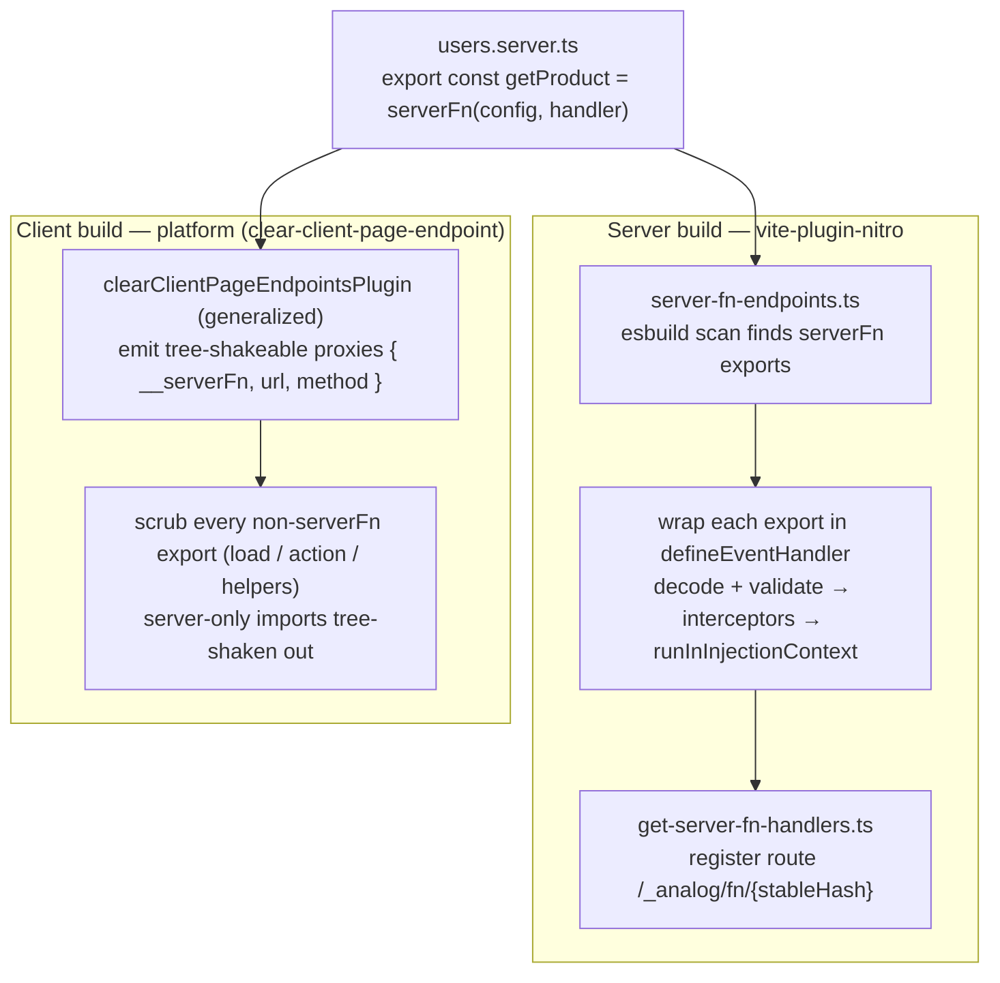
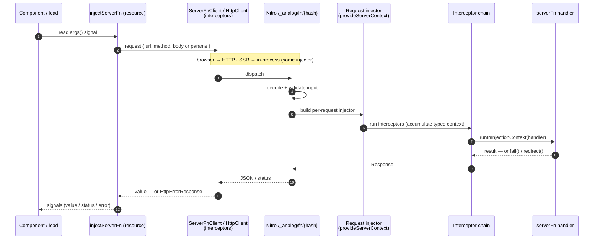

# RFC: Introduce Analog Server Functions

**Status:** Proposed (`feat/server-functions-rfc` branch)
**Author:** Brandon Roberts
**Date:** 2026-07-09
**Packages:** `@analogjs/router` (`/server` entry) · `@analogjs/vite-plugin-nitro`

---

## Summary

Add a typed, validated, **DI-aware** server function primitive to Analog:

```ts
// products.server.ts
import { serverFn } from '@analogjs/router/server';
import { inject } from '@angular/core';
import { REQUEST } from '@analogjs/router/tokens';
import * as v from 'valibot';

export const getProduct = serverFn(
  { method: 'POST', input: v.object({ id: v.string() }) }, // input ⇒ POST
  async (input) => {
    const catalog = inject(CatalogService); // runs in the SSR request injector
    const req = inject(REQUEST); // Analog's request-scoped token
    return catalog.find(input.id, req.headers['accept-language']);
  },
);
```

A server function is an `async` function whose body executes **inside the same
request-scoped injection context Analog already builds for SSR**, and whose
client half is a first-class Angular `resource()`, hydrated the same way `load`
is. It generalizes the existing
route-bound `load` / `action` mechanism into an arbitrary, colocated,
type-inferred RPC callable — without introducing a new DI story, a bespoke
client cache, or a non-idiomatic builder API.

## Motivation

Analog can already run server code from a colocated `*.server.ts` file, but only
in two fixed shapes, both bound to a page route:

- `load` — one GET per page, invoked during navigation, consumed via
  `injectLoad` (`packages/router/src/lib/inject-load.ts`).
- `action` — one POST per page, consumed via the `FormAction` directive.

That covers page data and form posts, but not the common case of _"call this
one typed, validated server operation from anywhere — a component, an effect, a
resolver — and get the result back with DI on the server."_ Today that requires
hand-writing a Nitro API route + a client `fetch`/`HttpClient` call + manual
typing on both ends. `serverFn` is the typed client/server RPC primitive for
Analog; it supersedes the `@analogjs/trpc` integration, which is no longer a
recommended path.

The pieces to do better already exist in the tree; they are just not composed
into a general primitive:

- **Server DI context** — `provideServerContext({ req, res })`
  (`packages/router/server/src/provide-server-context.ts`) already provides
  `REQUEST`, `RESPONSE`, `BASE_URL`, `LOCALE` from `@analogjs/router/tokens`
  into the SSR injector per request.
- **The endpoint transform** — `pageEndpointsPlugin`
  (`packages/vite-plugin-nitro/src/lib/plugins/page-endpoints.ts`) already
  esbuild-scans a `.server.ts` for `load` / `action` exports and wraps them in an
  h3 `defineEventHandler`, dispatching by method.
- **Endpoint routing** — `getPageHandlers`
  (`packages/vite-plugin-nitro/src/lib/utils/get-page-handlers.ts`) already
  globs `*.server.ts` and registers Nitro routes.
- **Response helpers** — `json` / `redirect` / `fail`
  (`packages/router/server/actions/src/actions.ts`).
- **Client scrub** — `clearClientPageEndpointsPlugin`
  (`packages/platform/src/lib/clear-client-page-endpoint.ts`) already replaces a
  `.server.ts` module with `export default undefined;` on the client build. It is
  scoped to `src/app/pages/` and today discards all exports.
- **Server→client hydration** — the `TransferState`-based transfer Analog already
  uses for `load`: a value resolved during SSR is serialized into the page and
  rehydrated on the client with no refetch, independent of HTTP method. Uses
  Angular-core `TransferState`, so no HTTP transfer-cache configuration.

This RFC composes those into `serverFn`.

## Goals

- A single authoring API for arbitrary server operations, colocated in
  `*.server.ts`, with **end-to-end type inference** (input from the validator,
  output from the handler return).
- **`inject()` works in the handler**, resolving from the per-request SSR
  injector — request tokens (`REQUEST`/`RESPONSE`/`BASE_URL`/`LOCALE`) and app
  services alike.
- **Middleware as functional interceptors**, composed through DI in the same
  shape as `provideHttpClient(withInterceptors([...]))`.
- **Idiomatic client consumption**: the reactive form is a `resource()` whose
  loader rides `HttpClient` (via `ServerFnClient`), so it inherits client
  `HttpInterceptorFn`s and `HttpTestingController` testing, and hydrates via
  `TransferState` with no HTTP transfer-cache configuration.
- **One client primitive** — `injectServerFn` covers both reactive reads (a
  `ResourceRef`) and imperative calls (a bound callable), in the `injectLoad`
  helper family; no separate hook per mode.
- Server code and its dependencies never enter the client bundle. On the client,
  a `.server.ts` is rewritten to only its tree-shakeable `serverFn` proxies;
  every other export and its server-only imports are scrubbed and tree-shaken.
- **`serverFn` is supported in existing `.server.ts` files**, coexisting with the
  `load` / `action` in the same module.
- `load` / `action` become expressible as thin sugar over `serverFn`.

## Non-Goals

- **Inline `serverFn` inside client route files** (TanStack Start's "extract the
  closure out of the component" model). v1 is file-scoped to `*.server.ts`,
  which sidesteps closure hoisting entirely because the module is already
  server-only. Inline authoring is deferred (see Future Work).
- A new client data cache. We reuse Angular's `resource()`, `HttpClient` (via
  `ServerFnClient`), and `TransferState`.
- A central procedure registry / "router" object. Server functions are grouped
  by module colocation (`*.server.ts`), not a single typed router. Consumers
  import the exact exports they use; there is no root type to assemble. This is
  the deliberate replacement for the tRPC router model — larger surfaces are
  many colocated `serverFn` exports, not one procedure tree.

## Design

### 1. Authoring API (server entry)

`serverFn(config, handler)` lives in `@analogjs/router/server` (server-only
entry — it already depends on `@angular/platform-server`).

```ts
export interface ServerFnConfig<In> {
  method?: 'GET' | 'POST'; // default 'POST'. GET is only valid with no input.
  input?: StandardSchemaV1<In>; // valibot/zod/arktype via Standard Schema
}

export declare function serverFn<In, Out>(
  config: ServerFnConfig<In>,
  handler: (input: In, context: ServerFnContext) => Promise<Out> | Out,
): ServerFn<In, Out>;
```

`ServerFn<In, Out>` is a branded callable whose **type** is `(input: In) =>
Promise<Out>`. On the server it is the real handler; on the client the build
replaces the implementation with an RPC proxy while preserving that type (see
Data Flow). The handler body runs via `runInInjectionContext`, which is what
makes top-level `inject()` inside it legal.

The interceptor-accumulated context is passed to the handler as its **second
argument** (`ServerFnContext`), not injected — a parameter is explicit and
discoverable. `ServerFnContext` is an interface apps extend by declaration
merging; because interceptors are registered through DI at runtime, the
per-handler context type cannot be inferred from them statically, so
augmentation is the typing seam.

**Transport.** Input-bearing functions are **POST**, with `input` in the request
body; we do not query-serialize. `method: 'GET'` is reserved for input-less
reads (its only benefit is runtime HTTP/CDN cacheability — hydration does not
depend on the method; see Client consumption). A `GET` config that also declares
an `input` schema is a build-time error.

> **Injection-context rule.** `inject()` is valid _inside the handler body_
> (invoked in an injection context at call time), not at module scope where
> `serverFn(...)` is declared. This matches the `assertInInjectionContext` guard
> on `injectLoad` and every other Analog inject-helper.

### 2. DI-aware execution — reuse `provideServerContext`

The generated endpoint runs the handler inside the request injector Analog
already assembles for SSR. Conceptually:

```ts
// generated per endpoint (see page-endpoints.ts analogue)
export default defineEventHandler(async (event) => {
  const injector = createRequestInjector([
    ...provideServerContext({ req: event.node.req, res: event.node.res }),
    ...appServerProviders, // app.config.server.ts
    ...serverFnInterceptorProviders, // provideServerFns(withServerFnInterceptors(...))
  ]);
  const input = await decodeAndValidate(event, fn.config);
  return runInInjectionContext(injector, () =>
    runInterceptors(injector, { input }, (ctx) =>
      fn.handler(ctx.input, ctx.context),
    ),
  );
});
```

So inside a handler: `inject(REQUEST)`, `inject(RESPONSE)`, `inject(LOCALE)`
(all from `@analogjs/router/tokens`) and any provided service resolve exactly as
they do inside a component during SSR. Request-scoped providers work because it
is a real per-request child injector, not a singleton.

**The surface is strictly DI.** The raw `H3Event` is used only internally to
build the injector and decode input — it is never handed to interceptors or
handlers. All request/response access goes through the `REQUEST` / `RESPONSE` /
`BASE_URL` / `LOCALE` tokens. This keeps handlers portable across the h3 runtime
and testable by overriding those tokens in `TestBed`, with no `event` to mock.

### 3. Middleware = functional interceptors, provided via DI

Modeled directly on `HttpInterceptorFn`. Interceptors are **not** attached
per-function; they are provided once and apply to every server function,
ordered by registration — the mental model developers already have from HTTP
interceptors.

```ts
// tenant.server-interceptor.ts
import { ServerFnInterceptorFn } from '@analogjs/router/server';
import { inject } from '@angular/core';
import { fail } from '@analogjs/router/server/actions';

export const authInterceptor: ServerFnInterceptorFn = (ctx, next) => {
  const session = inject(SessionService); // DI inside the interceptor
  if (!session.user()) return fail(401, { message: 'unauthenticated' });
  return next(ctx.with({ user: session.user() })); // typed context accumulates
};
```

```ts
// app.config.server.ts — mirrors provideHttpClient(withInterceptors(...))
provideServerFns(
  withServerFnInterceptors([
    authInterceptor,
    tenantInterceptor,
    loggingInterceptor,
  ]),
),
```

The feature builder is `withServerFnInterceptors`, not `withInterceptors`, to
avoid colliding with the `withInterceptors` already exported for
`provideHttpClient`. It follows the same `provide*(with*())` shape.

`ServerFnInterceptorFn = (ctx: ServerFnContext, next: ServerFnHandler) =>
Promise<Response | unknown>`. The `ctx.with({...})` helper threads a typed
context object down the chain; the accumulated type is visible to later
interceptors and is delivered to the handler as its second argument. Returning a
`Response` (via
`fail` / `redirect` / `json`) short-circuits — reusing the existing action
helpers verbatim.

### 4. Validation

`config.input` is any Standard Schema validator (valibot is the Analog default;
zod and arktype also conform). It runs server-side before the
handler. The same schema may optionally run client-side for early feedback,
which is free because Standard Schema is isomorphic.

### 5. Client consumption — a `resource()` hydrated from `TransferState`

The reactive form returns a `ResourceRef<Out>` from Angular's `resource()`
(`packages/core/src/resource/resource.ts`) whose loader calls `ServerFnClient` —
so requests still ride `HttpClient` and its interceptors. This is the client half
of every server function: a normal Angular resource.

```ts
@Component({
  /* … */
})
export class ProductCard {
  id = input.required<string>();
  protected product = injectServerFn(getProduct, () => ({ id: this.id() }));
}
```

```html
@if (product.value(); as p) { {{ p.name }} } @else if (product.error()) {
<error-banner [err]="product.error()" /> } @else { <spinner /> }
```

A read automatically gets: client `HttpInterceptorFn`s (via `ServerFnClient` /
`HttpClient`), signal state (`value`/`status`/`error`/`reload`), and
`HttpTestingController` in tests.

**Hydration is method-independent and needs no configuration.** Reads hydrate the
same way `load` does — not through the HttpClient transfer cache. When the
resource resolves during SSR, its value is serialized into the page under a
`TransferState` key derived from the function id and serialized input; on the
client the resource takes that seeded value as its first result with no request,
then fetches normally on later reactive changes. This uses Angular-core
`TransferState` directly, so **no `provideClientHydration` /
`withHttpTransferCacheOptions` / `includePostRequests` setup is required, and a
POST read (any input-bearing read) hydrates exactly like a GET.**

`injectServerFn` is the **single client primitive**, with two forms selected by
overload. It must run in an injection context (it `inject()`s the transport),
guarded by `assertInInjectionContext` exactly like `injectLoad` — the same
inject-helper family it belongs to.

```ts
export declare function injectServerFn<In, Out>( // reactive read → resource
  fn: ServerFn<In, Out>,
  args: () => NoInfer<In>,
): ResourceRef<Out>;

export declare function injectServerFn<In, Out>( // bound imperative callable
  fn: ServerFn<In, Out>,
): (input: In) => Promise<Out>;
```

**Reactive read** — given a signal-reading args factory, returns a
`ResourceRef<Out>` from `resource()`. It refetches when the read signals change,
and its `value` is a writable signal, so optimistic updates are a
`.value.set(...)` followed by `.reload()`. (The `ProductCard` example above.)

**Bound callable** — given no args factory, returns a DI-bound `(input) =>
Promise<Out>` for mutations, resolvers, effects, and `load`:

```ts
@Component({
  /* … */
})
export class Checkout {
  private place = injectServerFn(placeOrder); // POST serverFn → callable
  async submit(sku: string, qty: number) {
    const { orderId } = await this.place({ sku, qty });
  }
}

export const load = async () => {
  const loadProduct = injectServerFn(getProduct);
  return { product: await loadProduct({ id: 'p_1' }) };
};
```

Both forms go through the same injected transport, so client interceptors apply
either way. During SSR
the transport short-circuits the
HTTP round-trip and invokes the handler in-process within the request injector;
HTTP is only the browser transport.

`ServerFnClient` is the lower-level injectable the callable form is built on
(`inject(ServerFnClient).call(fn, input)`); reach for it only when you need the
transport outside an injection context. Prefer `injectServerFn`. Both are
**client-safe** and live in the main `@analogjs/router` entry, not `/server`
(see Entry-Point Boundary).

### 6. Errors

Handlers and interceptors signal failure with the existing `fail(status,
errors)` helper, which already tags responses with `X-Analog-Errors`. On the
client, the resource surfaces these as `HttpErrorResponse` (thrown by
`HttpClient` through `ServerFnClient`) in `.error()`, and `redirect()` is honored
by the transport.

### 7. Relationship to `load` / `action`

`load` and `action` become sugar:

- a page `load` ≡ a `serverFn({ method: 'GET' })` auto-bound to the route and
  consumed by `injectLoad`;
- an `action` ≡ a `serverFn({ method: 'POST' })` consumed by `FormAction`.

`page-endpoints.ts` can be re-expressed on top of the general endpoint
transform, collapsing two code paths into one. This is proposed as a follow-up,
not a prerequisite, to keep the first cut additive and low-risk.

## Version requirements

The client half uses Angular's `resource()` (first shipped experimental in
**Angular 19.0**, stable API in 22.0), `HttpClient`, and `TransferState`. It does
**not** depend on `httpResource`, so the floor is **`@angular/core` /
`@angular/common` ≥ 19.0** — consuming the experimental `resource()` API on
19.0–21 and the stable API on 22+.

This is a higher floor than `@analogjs/router`'s current peer range
(`^17 || … || ^22`), so `serverFn` is gated to 19.0+ rather than lowering the
whole package's support. Consuming an experimental API means tracking its changes
across minors.

## Entry-Point Boundary (import safety)

This is a deliberate design constraint, not an accident of layout:

| Symbol                                                                              | Entry                     | Why                                                          |
| ----------------------------------------------------------------------------------- | ------------------------- | ------------------------------------------------------------ |
| `serverFn`, `ServerFnInterceptorFn`, `provideServerFns`, `withServerFnInterceptors` | `@analogjs/router/server` | Server-only; authored in `*.server.ts`, stripped from client |
| `injectServerFn`, `ServerFnClient`, `provideServerFnClient`                         | `@analogjs/router` (main) | Client-safe; must be importable from components              |

A user's `*.server.ts` imports `serverFn` from `/server`; a component imports
`injectServerFn` from the root entry and references the _same exported symbol_
(`getProduct`), which the client build has rewritten to a proxy carrying
`{ url, method }`. The types line up because only the implementation is swapped.

## Implementation

### Files changed / added

| File                                                                 | Change                                                                                                                                                                                                                                                                                         |
| -------------------------------------------------------------------- | ---------------------------------------------------------------------------------------------------------------------------------------------------------------------------------------------------------------------------------------------------------------------------------------------- |
| `packages/router/server/src/server-fn.ts`                            | **new** — `serverFn`, `ServerFnConfig`, `ServerFn`, context/`with` helper                                                                                                                                                                                                                      |
| `packages/router/server/src/server-fn-interceptors.ts`               | **new** — `ServerFnInterceptorFn`, `provideServerFns`, `withServerFnInterceptors`, chain runner                                                                                                                                                                                                |
| `packages/router/server/src/index.ts`                                | export the server authoring surface                                                                                                                                                                                                                                                            |
| `packages/router/src/lib/inject-server-fn.ts`                        | **new** — `injectServerFn` (`resource()`-based, `TransferState` hydration), `ServerFnClient` (over `HttpClient`), `provideServerFnClient`                                                                                                                                                      |
| `packages/router/src/index.ts`                                       | export the client surface                                                                                                                                                                                                                                                                      |
| `packages/vite-plugin-nitro/src/lib/plugins/server-fn-endpoints.ts`  | **new** — generalized transform (sibling of `page-endpoints.ts`)                                                                                                                                                                                                                               |
| `packages/vite-plugin-nitro/src/lib/utils/get-server-fn-handlers.ts` | **new** — endpoint discovery/registration (sibling of `get-page-handlers.ts`); globs `<projectRoot>/src/**/*.server.ts` by default                                                                                                                                                             |
| `packages/vite-plugin-nitro/src/lib/vite-plugin-nitro.ts`            | register the new plugin + handlers                                                                                                                                                                                                                                                             |
| `packages/platform/src/lib/clear-client-page-endpoint.ts`            | generalize the client scrub: rewrite a `.server.ts` to only its tree-shakeable named `serverFn` proxies (`{ __serverFn, url, method }`); scrub every other export (`load`/`action`/helpers) so it tree-shakes out; `serverFn` coexists with `load`/`action`; same `<projectRoot>/src/**` scope |

### Data flow

**Build.** One `*.server.ts` module is compiled two ways: the server graph turns
each `serverFn` export into a Nitro endpoint; the client graph replaces it with a
transport proxy and strips the handler body.



`stableHash = hash(fileId + exportName)`. The client scrub is done by the
platform package's `clearClientPageEndpointsPlugin`, not `vite-plugin-angular`.
Today it replaces a page `.server.ts` with a single `export default undefined;`.
Generalized, it instead **rewrites the module to only its client-safe surface**:
one tree-shakeable named proxy per `serverFn` export, and nothing else — every
other export (`load`, `action`, server-only helpers) and its imports are scrubbed
so they tree-shake out of the client graph. `serverFn` is therefore supported in
the same `.server.ts` files that already hold `load`/`action`; the two coexist,
and each unused proxy drops on its own. Because the transform runs after
type-checking, the consumer type-checks against the real `ServerFn<In, Out>`
type while the runtime value is the proxy — inference holds end to end.

**Runtime.** `injectServerFn` drives a `resource()` (or a bound callable) that
goes through `HttpClient`; the request lands on the generated endpoint, which
builds the per-request injector, runs interceptors, and invokes the handler in
that injection context.



During SSR the `Http → Ep` hop is in-process, not a network call. A read resolved
during SSR seeds its value into `TransferState` (keyed by function id + input);
on the client the resource takes that seed as its first value with no refetch,
independent of HTTP method and with no transfer-cache configuration (see Client
consumption).

## Test coverage (planned)

- **Transform** (`server-fn-endpoints.spec.ts`): given a `*.server.ts` exporting
  one/many `serverFn`s, assert generated handler shape, method dispatch, route
  hashing, and that a non-`serverFn` export is untouched.
- **Interceptors** (`server-fn-interceptors.spec.ts`): ordering, context
  threading via `ctx.with`, short-circuit on `fail`/`redirect`, DI inside an
  interceptor.
- **DI execution**: handler resolves `REQUEST`/`RESPONSE`/`LOCALE` and an
  app-provided service under `TestBed.runInInjectionContext`; overrideable via
  `TestBed.overrideProvider`.
- **Client** (`inject-server-fn.spec.ts`): `provideHttpClientTesting()` +
  `HttpTestingController.expectOne('/_analog/fn/…')`; the HttpClient transfer
  cache avoids a second request after hydration.
- **Validation**: invalid input rejected server-side with a 4xx `fail`.

## Example usage (end to end)

```ts
// orders.server.ts
import { serverFn } from '@analogjs/router/server';
import { fail } from '@analogjs/router/server/actions';
import { inject } from '@angular/core';
import * as v from 'valibot';

export const placeOrder = serverFn(
  { method: 'POST', input: v.object({ sku: v.string(), qty: v.number() }) },
  async (input) => {
    const orders = inject(OrderService);
    const result = await orders.place(input.sku, input.qty);
    if (!result.ok) return fail(409, { reason: result.reason });
    return { orderId: result.id };
  },
);
```

```ts
// checkout.page.ts
import { injectServerFn } from '@analogjs/router';
import { placeOrder } from './orders.server';

@Component({
  /* … */
})
export default class CheckoutPage {
  private place = injectServerFn(placeOrder); // bound callable form
  async submit(sku: string, qty: number) {
    const { orderId } = await this.place({ sku, qty });
    // navigate to confirmation…
  }
}
```

## Alternatives considered

- **Fluent builder** (`serverFn().validator().middleware().handler()`, TanStack
  Start style). Rejected as non-idiomatic; DI-provided functional interceptors
  and a plain `(config, handler)` signature fit Angular conventions and keep
  middleware out of every call site.
- **Bespoke client cache.** Rejected in favor of Angular's `resource()` +
  `HttpClient` (via `ServerFnClient`) + `TransferState`, which give interceptors,
  hydration, and testing with no new cache.
- **Hydrate via the HttpClient transfer cache.** Rejected: it is request-keyed
  and GET-only by default, so parameterized (POST) reads would need
  `provideClientHydration(withHttpTransferCacheOptions({ includePostRequests }))`
  configuration. Seeding `TransferState` by key (like `load`) hydrates any read
  with zero configuration and independent of method.
- **New top-level package** (`@analogjs/server-fn`). Rejected; the feature is a
  generalization of router `load`/`action` and shares its server context and
  transform, so it belongs in `@analogjs/router` (`/server`).
- **Keep `@analogjs/trpc` as the RPC story.** No longer an option — tRPC is
  being retired; `serverFn` is its replacement, so the RFC does not position the
  two as coexisting choices.

## Future work

- **Inline `serverFn`** in client route files via closure extraction in
  `vite-plugin-angular` (the genuinely novel piece; v2).
- **Re-express `load`/`action`** on top of the shared endpoint transform.
- **Client interceptor leg** for `ServerFnInterceptorFn` (a `.client()`-style
  phase), matching HTTP interceptors more fully.
- **Streaming / async-iterable returns** for progressive results.
- **Schematic** to scaffold a `*.server.ts` with a `serverFn` and its consumer.
- **tRPC migration guide + codemod** — map each `@analogjs/trpc` procedure to a
  colocated `serverFn` (query → `method: 'GET'`, mutation → `method: 'POST'`,
  router grouping → module colocation) so existing consumers have a mechanical
  path off the retired integration.

## Open questions

None — all resolved and folded into Design:

- **Request/response surface** → strictly DI (`REQUEST`/`RESPONSE`/`BASE_URL`/
  `LOCALE` tokens). The raw `H3Event` is never exposed to user code.
- **Interceptor context** → passed to the handler as a second argument
  (`ServerFnContext`), not injected.
- **Input encoding** → require POST for any input; GET is reserved for input-less
  reads. No query-serialization.
- **Discovery scope** → glob `<projectRoot>/src/**/*.server.ts` by default (both
  endpoint discovery and the client scrub).
